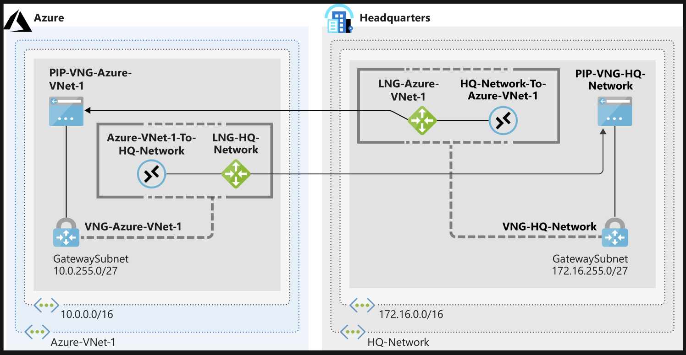
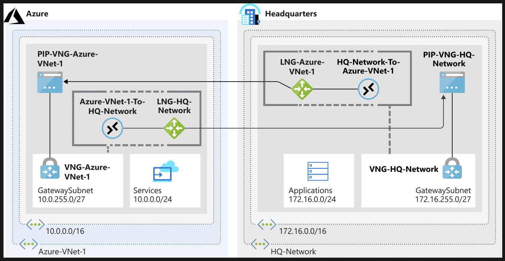

# Prepare on-prem VNet with CLI



## Create Azure side resources

```sh
az network vnet create \
    --resource-group <resource-group> \
    --name Azure-VNet-1 \
    --address-prefix 10.0.0.0/16 \
    --subnet-name Services \
    --subnet-prefix 10.0.0.0/24

az network vnet subnet create \
    --resource-group <resource-group> \
    --vnet-name Azure-VNet-1 \
    --address-prefix 10.0.255.0/27 \
    --name GatewaySubnet

az network local-gateway create \
    --resource-group <resource-group> \
    --gateway-ip-address 94.0.252.160 \
    --name LNG-HQ-Network \
    --local-address-prefixes 172.16.0.0/16
```


## Create simulated on-prem resources

```sh
az network vnet create \
    --resource-group <resource-group> \
    --name HQ-Network \
    --address-prefix 172.16.0.0/16 \
    --subnet-name Application \
    --subnet-prefix 174.16.0.0/24

az network vnet subnet create \
    --resource-group <resource-group> \
    --address-prefix 172.16.255.0/27 \
    --name GatewaySubnet \
    --vnet-name HQ-Network

az network local-gateway create \
    --resource-group <resource-group> \
    --gateway-ip-address 94.0.252.160 \
    --name LNG-Azure-VNet-1 \
    --local-address-prefixes 10.0.0.0/16
```

## Verify the topology

```sh
az network vnet list --output table

az network local-gateway list \
    --resource-group <resource-group> \
    --output table
```

# Create site-to-site VPN gateway with CLI

## Create the Azure-side VPN gateway

```sh
az network public-ip create \
    --resource-group <resource-group> \
    --name PIP-VNG-Azure-VNet-1 \
    --allocation-method Dynamic

az network vnet create \
    --resource-group <resource-group> \
    --name VNG-Azure-VNet-1 \
    --subnet-name GatewaySubnet

az network vnet-gateway create \
    --resource-group <resource-group> \
    --name VNG-Azure-VNet-1 \
    --public-ip-address PIP-VNG-Azure-VNet-1 \
    --vnet VNG-Azure-VNet-1 \
    --gateway-type Vpn \
    --vpn-type RouteBased \
    --sku VpnGw1 \
    --no-wait

```

## Create the on-prem VPN gateway

```sh
az network public-ip create \
    --resource-group <resource-group> \
    --name PIP-VNG-HQ-Network \
    --allocation-method Dynamic

az network vnet create \
    --resource-group <resource-group> \
    --name VNG-HQ-Network \
    --subnet-name GatewaySubnet 

az network vnet-gateway create \
    --resource-group <resource-group> \
    --name VNG-HQ-Network \
    --public-ip-address PIP-VNG-HQ-Network \
    --vnet HQ-Network \
    --gateway-type Vpn \
    --vpn-type RouteBased \
    --sku VpnGw1 \
    --no-wait
```

Waiting...

```sh
watch -d -n 5 az network vnet-gateway list \
    --resource-group <resource-group> \
    --output table
```

## Update the local network gatewy IP addresses

Check if finished waiting...

```sh
az network vnet-gateway list \
    --resource-group learn-0654e7d9-9f71-4b93-91df-fec032271f32 \
    --query "[?provisioningState=='Succeeded']" \
    --output table
```

```sh
PIPVNGAZUREVNET1=$(az network public-ip show \
    --resource-group learn-0654e7d9-9f71-4b93-91df-fec032271f32 \
    --name PIP-VNG-Azure-VNet-1 \
    --query "[ipAddress]" \
    --output tsv)

az network local-gateway update \
    --resource-group learn-0654e7d9-9f71-4b93-91df-fec032271f32 \
    --name LNG-Azure-VNet-1 \
    --gateway-ip-address $PIPVNGAZUREVNET1

PIPVNGHQNETWORK=$(az network public-ip show \
    --resource-group learn-0654e7d9-9f71-4b93-91df-fec032271f32 \
    --name PIP-VNG-HQ-Network \
    --query "[ipAddress]" \
    --output tsv)

az network local-gateway update \
    --resource-group learn-0654e7d9-9f71-4b93-91df-fec032271f32 \
    --name LNG-HQ-Network \
    --gateway-ip-address $PIPVNGHQNETWORK

```

## Create the connections

```sh
SHAREDKEY=<shared key>

az network vpn-connection create \
    --resource-group <resource-group> \
    --name Azure-VNet-1-To-HQ-Network \
    --vnet-gateway1 VNG-Azure-VNet-1 \
    --shared-key $SHAREDKEY \
    --local-gateway2 LNG-HQ-Network

az network vpn-connection create \
    --resource-group <resource-group> \
    --name HQ-Network-To-Azure-VNet-1  \
    --vnet-gateway1 VNG-HQ-Network \
    --shared-key $SHAREDKEY \
    --local-gateway2 LNG-Azure-VNet-1
```

## Verify

```sh
az network vpn-connection show \
    --resource-group learn-0654e7d9-9f71-4b93-91df-fec032271f32 \
    --name Azure-VNet-1-To-HQ-Network  \
    --output table \
    --query '{Name:name,ConnectionStatus:connectionStatus}'
```

now you got this...

