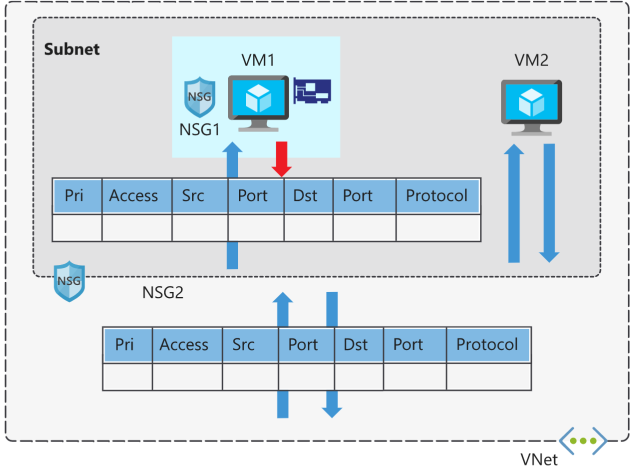
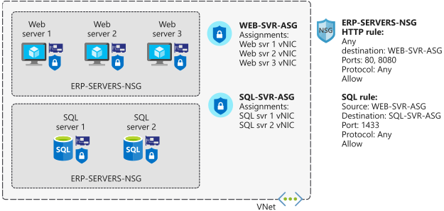
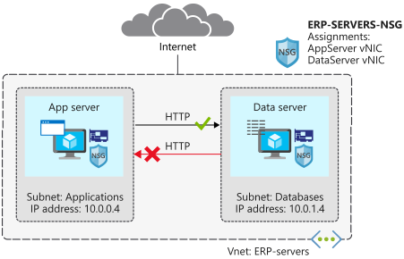
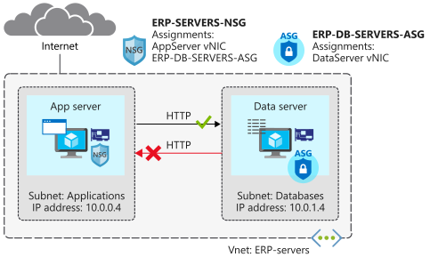
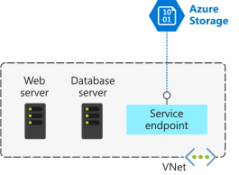
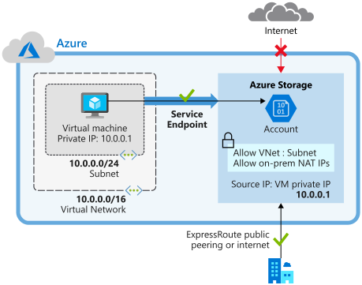
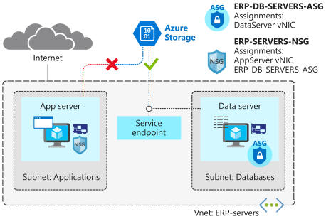

# Secure  and isolated access to Azure resources by using NSGs and service endpoints

- Capabilities and features of NSGs
- Capabilities and features of service endpoints
- Restrict network connectivity with NSGs
- Control traffic with vnet service endpoints

# NSGs

Filters traffic too and from Azure resources. Contains security rules that allow or deny inbound / outbound traffic. Used to filter traffic between VMs or subnets, within a vnet and from the internet.

## Assignment and evaluation

- Assigned to a NIC or a subnet
- Rules apply to all NICs in that subnet
- Further restrict by putting the NSG on the NIC of a VM

When applied to both subnet and NIC, each NSG is evaluated independently
- Firstly inbound at subnet then at the NIC
- Outbount firstly at the NIC then subnet




- Evaluted by priority, using 5-tuple (source, source port, destination, destination port, protocol) to allow or deny traffic
- Lower priority numbers have higher priority
- NSG connections are stateful, automatically allowing return traffic for the same TCP/UDP session.

## Augmented security Rules

Augment security rules to simplify the management of large numbers of rules. Single rule can contain:

- Multiple IP addressses
- Multiple ports
- Service tags
- App security groups

## Service tags

Simplify NSG security even further by allowing/denying traffic to a specific Azure service, globally or by region.

Represents a group of IP addresses and helps simplify the config of security rules because for resources that have a tag you don't need to know the IP/port details.

# App security groups

Makes admin easier. Configure network security for resources used by specific apps. Group VMs logically no matter what their IP or subnet assignment.

- Used within an NSG to apply a security rule to a group of resources
- Easier to deploy and scale an app workload
- Group network interfaces together and use the app security group as a source or destination rule on NSG
- Without ASGs you'd need a rule for each VM



# Example




## VNet and NSG

```sh
az login

rg=adt-1c-rg
az group create --name $rg --location westeurope

az network vnet create \
    --resource-group $rg \
    --name ERP-servers \
    --address-prefix 10.0.0.0/16 \
    --subnet-name Applications \
    --subnet-prefix 10.0.0.0/24

az network vnet subnet create \
    --resource-group $rg \
    --vnet-name ERP-servres \
    --address-prefix 10.0.1.0/24 \
    --name Databases

az network nsg create \
    --resource-group $rg \
    --name ERP-SERVERS-NSG
```

## Create VMs

```sh
wget -N https://raw.githubusercontent.com/MicrosoftDocs/mslearn-secure-and-isolate-with-nsg-and-service-endpoints/master/cloud-init.yml && \
az vm create \
    --resource-group $rg \
    --name AppServer \
    --vnet-name ERP-servers \
    --subnet Applications \
    --nsg ERP-SERVERS-NSG \
    --image UbuntuLTS \
    --size Standard_DS1_v2 \
    --admin-username azureuser \
    --custom-data cloud-init.yml \
    --no-wait \
    --admin-password <password>

az vm create \
    --resource-group $rg \
    --name DataServer \
    --vnet-name ERP-servers \
    --subnet Databases \
    --nsg ERP-SERVERS-NSG \
    --size Standard_DS1_v2 \
    --image UbuntuLTS \
    --admin-username azureuser \
    --custom-data cloud-init.yml \
    --admin-password <password>

az vm list \
    --resource-group $rg \
    --show-details \
    --query "[*].{Name:name, Provisioned:provisioningState, Power:powerState}" \
    --output table
```

## Check default connectivity

Get the public IPs of the VM so you can address them...

```sh
az vm list \
    --resource-group $rg \
    --show-details \
    --query "[*].{Name:name, PrivateIP:privateIps, PublicIP:publicIps}" \
    --output table
```

Assign them to vars for scripting

```sh
APPSERVERIP="$(az vm list-ip-addresses \
    --resource-group $rg \
    --name AppServer \
    --query "[].virtualMachine.network.publicIpAddresses[*].ipAddress" \
    --output tsv)"

DATASERVERIP="$(az vm list-ip-addresses \
    --resource-group $rg \
    --name DataServer \
    --query "[].virtualMachine.network.publicIpAddresses[*].ipAddress" \
    --output tsv)"
```

Can't connect, get timeouts...

```sh
ssh azureuser@APPSERVERIP -o ConnectTimeout=5
ssh azureuser@DATASERVERIP -o ConnectTimeout=5
```

Default rules deny inbound traffic unless it is comming from the same vnet.
Create a rule for ssh...

```sh
az network nsg rule create \
    --resource-group $rg \
    --nsg-name ERP-SERVERS-NSG \
    --name AllowSSHRule \
    --direction Inbound \
    --priority 100 \
    --source-address-prefixes '*' \
    --source-port-ranges '*' \
    --destination-address-prefixes '*' \
    --destination-port-ranges 22 \
    --access Allow \
    --protocol Tcp \
    --description "Allow inbound SSH"
```

Now connect...

```sh
ssh azureuser@$APPSERVERIP -o ConnectTimeout=5
```

App server can communicate with data server over HTTP but not the over way round...

```sh
az network nsg rule create \
    --resource-group $rg \
    --nsg-name ERP-SERVERS-NSG \
    --name httpRule \
    --direction Inbound \
    --priority 150 \
    --source-address-prefixes 10.0.1.4 \
    --source-port-ranges '*' \
    --destination-address-prefixes 10.0.0.4 \
    --destination-port-ranges 80 \
    --access Deny \
    --protocol Tcp \
    --description "Deny from DataServer to AppServer on port 80"
```

Test it...

```sh
ssh -t azureuser@$APPSERVERIP 'wget http://10.0.1.4; exit; bash'
```

should get back a 200.

Can't connect data server to app server, this times out...

```sh
ssh -t azureuser@$DATASERVERIP 'wget http://10.0.0.4; exit; bash'
```

## Deploy and App Security Group

Create an app security group for database servers so that all servers in the group can be assigned the same settings.



```sh
az network asg create \
    --resource-group $rg \
    --name ERP-DB-SERVERS-ASG

az network nic ip-config update \
    --resource-group $rg \
    --application-security-groups ERP-DB-SERVERS-ASG \
    --name ipconfigDataServer \
    --nic-name DataServerVMNic \
    --vnet-name ERP-servers \
    --subnet Databases

az network nsg rule update \     
    --resource-group $rg \
    --nsg-name ERP-SERVERS-NSG \
    --name httpRule \
    --direction Inbound \
    --priority 150 \
    --source-address-prefixes "" \
    --source-port-ranges '*' \
    --source-asgs ERP-DB-SERVERS-ASG \
    --destination-address-prefixes 10.0.0.4 \
    --destination-port-ranges 80 \
    --access Deny \
    --protocol Tcp \
    --description "Deny from DataServer to AppServer on port 80 using ASG"
```

# Secure network access to PaaS with VNet service endpoints

## VNet Service Endpoints

Extends the private address space in Azure by providing a direct connection to the Azure services. Service traffic remains on the Azure backbone and doesn't go out to the internet.



Azure resources have public IPs because they are designed for internet access by default. Anyone can potentially access these services.

Service endpoints can connect certain PaaS services directly to the private address space in Azure, so they act like they're on the same vnet. Use private address space to access PaaS services directly. <b>Adding service endpoints doesn't remove the public endpoint</b>.

## How it works...

1. Turn off public access to the service
2. Add the service endpoint to a VNet

Enabling the service endpoint restricts the flow of traffic, and enables Azure VMs to access the service directly from the private address space.

## Service endpoints and hybrid networks

Service resources secured using vnet service endpoints are accessible from on-prem networks by default. Use NAT IPs to enable this.



## Example

Service endpoint using network rules to restrict access to Azure Storage.



Add rules to the NSG to ensure that comms with Azure Storage pass through the service endpoint.

```sh
az network nsg rule create \
    --resource-group $rg \
    --nsg-name ERP-SERVERS-NSG \
    --name Allow_Storage \
    --priority 190 \
    --direction Outbound \
    --source-address-prefixes "VirtualNetwork" \
    --source-port-ranges '*' \
    --destination-address-prefixes "Storage" \
    --destination-port-ranges '*' \
    --access Allow \
    --protocol '*' \
    --description "Allow access to Azure Storage"

az network nsg rule create \
    --resource-group $rg \
    --nsg-name ERP-SERVERS-NSG \
    --name Deny_Internet \
    --priority 200 \
    --direction Outbound \
    --source-address-prefixes "VirtualNetwork" \
    --source-port-ranges '*' \
    --destination-address-prefixes "Internet" \
    --destination-port-ranges '*' \
    --access Deny \
    --protocol '*' \
    --description "Deny access to Internet"
```

Configure storage account and file share...

```sh
STORAGEACCT=$(az storage account create \
    --resource-group $rg \
    --name engineeringdocs$RANDOM \
    --sku Standard_LRS \
    --query "name" | tr -d '"')

STORAGEKEY=$(az storage account keys list \
    --resource-group $rg \
    --account-name $STORAGEACCT \
    --query "[0].value" | tr -d '"')

az storage share create \
    --account-name $STORAGEACCT \
    --account-key $STORAGEKEY \
    --name "erp-data-share"
```

Enable the service endpoint...

Configure the storage account to be accessible only from database servers, by assigning the storage endpoint to the Databases subnet. Then add a security rule to the storage account.


```sh
az network vnet subnet update \
    --vnet-name ERP-servers \
    --resource-group $rg \
    --name Databases \
    --service-endpoints Microsoft.Storage

az storage account network-rule add \
    --resource-group $rg \
    --account-name $STORAGEACCT \
    --vnet ERP-servers \
    --subnet Databases
```

Test access...

```sh
APPSERVERIP="$(az vm list-ip-addresses \
    --resource-group $rg \
    --name AppServer \
    --query "[].virtualMachine.network.publicIpAddresses[*].ipAddress" \
    --output tsv)"

DATASERVERIP="$(az vm list-ip-addresses \
    --resource-group $rg \
    --name DataServer \
    --query "[].virtualMachine.network.publicIpAddresses[*].ipAddress" \
    --output tsv)"
```

First command fails with a mount error, second succeeds...

```sh
ssh -t azureuser@$APPSERVERIP \
    "mkdir azureshare; \
    sudo mount -t cifs //$STORAGEACCT.file.core.windows.net/erp-data-share azureshare \
    -o vers=3.0,username=$STORAGEACCT,password=$STORAGEKEY,dir_mode=0777,file_mode=0777,sec=ntlmssp; findmnt \
    -t cifs; exit; bash"

ssh -t azureuser@$DATASERVERIP \
    "mkdir azureshare; \
    sudo mount -t cifs //$STORAGEACCT.file.core.windows.net/erp-data-share azureshare \
    -o vers=3.0,username=$STORAGEACCT,password=$STORAGEKEY,dir_mode=0777,file_mode=0777,sec=ntlmssp;findmnt \
    -t cifs; exit; bash"
```
