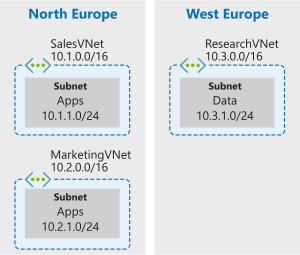
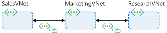
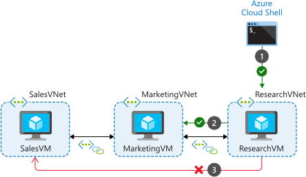

# Distribute services across Azure VNets and integrate them using VNet peering

Use VNet peering to enable comms across VNets in a way thats secure and minimally complex.

- Use cases for VNet peering
- Features and limitations of VNet peering
- Configure peering connections

Easy to implement and deploy, works well across regions / subs. Should be first choice when integrating Azure networks. Might not be best options if you have ExpressRoute, or VPN connections, or services behind Azure Basic Load Balancers that would be accessed from a peered VNet. 

VNet peering directly connects VNets so that VMs in the networks can communicate with each other as if they were in the same network.

Peered VNet traffic is routed between VMs through the Azure network, using only private IP addresses. No reliance on internet connectivity, gateways, or encrypted connections. 

- Traffic always private
- On backbone (high bandwidth / low latency connection)

Two types of peering connections:

1. VNet peering - same region VNet peering
2. Global VNet peering - different Azure regions

Reciprocal connections connect VNets together.

Cross-subscription VNet peering supports peering of VNets in different subs, using the same of different AD tenants. With different tenants, must grant peer subs <i>Network Contributor</i> role on both sides.

Peered VNets can only communicate with each other, not with peers of peers (non-transitive).

Gateway transit - Transitive connections on-prem using VNet gateways as transit points. Can enable on-prem connectivity without deploying VNet gateways to all VNets. Can reduce cost and complexity.

## Overlapping address spaces

IP address spaces of connected networks within Azure and between Azure and on-prem systems can't overlap, same for peered networks.

## Alternative connectivity methods

Other methods mainly for on-prem to Azure networks.

- ExpressRoute circuit
- VPNs (higher latency / more complex to manage / more costly)

When VNets are connected through both a gateway and VNet peering, traffic flows through peering connection.


## Example




```sh
az network vnet create \
    --resource-group $rg \
    --name SalesVNet \
    --address-prefix 10.1.0.0/16 \
    --subnet-name Apps \
    --subnet-prefix 10.1.1.0/24 \
    --location northeurope

az network vnet create \
    --resource-group $rg \
    --name MarketingVNet \
    --address-prefix 10.2.0.0/16 \
    --subnet-name Apps \
    --subnet-prefix 10.2.1.0/24 \
    --location northeurope

az network vnet create \
    --resource-group $rg \
    --name ResearchVNet \
    --address-prefix 10.3.0.0/16 \
    --subnet-name Data \
    --subnet-prefix 10.3.1.0/24 \
    --location westeurope
```

Check the VNet situation...

```sh
az network vnet list --output table
```

Create VMs...

```sh
az vm create \
    --resource-group $rg \
    --no-wait \
    --name SalesVM \
    --location northeurope \
    --vnet-name SalesVNet \
    --subnet Apps \
    --image UbuntuLTS \
    --admin-username azureuser \
    --admin-password <password>

az vm create \
    --resource-group $rg \
    --no-wait \
    --name MarketingVM \
    --location northeurope \
    --vnet-name MarketingVNet \
    --subnet Apps \
    --image UbuntuLTS \
    --admin-username azureuser \
    --admin-password <password>

az vm create \
    --resource-group $rg \
    --no-wait \
    --name ResearchVM \
    --location westeurope \
    --vnet-name ResearchVNet \
    --subnet Data \
    --image UbuntuLTS \
    --admin-username azureuser \
    --admin-password <password>
```

Confirm they are created...

```sh
az vm list \
    --resource-group $rg \
    --show-details \
    --query '[*].{Name:name, ProvisioningState:provisioningState, PowerState:powerState}' \
    --output table
```

Hub and spoke peering topology...


```sh
az network vnet peering create \
    --name SalesVNet-To-MarketingVNet \
    --remote-vnet MarketingVNet \
    --resource-group $rg \
    --vnet-name SalesVNet \
    --allow-vnet-access

az network vnet peering create \
    --name MarketingVNet-To-SalesVNet \
    --remote-vnet SalesVNet \
    --resource-group $rg \
    --vnet-name MarketingVNet \
    --allow-vnet-access

az network vnet peering create \
    --name MarketingVNet-To-ResearchVNet \
    --remote-vnet ResearchVNet \
    --resource-group $rg \
    --vnet-name MarketingVNet \
    --allow-vnet-access

az network vnet peering create \
    --name ResearchVNet-To-MarketingVNet \
    --remote-vnet MarketingVNet \
    --resource-group $rg \
    --vnet-name ResearchVNet \
    --allow-vnet-access
```

Check it

```sh
az network vnet peering list \
    --resource-group $rg \
    --vnet-name SalesVNet \
    --output table

az network vnet peering list \
    --resource-group $rg \
    --vnet-name MarketingVNet \
    --output table

az network vnet peering list \
    --resource-group $rg \
    --vnet-name ResearchVNet \ 
    --output table
```



Check the routes...

```sh
az network nic show-effective-route-table \
    --resource-group $rg \
    --name SalesVMVMNic \
    --output table

az network nic show-effective-route-table \
    --resource-group $rg \
    --name MarketingVMVMNic \
    --output table

az network nic show-effective-route-table \
    --resource-group $rg \
    --name MarketingVMVMNic \
    --output table
```

Connect to the VMs to confirm connectivity between them. SalesVNet and ResearchVNet can't communicate (because not transitive).

Get the IPs...

```sh
az vm list \
    --resource-group $rg \
    --query "[*].{Name:name, PrivateIP:privateIps, PublicIP:publicIps}" \
    --show-details \
    --output table

Name         PrivateIP    PublicIP
-----------  -----------  --------------
MarketingVM  10.2.1.4     40.127.134.244
SalesVM      10.1.1.4     40.115.114.40
ResearchVM   10.3.1.4     104.47.152.193
```

Connect using (in cloud shell because they're in a vnet):

```sh
ssh -o StrictHostKeyChecking=no azureuser@<SalesVM public IP>
```

then run

```sh
ssh -o StrictHostKeyChecking=no azureuser@<MarketingVM private IP>
```

Check all of them. See this...


