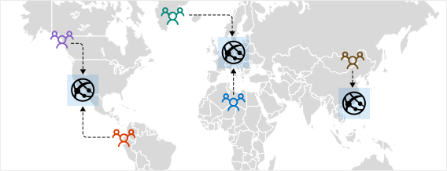
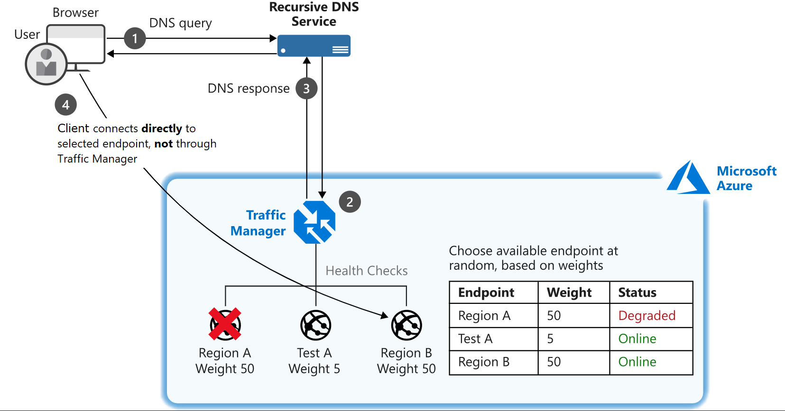
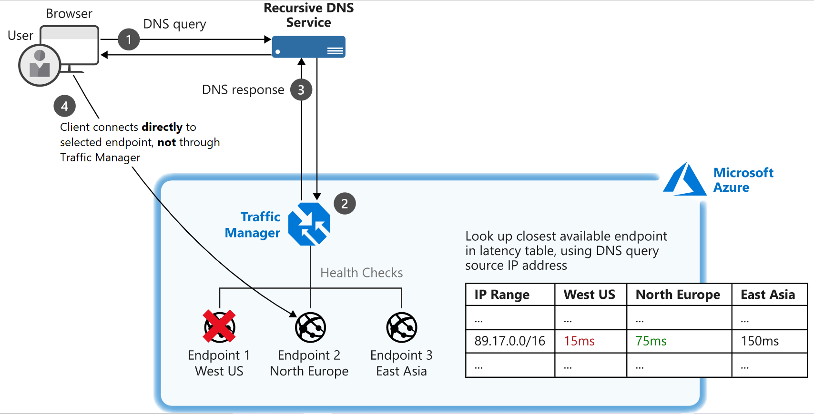
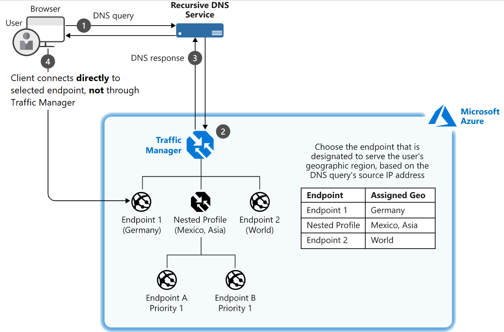
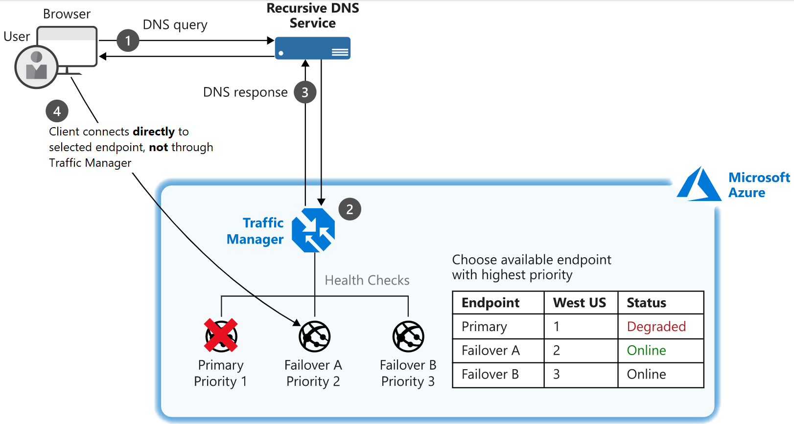

# Traffic Manager

Provides DNS load balancing. Distributes traffic to services across Azure regions globally. Helps provide HA, resilience, and responsiveness.

## Learning Objectives

- Distribute network traffic
- Failover to secondary regions
- Redirect to nearest endpoint

## How it works

DNS based solution. Traffic Manager uses DNS to direct clients to a specific endpoint based on the rules of the traffic routing method thats used. Clients connect directly to the selected endpoint. Its not a proxy or a gateway, and doesn't see the traffic that passes between the clients and the service. Just gives the clients the IP addresses of where they need to go.




## Endpoints

The destination location that is returned to the client. Configure each app deployment as an endpoint in Traffic Manager. Traffic Manager receives a DNS request and chooses an available endpoint to return in the DNS response.  
Three types of endpoint supported:

1. <b>Azure endpoints</b> used for services hosted in Azure (App Service, Public IP)
2. <b>External endpoints</b> used for IPv4/IPv6 addresses, FQDNs, or services hosted outside of Azure
3. <b>Nested endpoints</b> used to combine Traffic Manager profiles to create more flexible traffic-routing schemes


## Routing methods

Traffic Manager supports different methods for routing traffic to multiple endpoints. Applies routing method to each DNS query it receives and determines which endpoint is returned in the response.

Six routing methods.


### Weighted routing

- Distribute traffic across endpoints either evenly or based on different weights.
- Weight is 1 to 1000
- Randomly chooses an available endpoint
- Probability of choosing an endpoint is based on weights assigned to endpoints




### Performance routing

- For use across different geographic locations
- Uses an internet latency table which actively tracks network latencies to endpoints around the globe
- Best performing endpoint is returned based on location request




### Geographic routing

- Routes to endpoints based on where the DNS query originates
- Enables geo-fencing content to specific user regions




### Multivalue routing

- Used to get multiple healthy endpoints in a single DNS query response
- Client-side retries with other endpoints if an endpoint is unresponsive
- Pattern increases availability of a service and reduces latency associated with a new DNS query to obtain a health endpoint


### Subnet routing

- Maps a set of user IP ranges to specific endpoints within a Traffic Manager profile
- Returns the endpoint that is mapped to the requests source IP address


### Priority routing

- Traffic Manager contains a prioritized list of service endpoints.
- Default is to send all traffic to the primary (highest-priority) endpoint
- Drops down the list of prioritised endpoints based on availability
- Availability is based on configured status and endpoint monitoring




# Example

Priority routing.

```sh
az network traffic-manager profile create \
    --resource-group $rg \
    --name TM-MusicStream-Priority \
    --routing-method Priority \
    --unique-dns-name TM-MusicStream-Priority-$RANDOM
```

Deploy multi-region web applications via templates

```sh
az deployment group create \
    --resource-group Sandbox resource group  \
    --template-uri  https://raw.githubusercontent.com/MicrosoftDocs/mslearn-distribute-load-with-traffic-manager/master/azuredeploy.json \
    --parameters password=<password>
```

Add priority endpoints to the traffic manager...

```sh
WestId=$(az network public-ip show \
    --resource-group $rg \
    --name westus2-vm-nic-pip \
    --query id \
    --out tsv)

az network traffic-manager endpoint create \
    --resource-group $rg \
    --profile-name TM-MusicStream-Priority \
    --name "Primary-WestUS" \
    --type azureEndpoints \
    --priority 1 \
    --target-resource-id $WestId

EastId=$(az network public-ip show \
    --resource-group $rg \
    --name eastasia-vm-nic-pip \
    --query id \
    --out tsv)

az network traffic-manager endpoint create \
    --resource-group $rg \
    --profile-name TM-MusicStream-Priority \
    --name "Failover-EastAsia" \
    --type azureEndpoints \
    --priority 2 \
    --target-resource-id $EastId
```

List the endpoints...

```sh
az network traffic-manager endpoint list \
    --resource-group $rg \
    --profile-name TM-MusicStream-Priority \
    --output table
```

Check the DNS records...

```sh
# Retrieve the address for the West US 2 web app
nslookup $(az network public-ip show \
    --resource-group $rg  \
    --name westus2-vm-nic-pip \
    --query dnsSettings.fqdn \
    --output tsv)

# Retrieve the address for the East Asia web app
nslookup $(az network public-ip show \
    --resource-group $rg  \
    --name eastasia-vm-nic-pip \
    --query dnsSettings.fqdn \
    --output tsv)

# Retrieve the address for the Traffic Manager profile
nslookup $(az network traffic-manager profile show \
    --resource-group $rg \
    --name TM-MusicStream-Priority \
    --query dnsConfig.fqdn \
    --out tsv)
```

Get the FQDN of the Traffic Manager...

```sh
echo http://$(az network traffic-manager profile show \
    --resource-group $rg \
    --name TM-MusicStream-Priority \
    --query dnsConfig.fqdn \
    --out tsv)
```

Disable the primary endpoint...

```sh
az network traffic-manager endpoint update \
    --resource-group $rg \
    --name "Primary-WestUS" \
    --profile-name TM-MusicStream-Priority \
    --type azureEndpoints \
    --endpoint-status Disabled
```

Now check the DNS records again. Traffic Manager record show east asia and if you visit the TM address you'll get the east asia app instance.


Setup some performance routing...

```sh
az network traffic-manager profile create \
    --resource-group $rg \
    --name TM-MusicStream-Performance \
    --routing-method Performance \
    --unique-dns-name TM-MusicStream-Performance-$RANDOM \
    --output table

WestId=$(az network public-ip show \
    --resource-group $rg \
    --name westus2-vm-nic-pip \
    --query id \
    --out tsv)

az network traffic-manager endpoint create \
    --resource-group $rg \
    --profile-name TM-MusicStream-Performance \
    --name "WestUS" \
    --type azureEndpoints \
    --target-resource-id $WestId

EastId=$(az network public-ip show \
    --resource-group $rg \
    --name eastasia-vm-nic-pip \
    --query id \
    --out tsv)

az network traffic-manager endpoint create \
    --resource-group $rg \
    --profile-name TM-MusicStream-Performance \
    --name "EastAsia" \
    --type azureEndpoints \
    --target-resource-id $EastId
```

Get the FQDN...

```sh
echo https://$(az network traffic-manager profile show \
    --resource-group $rg \
    --name TM-MusicStream-Performance \
    --query dnsConfig.fqdn \
    --output tsv)
```

If you visit that then you'll be routed to the best performing regional deployment.

Check the DNS record...


```sh
nslookup $(az network traffic-manager profile show \
    --resource-group $rg \        
    --name TM-MusicStream-Performance \
    --query dnsConfig.fqdn \
    --output tsv)
```
