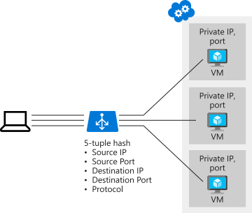
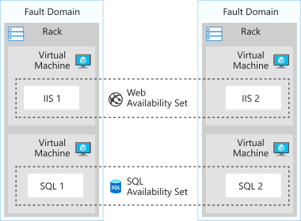
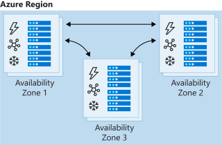

# Improve Application Scalability and Resiliency using Azure Load Balancer

Azure Load Balancer can provide resiliency and scale when demand increases.

## Learning Objectives

- Identify the features and capabilities of the ALB
- Deploy and configure the ALB

## ALB features and capabilities

Distribute load across multiple services, such as VMs, allowing scaling of the app to larger sizes than a signle instance can support and ensure resiliency.

Uses a hash-based distributioon algorithm, five-tuple hash by default.

- Source IP
- Source port
- Destination IP
- Destination port
- Protocol type (TCP/UDP)



Supports

- Inbound and outbound scenarios
- Low latency and high throughput
- Scales to millions of flows for TCP/UDP applications
- Not physical instances, just expresses how Azure configures it infra to meet requirements
- Use availability sets / zones to ensure availability of target services


## Availability set

- Essential for solution reliability
- Logical grouping used to isolate VMs from each other
- Ensures that VMs in an availability set run across multiple physical servers, compute racks, storage units, network switches.
- Isolates failures to only a part of the solution, allowing the overall solution to stay operational




# Availability zones

- Resilience to datacenter failures
- Offers groups of one or more datacenters with independent power, cooling, and networking
- VMs in an availability zone are placed in different pysical locations in the same region




## Selecting the right Load Balancer product

- Basic load balancer
- Standard load balancer

### Basic

- Port forwarding
- Automatic reconfiguration
- Health probes
- Outbound connections through SNAT
- Log Analytics
- Availability sets only

### Standard 

All basic + ...

- HTTPS health probes
- Availability zones
- Azure Monitor, for multidimensional metrics
- HA ports
- Outbound rules
- SLA (99.99, for two or more VMs)


## Internal and External load balancers

### External

- Distribute client traffic across multiple VMs
- Permits internet traffic

Distribution modes

- Five tuple hash is default
- Source IP affinity (session affinity / client IP affinity)
    - two-tuple hash (source / destination IP)
    - three-tuple hash (source / destination IP / protocol)

Remote Desktop Gateways enable clients on the internet to make RDP connections through firewalls to Remote Desktop servers on the private network. To enable this use source IP affinity.

Media uploads - use IP affinity also, so you don't fail connections by swapping backend through the default five-tuple hash.


### Internal

- Distributes load from internal Azure resources to other Azure resources
- No internet traffic allowed


## Example

Clone this repo and set it up...

```sh
git clone https://github.com/MicrosoftDocs/mslearn-improve-app-scalability-resiliency-with-load-balancer.git
cd mslearn-improve-app-scalability-resiliency-with-load-balancer

bash create-high-availability-vm-with-sets.sh learn-4b1cd597-b232-4688-9c4d-268d59835426
```

```sh
az network public-ip create \
    --resource-group $rg \
    --allocation-method Static \
    --name myPublicIP

az network lb create \
    --resource-group $rg \
    --name myLoadBalancer \
    --public-ip-address myPublicIP \
    --frontend-ip-name myFrontEndPool \
    --backend-pool-name myBackEndPool

az network lb probe create \
    --resource-group $rg \
    --lb-name myLoadBalancer \
    --name myHealthProbe \
    --protocol tcp \
    --port 80

az network lb rule create \
    --resource-group $rg \
    --lb-name myLoadBalancer \
    --name myHTTPRule \
    --protocol tcp \
    --frontend-port 80 \
    --backend-port 80 \
    --frontend-ip-name myFrontEndPool \
    --backend-pool-name myBackEndPool \
    --probe-name myHealthProbe

az network nic ip-config update \
    --resource-group $rg \
    --nic-name webNic1 \
    --name ipconfig1 \
    --lb-name myLoadBalancer \
    --lb-address-pools myBackEndPool

az network nic ip-config update \
    --resource-group $rg \
    --nic-name webNic2 \
    --name ipconfig1 \
    --lb-name myLoadBalancer \
    --lb-address-pools myBackEndPool

# Public IP address of the load balancer
echo http://$(az network public-ip show \
    --resource-group $rg \
    --name myPublicIP \
    --query ipAddress \
    --output tsv)
```
