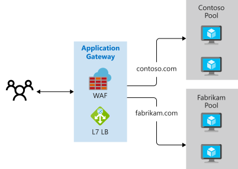

# Load balance your web service traffic with Application Gateway

## Learning objectives

- Identify the load-balancing capabilities of Application Gateway
- Do some load balancing
- URL path-based routing

## Application Gateway traffic routing

- Manages client app requests to a web app
- URL-based routing (layer 7)
- Backend resources can be Azure VMs, VM scale sets, App Services, on-prem servers


## How it works

- Client requests to web apps IP / DNS name of the gateway
- Gateway routes requests to the selected web server in the back-end pool using route rules
- Route rules primarily, either
    - path-based
    - multiple site hosting


## Path-based routing

Route based on the URL path to different backend pools...


## Multiple site hosting

- More than one web app on the same application gateway instance
- Register multiple DNS CNAMEs for the IP of the app gateway, specifying the name of each site
- Listeners pass requests to different rules which route to different pools
- Useful for supporting multi-tenant apps




## Other routing capabilities

- Redirection
    - to another site
    - HTTP to HTTPS
- Rewrite request / response headers
- Custom error pages


## Load balancing

- Automatic round-robin
- Optional sticky sessions incase of stateful sessions
- OSI Layer 7
    - Supports HTTP, HTTPS, HTTP/2, and WebSocket protocols
    - WAF
    - E2E request encryption
    - Autoscaling

## App gateway config


<b>Front-end IPs</b>
- max one private
- max one public
- or both

<b>Listeners</b>, one or more basic or multi-site, receive incoming requests on combination of the following and routes to backend pool using rules. Basic only uses the URL but multi-site can use the hostname.
- protocol
- port
- host
- IP


A <b>Routing rule</b> binds a listener to back-end pools using the request hostname and path. 

<b>HTTP</b> settings specify encryption between App Gateway and the back-end servers, and...

- Protocol
- Session stickiness
- Connection draining
- Request timeout
- Health probes

<b>Backend pools</b> reference a collection of web servers. 
- VMs / VM scale sets
- App Service
- On-prem servers

<b>Health probes</b> determine which servers are available for serving in the back-end pool.

## WAF

Handles incoming requests before they reach a listener. Based on OWASP core rule set (CRS)...
- SQL injections
- XSS
- Command injection
- HTTP request smuggling
- HTTP response splitting
- Remote file inclusion
- Bots, crawlers, and scanners
- HTTP protocol violations and anomalies


## Network requirements

App Gateway has to be in a vnet. Subnet address space needs to be big enough for the scale instances.

A private IP can expose only internal sites.


## Tiers

- Standard
    - Small, medium, large
- WAF
    - WAF V1
    - WAF V2 (supports availability zones)

## Example

App running on a pair of VMs inside a VNet, also a site running on App Service.


```sh
# clone this to 1g-module-files
git clone https://github.com/MicrosoftDocs/mslearn-load-balance-web-traffic-with-application-gateway module-files

# create the resource group
az group create --name $RG --location westeurope

# vnet and subnet for the VMs
az network vnet create \
    --resource-group $RG \
    --name vehicleAppVnet \
    --address-prefix 10.0.0.0/16 \
    --subnet-name webServerSubnet \
    --subnet-prefix 10.0.1.0/24

# create vms
az vm create \
    --resource-group $RG \
    --name webServer1 \
    --image UbuntuLTS \
    --admin-username azureuser \
    --generate-ssh-keys \
    --vnet-name vehicleAppVnet \
    --subnet webServerSubnet \
    --public-ip-address "" \
    --nsg "" \
    --custom-data 1g-module-files/scripts/vmconfig.sh \
    --no-wait
az vm create \
    --resource-group $RG \
    --name webServer2 \
    --image UbuntuLTS \
    --admin-username azureuser \
    --generate-ssh-keys \
    --vnet-name vehicleAppVnet \
    --subnet webServerSubnet \
    --public-ip-address "" \
    --nsg "" \
    --custom-data 1g-module-files/scripts/mconfig.sh

# confirm
az vm list \
    --resource-group $RG \
    --show-details \
    --output table

# create the app service
APPSERVICE="licenserenewal$RANDOM"
az appservice plan create \
    --resource-group $RG \
    --name vehicleAppServicePlan \
    --sku S1
az webapp create \
    --resource-group $RG \
    --name $APPSERVICE \
    --plan vehicleAppServicePlan \
    --deployment-source-url https://github.com/MicrosoftDocs/mslearn-load-balance-web-traffic-with-application-gateway \
    --deployment-source-branch appService --runtime "DOTNETCORE|2.1"
```


App Gateway...


```sh
az network vnet subnet create \
    --resource-group $RG \
    --vnet-name vehicleAppVnet  \
    --name appGatewaySubnet \
    --address-prefixes 10.0.0.0/24

az network public-ip create \
    --resource-group $RG \
    --name appGatewayPublicIp \
    --sku Standard \
    --dns-name vehicleapp${RANDOM}

az network application-gateway create \
    --resource-group $RG \
    --name vehicleAppGateway \
    --sku WAF_v2 \
    --capacity 2 \
    --vnet-name vehicleAppVnet \
    --subnet appGatewaySubnet \
    --public-ip-address appGatewayPublicIp \
    --http-settings-protocol Http \
    --http-settings-port 8080 \
    --private-ip-address 10.0.0.4 \
    --frontend-port 8080

# get the private IPs
az vm list-ip-addresses \
    --resource-group $RG \
    --name webServer1 \
    --query "[0].virtualMachine.network.privateIpAddresses[0]" \
    --output tsv

az vm list-ip-addresses \
    --resource-group $RG \
    --name webServer2 \
    --query "[0].virtualMachine.network.privateIpAddresses[0]" \
    --output tsv

az network application-gateway address-pool create \
    --gateway-name vehicleAppGateway \
    --resource-group $RG \
    --name vmPool \
    --servers 10.0.1.4 10.0.1.5

az network application-gateway address-pool create \
    --resource-group $RG \
    --gateway-name vehicleAppGateway \
    --name appServicePool \
    --servers $APPSERVICE.azurewebsites.net

az network application-gateway frontend-port create \
    --resource-group $RG \
    --gateway-name vehicleAppGateway \
    --name port80 \
    --port 80

az network application-gateway http-listener create \
    --resource-group $RG \
    --name vehicleListener \
    --frontend-port port80 \
    --frontend-ip appGatewayFrontendIP \
    --gateway-name vehicleAppGateway

az network application-gateway probe create \
    --resource-group $RG \
    --gateway-name vehicleAppGateway \
    --name customProbe \
    --path / \
    --interval 15 \
    --threshold 3 \
    --timeout 10 \
    --protocol Http \
    --host-name-from-http-settings true

az network application-gateway http-settings create \
    --resource-group $RG \
    --gateway-name vehicleAppGateway \
    --name appGatewayBackendHttpSettings \
    --host-name-from-backend-pool true \
    --port 80 \
    --probe customProbe

az network public-ip create \
    --resource-group $RG \
    --name appGatewayPublicIp \
    --sku Standard \
    --dns-name vehicleapp${RANDOM}

az network application-gateway url-path-map rule create \
    --resource-group $RG \
    --gateway-name vehicleAppGateway \
    --name appServiceUrlPathMap \
    --paths "/LicenseRenewal/*" \
    --http-settings appGatewayBackendHttpSettings \
    --address-pool appServicePool \
    --path-map-name urlPathMap

az network application-gateway rule create \
    --resource-group $RG \
    --gateway-name vehicleAppGateway \
    --name appServiceRule \
    --http-listener vehicleListener \
    --rule-type PathBasedRouting \
    --address-pool appServicePool \
    --url-path-map urlPathMap

az network application-gateway rule delete \
    --resource-group $RG \
    --gateway-name vehicleAppGateway \
    --name rule1
```


