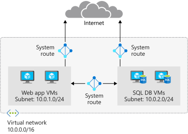
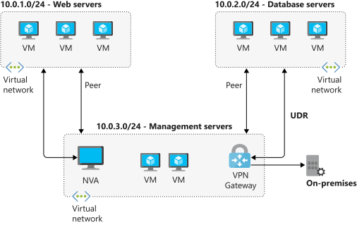
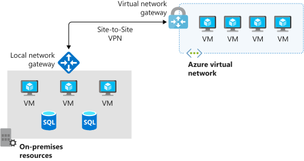
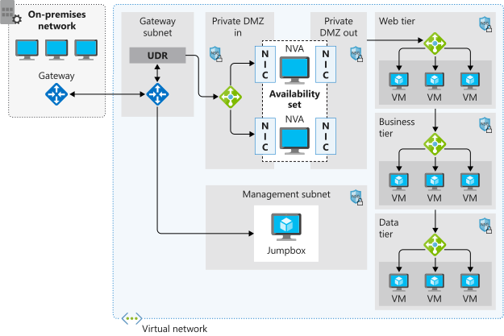
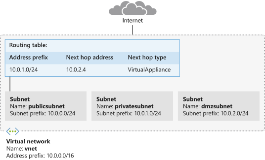
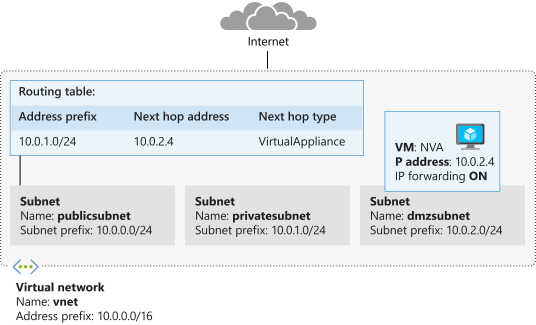
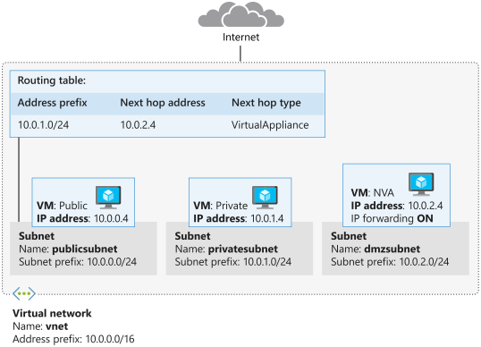
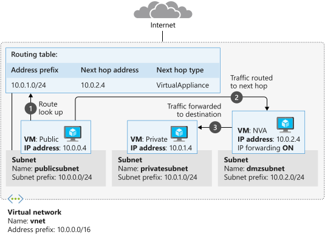

# Manage and control traffic flow in Azure deployment with routes

## Learning objectives

Control Azure vnet traffic by implementing custom routes.

- Routing capabilities of Azure vnet
- Routing config
- Deployment
- Routing config to send traffic through a network virtual appliance (NVA)


## Azure routing

Network traffic in Azure is automatically routed across Azure subnets, vnets and on-prem networks. This is controlled by system routes which are assigned by default to each subnet in a vnet.

Any Azure VM deployed to a vnet can communicate with all other VMs in subnets in that network, and potentially from on-prem through hybrid network of the internet.

- System routes can't be created or deleted
- System routes can be overridden by adding custom route

Subnet system routes:

| Address prefix                | Next hop type   |
| :---                          | :----:          |
| Unique to the virtual network | Virtual network |
| 0.0.0.0/0	                    | Internet        |
| 10.0.0.0/8                    | None            |
| 172.16.0.0/12                 | None            |
| 192.168.0.0/16                | None            |
| 100.64.0.0/10                 | None            |

&nbsp;
&nbsp;

Next hop type is network path taken by traffic sent to each address prefix.

- Virtual network: route created in the address prefix, representing each address range created at the vnet level. With multiple ranges specified, multiple routes created for each range.
- Internet: default system route 0.0.0.0/0 routes any address range to the internet, unless overridden with a custom route.
- None: Any traffic dropped and doesn't get routed outside the subnet. 100.64.0.0/10 for shared address space is also added.

&nbsp;
&nbsp;



Additional system routes are created if the following capabilities are enabled:

- vnet peering
- service chaining
- vnet gateway
- vnet service endpoint


## VNet peering and service chaining

- let vnets be connected to one another
- VMs can communicate in same region or across regions
- creates additional routes within the default route table

Service chaining lets you override these routes by creating user-defined routes between peered networks.

VNets with peering configured with user defined routes routing traffic through an NVA or an Azure VPN gateway.



&nbsp;
&nbsp;

## VNet gateway

VNet gateways used to send encrypted traffic between Azure and on-prem over the internet and between Azure networks. A vnet gateway contains route tables and gateway services.




## VNet service endpoint

Extend private address space in Azure by providing a direct connection to Azure resources. Restricts flow of traffic. Azure creates routes in the route table to direct traffic.

&nbsp;
&nbsp;

# Custom Routes

Used to control traffic flow within a network. Like, route traffic through NVAs or firewall. Two options for implementing custom routes:

1. user-defined route
2. BGP


## User-defined routes

Overrides the default system routes so that traffic can be routed through firewalls or NVAs. 

Hop type options:
- **Virtual appliance** typically used to analyse or filter traffic that is entering/leaving a network.
- **VNet gateway** to indicate when routes for a specific address are to be routed to a vnet gateway. VNet gateway is specified as a VPN for the next hop type.
- **VNet** to override the default system route within a virtual network.
- **Internet** to route traffic to a specified address prefix that is routed to the internet.
- **None** to drop traffic sent to a specified address space.

Can't specify the next hop type <b>VirtualNetworkServiceEndpoint</b> which indicates vnet peering.


## Border Gateway Protocol (BGP)

Network gateways in on-prem networks can exchange routes with a vnet gateway in Azure using [BGP](https://en.wikipedia.org/wiki/Border_Gateway_Protocol), standard routing protocol.

[RFC 1105](https://tools.ietf.org/html/rfc1105), BGP is an inter-autonomous system routing protocol, primarily for exchange of network reachability information with other BGP systems. This includes information on the autonomous systems (AS's) that traffic must transmit to reach these networks. The information is sufficient to construct a graph of AS connectivity from which routing loops may be pruned and policy decisions at the AS level may be enforced. Runs on a reliable transport level protocol, based on but not limited to TCP. Uses port 179.

[RFC 4271](https://tools.ietf.org/html/rfc4271), BGP4 is current version, with support for CIDR and route aggregation.

Typically use BGP to advertise on-prem routes to Azure when connected to an Azure datacenter through ExpressRoute, but also using VPN site-to-site connection.

Offers network stability because routers can quickly change connections to send packets if a connection path goes down.

## Route selection and priority

If multiple routes are available in a route table, Azure uses the route with the longest prefix match. Example, if a message is sent to 10.0.0.2, but two routes are available with 10.0.0.0/16 and 10.0.0.0/24 prefixes, then Azure selects the route with 10.0.0.0/24 because its more specific. Means can select the intended address more quickly.

Can't configure multiple user-defined routes with the same address prefix. Azure selects the route based on its type in the following order of priority.

1. User-defined routes
2. BGP routes
3. System routes


## What is an NVA

Its a virtual appliance that consists of various layers like:

- firewall
- WAN optimizer
- application-delivery controllers
- routers
- load balancers
- IDS/IPS
- proxies
- SD WAN edge

Available through the Azure Marketplace.



- perimeter-network subnet
- dedicated subnets / microsegmentation
    - all traffic routed through firewall and inspected by NVAs
    - forwarding on the NVA nics to pass traffic accepted by appropriate subnet
    - Layer 4
    - Layer 7 for app-aware appliances
    - acts as a router between subnets


### HA

Important to include this in any network design that includes NVAs.


## User-defined routes

Required when:
- Access to the internet via on-prem network using forced tunneling
- Using virtual appliances to control traffic flow

Each routing table is associated with one or more subnets but each subnet is associated with only one routing table.


# Exercise - Create custom routes

Use a network virtual applicance to secure and monitor traffic. Ensure comms between public front-end servers and internal private servers is always routed through the appliance.

Network is configured so that all traffic from a public subnet to a private subnet is routed through the NVA.
- Create custom route from public subnet to perimeter-network subnet
- Deploy an NVA to perimeter-network subnet




## Create a route table with custom route

```sh
# create a route table
az network route-table create -g $rg -n publictable --disable-bgp-route-propagation false

# create a custom route
az network route-table route create -g $rg -n productionsubnet \
    --route-table-name publictable \
    --address-prefix 10.0.1.0/24 \
    --next-hop-type VirtualAppliance \
    --next-hop-ip-address 10.0.2.4
```

## Create a VNet and subnets

Create a vnet and three subnets, publicsubnet, privatesubnet, and dmzsubnet.


```sh
# vnet and publicsubnet
az network vnet create -g $rg -n vnet \
    --address-prefix 10.0.0.0/16 \
    --subnet-name publicsubnet \
    --subnet-prefix 10.0.0.0/24

az network vnet subnet create -g $rg -n privatesubnet --vnet-name vnet --address-prefix 10.0.1.0/24
az network vnet subnet create -g $rg -n dmzsubnet --vnet-name vnet --address-prefix 10.0.2.0/24

az network vnet subnet list -g $rg --vnet-name vnet -o table
```

Subnets...

```sh
AddressPrefix    Name           PrivateEndpointNetworkPolicies    PrivateLinkServiceNetworkPolicies    ProvisioningState    ResourceGroup
---------------  -------------  --------------------------------  -----------------------------------  -------------------  ---------------
10.0.0.0/24      publicsubnet   Enabled                           Enabled                              Succeeded            adt-rg-29702
10.0.1.0/24      privatesubnet  Enabled                           Enabled                              Succeeded            adt-rg-29702
10.0.2.0/24      dmzsubnet      Enabled                           Enabled                              Succeeded            adt-rg-29702
```

## Associate the route table with the public subnet

```sh
az network vnet subnet update -g $rg -n publicsubnet --vnet-name vnet --route-table publictable
```


## Create an NVA and VMs

Deploy an NVA to secure and monitor traffic between front-end public servers and internal private servers. Forward IP traffic.

Deploy the NVA to the dmzsubnet and enable IP forwarding to allow traffic from publicsubnet and traffic that uses the custom route to be sent to the private subnet.




Enable IP forwarding for the Azure NIC

```sh
az vm create \
    --resource-group $RG \
    --name nva \
    --vnet-name vnet \
    --subnet dmzsubnet \
    --image UbuntuLTS \
    --admin-username azureuser \
    --admin-password <password>

NICID=$(az vm nic list \
    --resource-group $RG \
    --vm-name nva \
    --query "[].{id:id}" \
    --output tsv)

echo $NICID

NICNAME=$(az vm nic show \
    --resource-group $RG \
    --vm-name nva \
    --nic $NICID \
    --query "{name:name}" \
    --output tsv)

echo $NICNAME

az network nic update --name $NICNAME \
    --resource-group $RG \
    --ip-forwarding true
```

Enable IP forwarding in the appliance

```sh
NVAIP="$(az vm list-ip-addresses \
    --resource-group $RG \
    --name nva \
    --query "[].virtualMachine.network.publicIpAddresses[*].ipAddress" \
    --output tsv)"

echo $NVAIP

# Enable IP forwarding withing the NVA
ssh -t -o StrictHostKeyChecking=no azureuser@$NVAIP 'sudo sysctl -w net.ipv4.ip_forward=1; exit;'
```

Route traffic through the NVA




Deploy and VM into the public and private subnets

```sh
# check 1h/cloud-init.txt to install the inetutils-traceroute package.

az vm create \
    --resource-group $RG \
    --name public \
    --vnet-name vnet \
    --subnet publicsubnet \
    --image UbuntuLTS \
    --admin-username azureuser \
    --no-wait \
    --custom-data 1h/cloud-init.txt \
    --admin-password <password>

az vm create \
    --resource-group $RG \
    --name private \
    --vnet-name vnet \
    --subnet privatesubnet \
    --image UbuntuLTS \
    --admin-username azureuser \
    --no-wait \
    --custom-data 1h/cloud-init.txt \
    --admin-password 1ntergeNH1tach!

# mac? brew install watch
watch -d -n 5 "az vm list \
    --resource-group $RG \
    --show-details \
    --query '[*].{Name:name, ProvisioningState:provisioningState, PowerState:powerstate}' \
    --output table"

PUBLICIP="$(az vm list-ip-addresses \
    --resource-group $RG \
    --name public \
    --query "[].virtualMachine.network.publicIpAddresses[*].ipAddress" \
    --output tsv)"

echo $PUBLICIP

PRIVATEIP="$(az vm list-ip-addresses \
    --resource-group $RG \
    --name private \
    --query "[].virtualMachine.network.publicIpAddresses[*].ipAddress" \
    --output tsv)"

echo $PRIVATEIP
```

Now the testing!...

Uses traceroute to show how traffic is routed.
1. ICMP packets sent from public VM to private VM
2. ICMP packets sent from private VM to public VM

```sh
andrew@Andrews-MacBook-Air 1-network-infra % ssh -t -o StrictHostKeyChecking=no azureuser@$PUBLICIP 'traceroute private --type=icmp; exit'
Warning: Permanently added '104.214.218.37' (ECDSA) to the list of known hosts.
traceroute to private.xfcgjqlfvkvuplrpnod42ft2nb.ax.internal.cloudapp.net (10.0.1.4), 64 hops max
  1   10.0.2.4  0.796ms  1.183ms  0.504ms 
  2   10.0.1.4  2.348ms  2.295ms  2.224ms 
Connection to 104.214.218.37 closed.
```




```sh
andrew@Andrews-MacBook-Air 1-network-infra % ssh -t -o StrictHostKeyChecking=no azureuser@$PRIVATEIP 'traceroute public --type=icmp; exit'
Warning: Permanently added '13.81.63.101' (ECDSA) to the list of known hosts. 
traceroute to public.xfcgjqlfvkvuplrpnod42ft2nb.ax.internal.cloudapp.net (10.0.0.4), 64 hops max
  1   10.0.0.4  3.347ms  2.191ms  2.348ms 
Connection to 13.81.63.101 closed.
```


