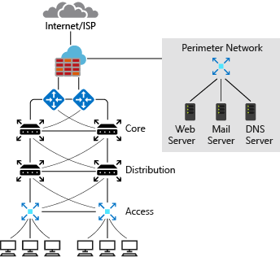
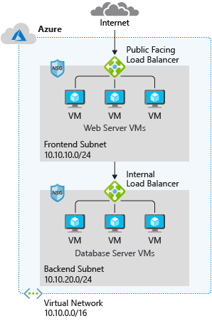

# Design an IP addressing schema for an Azure deployment

Provides flexibility, room for growth, and on-prem integration. Ensure communication works for deployed resources, minimises public exposure of systems, and gives the org flexibility in its network.

If not properly designed, systems might not be able to communicate and introduce technical debt.

## Learning objectives

- IP addressing capabilities of Azure VNets
- IP addressing capabilities of Azure
- IP addressing when integrating with on-prem networks

## Network IP addressing and integration

### On-prem IP addressing

A typical on-prem network design includes

- routers
- firewalls
- switches
- network segmentation

Example private IP address ranges, not accessible over the internet, which internal admin would have full control over for IP address assignment, name resolution, security settings, and security rules.

- 10.0.0.0 to 10.255.255.255
- 172.16.0.0 to 172.31.255.255
- 192.168.0.1 to 192.168.255.255

Admins can add or remove on-prem subnets to accommodate network devices and services. The number of subnets and IP addresses you can have in your on-prem network depends on CIDR for the IP address block.

### Azure IP addressing

Azure vnets use private IP addresses with IP ranges the same as for on-prem IP addressing. Admin has full control and can add or remove subnets depending on the CIDR for the IP address block.

Typical Azure network design has:

- vnets
- subnets
- NSGs
- firewalls
- load balancers

Azure network has features and functions similar to on-prem nets but the structure is different.

- not a  hierarchial design
- ability to scale infra based on demand
- rapid provisioning
- no hardware devices
- entirely virtual

Typically, use subnets to isolate services (front end vs backend), NSGs filter internal / external traffic at network layer, and deploy both NSGs and firewall to get improved isolation of resources for a secure network architecture.

### Basic properties of VNets

- smallest subnet /29
- largest /8

### Integration

- can't have IP address overlap with cloud/prem interconnected nets
- can have same class ranges for multiple networks

## Public and private IP addressing in Azure

Constraints and limitations for public and private IP addresses in Azure, and capabilities in Azure to reassign IP addresses in your network.

### IP address types

- Public
- Private

allocated as either...

- Dynamic
- Static

### Public IP addresses

- Use for public facing services
- Static or dynamic
- Assignable to VM, ILB, VPN gateway, app gateway

<b>Dynamic</b> public IPs (default allocation method):

- Changes over the lifespan of an Azure resource
- Allocated on resource creation
- Released when stop or delete resource
- Assigned from a unique pool of regional addresses

<b>Static</b> public IPs:

- Don't change over the lifespan of the Azure resource
- Released only when resource is deleted or change allocation method to dynamic

### Basic and Standard SKUs

<b>Basic</b> public IPs assignable to any Azure resource that can be assigned a public IP.

- Static or dynamic allocation
- Adjustable inbound originated flow idle timeout of 4-30 mins (4 default)
- Fixed outbound originated flow idle timeout of 4 mins
- Open by default
- Recommended to use NSGs to restrict inbound / outbound traffic.
- Don't support availability zone scenarios (use <b>Standard</b> SKU)

<b>Standard</b> SKU public IP 

- Always statically allocated
- Adjustable inbound originated flow idle timeout of 4-30 mins (4 default)
- Fixed outbound originated flow idle timeout of 4 minutes.
- Secure by default and closed to inbound traffic
    - have to explicitly allow it by using NSG
- Assignable to NICs, LBs, app gateways, VPN gateways
- Zone-redundant (default), optionally zonal and guaranteed in a specific availability zone

### PIP address prefix

- Doesn't support BYO PIP addresses from prem to Azure
- Assigned from a pool of available addresses
- Range unique to a region
- Not region transferrible

Use Traffic Manager for multi-region deployments.

Ensure static range by creating a PIP address prefix. After prefix is created, the address is fixed. Advantage of a PIP prefix is that you can specify firewall rules for the IP addresses with knowledge they won't change.

### Private IP addresses

- Internal comms within a vnet
- Cloud to on-prem nets
- Support dynamic DHCP lease, or static DHCP reservation

Static IPs persist if a resource is stopped or deallocated.

### IP Addressing for VNets

VNets define the scope of IP addresses. Private IP addressing in Azure works the same way as it does in on-prem nets.

Private IP addresses reserved by Internet Assigned Numbers Authority (IANA) based on network requirements:

- 10.0.0.0/8
- 172.16.0.0/12
- 192.168.0.0/16

A subnet is a range of IP addresses in the vnet, dividing the vnet into multiple subnet. Each subnet has a unique range (CIDR).

Azure reserves the first three IPs for all subnets by default. Also, first and last IP addresses of all subnets are also reserved, for protocol conformance. Internal DHCP in Azure assigns and maintains the lease of IP addresses. the .1, .2, .3, and last IP are not visible or configurable by Azure customer.

Number of possible addressses on an Azure subnet is (2^n)-5.

## Plan IP addressing

- Explore the requirements for a network IP address scheme
- Slice IP block to meet you addressing needs, with CIDR
- Planning IP addressing for Azure VNets

### Requirements Capture

- How many devices do you have on the network?
- How many devices will be added to the network?

You want to avoid the redesign of the IP addressing scheme as the network expands.

- What devices need separating?
- How many subnets?
- How many devices per subnet?
- How many devices will be added to the subnet in the future?
- Subnet size requirements?
- Subnet future requirements?

Service isolation provides additional layers of security, but also requires good planning.

CIDR allows more flexible allocation of IP addresses than was possible with class based addressing scheme. CIDR can be used to slice the IP block into the required subnets and hosts.

