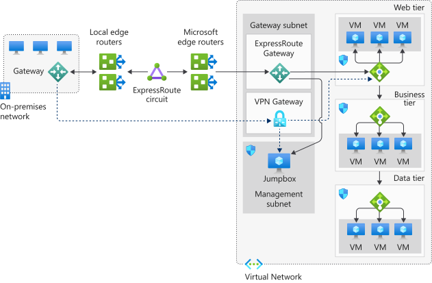

# Hybrid network architecture

Connectivity methods for use cases to balance functionality, cost and security.

## References

- [Connect an on-premises network to Azure](https://docs.microsoft.com/en-us/azure/architecture/reference-architectures/hybrid-networking/)

## Learning objectives

- Integrating on-prem networks with Azire
- Features and limitations
- Use case specific solutions

## On-prem network integration on Azure

### Routing

- outbound routed based on destination IP
- routing table defines how traffic routes
- destination IPs can exist across multiple routing table prefix destinations
- router finds the longest prefix match and routes accordingly

Two routing tables: system and custom.

### System

Azure creates a set of default routing tables for the vnet and each subnet mask within the vnet.

- immutable
- can be overriden with custom route table
- made up of source, address, next-hop type

All traffic that leaves the subnet uses the routing table to find out where is should go next (next hop in the journey).

A next hop defines what happens in the traffic flow next, based on prefix. Types: 

- <b>Virtual network</b> routes according to the IP address in the vnet
- <b>Internet</b> routes to the internet
- <b>None</b> traffic is dropped

### Custom

User defined route tables override the default system table. There are limitations on the number of routing items you can have in a custom table.

| Resource                       | Default or maximum |
|--------------------------------| :----------------: |
| Virtual networks               |              1,000 |
| Subnets per vnet               |              3,000 |
| Vnet peerings per vnet         |                500 |
| Private IP addresses per vnet  |             65,536 |

More options:

- <b>Virtual appliance</b>, usually a VM running a network app such as a firewall
- <b>Virtual network gateway</b>. Must be VPN. Can't be ExpressRoute.
- <b>None</b> drops traffic
- <b>Virtual network</b> overrides the default system routing
- <b>Internet</b>

## Connect Azure VNets

Can use VPNs or ExpressRoute.

### VPNs

Encrypted, over public internet. Suitable for hybrid applications where traffic between on-prem and cloud is likely to be light, or willing to trade latency for flexibility and power of the cloud.

Challenges

- Requires on-prem VPN device
- SLA only covers the VPN gateway not the connection to the gateway

Reference architecture - [Extending an on-prem network using VPN](https://docs.microsoft.com/en-us/azure/architecture/reference-architectures/hybrid-networking/)

- site-to-site
- multisite 
    - requires a dynamic gateway
    - all connections route through and share all available bandwidth
- point-to-site
- network-to-network
    - multisite configuration to establish combined cross-prem connections with inter-vnet connectivity

### ExpressRoute

Reference architecture - [Connect an on-prem network to Azure using ExpressRoute](https://docs.microsoft.com/en-us/azure/architecture/reference-architectures/hybrid-networking/expressroute-vpn-failover)

Direct connection between on-prem network and Azure vnet that doesn't use the internet.

- CloudExchange colocation
- Point-to-point Ethernet connection
- Any-to-any (IPVPN) connection

Peering - connecting vnets across subscriptions and regions. Comms are via the Azure backbone private network.

## Site-to-site VPN gateway reference architecture

## What is a hybrd network architecture?

<i>Hybrid</i> network is a term used when two different network topologies combine to form a single cohesive network. On Azure it represents the merging or combining of an on-prem network with an Azure vnet. 

Reasons to adopt:
- Allows continued use of existing infra while giving you all the benefits of cloud based computing
- Migrate from pure on-prem to pure cloud-based network
- Extend on-prem to cloud

Architectures to considers
- Azure VPN Gateway
- ExpressRoute with VPN failover
- Hub-spoke network topology

### ExpressRoute Resiliency Architecture

Creates a resilient HA network.

VPN failover example, where all the traffic routes through the ExpressRoute private connection. When connectivity is lost on ExpressRoute circuit, the gateway subnet automatically fails over to the site-to-site VPN gateway circuit. Switches back on restoration.

### Hub-spoke topology

- Allows you to structure workloads that are carried out by your servers
- Single vnet as the hub
    - VPN or ExpressRoute
- Spokes are other vnets that are peered with the hub
- Hub is used for shared services

Benefits

- The use of sharing and centralised services on the hub might reduce the need for duplication on the spokes (cost reduction)
- Subscription limits are overcome by peering virtual networks
- Separation of organisational work areas into dedicated spokes, such as SecOps, InfraOps, and DevOps.

