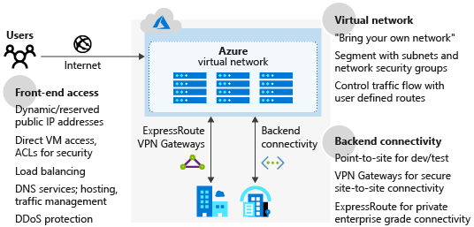
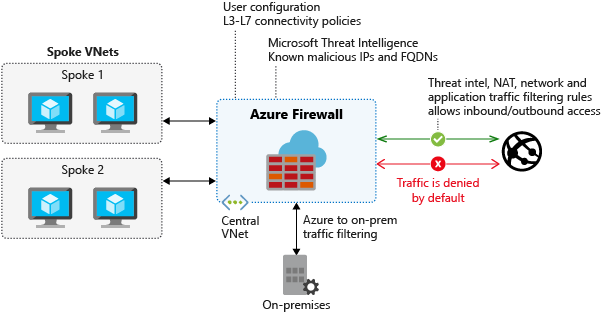

# Centralize core services using hub-spoke Azure virtual network architacture

Azure network architecture that allows for growth and flexibility, secure isolation of critical resources, low addministrative overhead, and communication with on-premises network resources.

## Learning objectives

- Requirements and components for a hib and spoke network in Azure
- Components and limitations for connectivity to on-prem networks
- Secure connectivity in a hub and spoke network

## Hub-spoke network topology

Consists of a centralised architecture (hub) connecting to multiple points (spokes). In Azure, multiple connected vnets.

Provides an efficient way to manage common communication, security requirements, and potential subscription limitations.

Benefits
- Centrally managed connection to on-prem
- Integration of separate working environments into a central location for shared services
- Simpler to implement and maintain in the long term
- Increased business agility by standardising on network connections.
    - Adapt to changing markets by adding a new branch in a different geo.
    - Or a new business channel as spokes
- Liability reduction by maintaining a consistent architecture
    - Business / traffic growth? Add more systems.
- Centralised, deeper, insight into the business
- Single location to share centralised services by multiple workloads.
    - Minimise redundant resources and effort required to manage them.
 

Hub is a vnet that acts as a central location for managing external connectivity and hosting services used by multiple workloads. Coordinates all comms to and from the spokes. Centralised security can inspect, route, and manage traffic. 

Spokes are vnets that host workloads and connect to the hub through peering.

## Architectural components

Hub
- Azure vnet that is the center point for business connectivity
- Shared services in subnets fir sharing with spokes
- Perimeter subnet acts as a security appliance

Spokes
- Azure vnets used to isolate  individual workloads
- Peered to the hub
- Separate subs or resource groups

ExpressRoute on-prem to Azure.

## Plan VNets on Azure

VNet design considerations
- Managing flow, direction, and type of traffic
- <b>Segmentation</b>, isolation of traffic into different subnets or vnets, or subs
- <b>Security</b>, NSGs and NVAs to filter traddic to and from resources in a vnet
- <b>Connectivity</b>, between vnets via peering, or to on-prem via VPNs or ExpressRoute
- <b>Routing</b>, and default routes, custom routes fr directing traffic through NVAs

## Secure hub-spoke network

- Network ACLs to ensure services are accessible to only the users and devices you want
- NSGs and packet filtering firewall to control VNet traffic
- Route control / forced tunneling to define custom routes through the infra and ensure services can't connect to an internet device
- NVAs
- ExpressRoute for a dedicated WAN link to extend your on-prem nets to Azure
- Azure Security Center to prevent, detect, and respond to threats against Azure services.
- Azure Firewall as a network security service

### NSG

Put one on each subnet within the topology. Implement security rules to allow or denu network traffic to and from each resource in the topology.

### Perimeter network

In a dedicated subnet in the hub vnet for routing external traffic. Designed to host NVAs for security functionality such as firewals and packet inspection. Route outbound traffic from the perimeter network so that it is monitored, secured and audited.

### Network virtual appliance

NVAs provide a secure network boundary by checking all inbound and outbound network traffic. Passes only traffic  that passes security rules.

### ExpressRoute

Created a dedicated private WAN link between on-prem resources and Azure gateway subnet in the hub vnet.

## Azure Firewall

Microsoft managed network security service. Protects Azure VNets and their resources by letting you manage and enforce connectivity policies centrally. Uses static, public IPs for vnet resources allowing outside firewalls to identify your traffic.

Fully stateful network firewall that tracks the operating state, and characteristics of network connections traversing it. Enables central control of all network comms through policy enforcement. Policies can be enforced across vnets, regions, and Azure subs. In a hub and spoke, typically provisioned in the hub.

Azure Firewall consists of reviewing the firewall activity logs. Its integrated with Azure Monitor Logs.

- Store in an Azure Storage Account
- Stream to an Event Hub
- Send to Azure Monitor Logs

## NSGs

- Enforce and control network traffic rules
- Control access by permitting or denying comms between workloads in vnets
- Rules based, using five-tuple method
    - Source IP
    - Source port
    - Destination IP
    - Destination port
    - Protocol
- Default rules, which can be overridden
    - Traffic originating from and ending in a vnet is allowed
    - Outbound traffic to internet is allowed, inbound is blocked
    - ALB is allowed to probe the health of VMs or role instances

## Additional security considerations

- <b>Application Security Groups</b> provide central policy and security management for apps. Used to define detailed network security policies by using a moniker. Then you can use a zero trust approach where only specified flows are permitted.
- <b>Azure Network Watcher</b> enables insights into network logging and diags. Give understanding of health and  performance of your Azure networks.
- <b>Virtual network service endpoints</b> extend vnet private address space to make it available to Azure services. The endpoints allow you to restrict access to Azure resources.
- <b>Azure DDoS Protection</b> Allows you to mitigate volumetric, protocol, and resource layer attacks.

