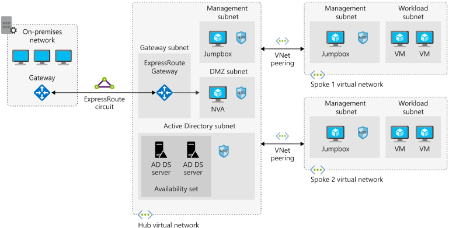
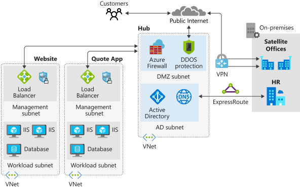

# Centralize core services using hub-spoke Azure virtual network architacture

Azure network architecture that allows for growth and flexibility, secure isolation of critical resources, low addministrative overhead, and communication with on-premises network resources.

## Learning objectives

- Requirements and components for a hib and spoke network in Azure
- Components and limitations for connectivity to on-prem networks
- Secure connectivity in a hub and spoke network

## Hub-spoke network topology

Consists of a centralised architecture (hub) connecting to multiple points (spokes). In Azure, multiple connected vnets.

Provides an efficient way to manage common communication, security requirements, and potential subscription limitations.

Benefits
- Centrally managed connection to on-prem
- Integration of separate working environments into a central location for shared services
- Simpler to implement and maintain in the long term
- Increased business agility by standardising on network connections.
    - Adapt to changing markets by adding a new branch in a different geo.
    - Or a new business channel as spokes
- Liability reduction by maintaining a consistent architecture
    - Business / traffic growth? Add more systems.
- Centralised, deeper, insight into the business
- Single location to share centralised services by multiple workloads.
    - Minimise redundant resources and effort required to manage them.
 

Hub is a vnet that acts as a central location for managing external connectivity and hosting services used by multiple workloads. Coordinates all comms to and from the spokes. Centralised security can inspect, route, and manage traffic. 

Spokes are vnets that host workloads and connect to the hub through peering.

## Architectural components

Hub
- Azure vnet that is the center point for business connectivity
- Shared services in subnets fir sharing with spokes
- Perimeter subnet acts as a security appliance

Spokes
- Azure vnets used to isolate  individual workloads
- Peered to the hub
- Separate subs or resource groups

ExpressRoute on-prem to Azure.

## Plan VNets on Azure

VNet design considerations
- Managing flow, direction, and type of traffic
- <b>Segmentation</b>, isolation of traffic into different subnets or vnets, or subs
- <b>Security</b>, NSGs and NVAs to filter traddic to and from resources in a vnet
- <b>Connectivity</b>, between vnets via peering, or to on-prem via VPNs or ExpressRoute
- <b>Routing</b>, and default routes, custom routes fr directing traffic through NVAs

 
