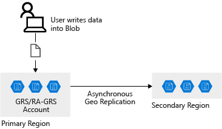
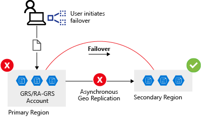
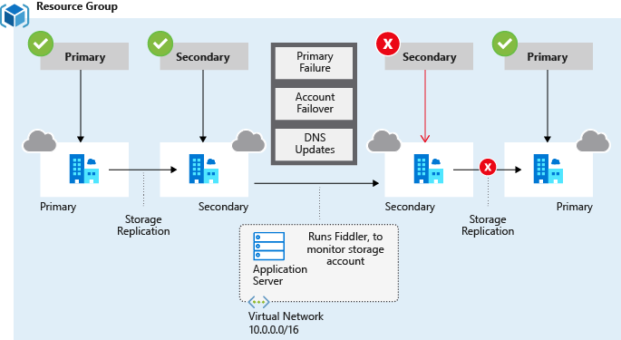
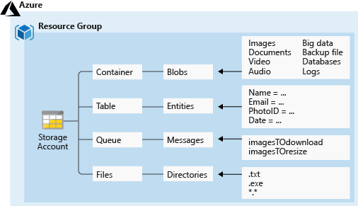

# Make your app storage highly available with read-access geo-redundant storage

Geo-redundant storage ensures high-availability by storing synced copies of the data in two or more Azure regions. If the connection to one Azure region fails, fail over to another region and still access the data.


## Learning objectives

- Key features of RA-GRS
- Design considerations for using RA-GRS
- Application Circuit Breaker pattern


## Data redundancy

Replication options:

- Locally redundant storage (LRS)
    - three copies, across fault-domains
    - single datacenter
    - one region
    - not tolerant to datacenter outage
    - least expensive, least durable option
- Zone-redundant storage (ZRS)
    - three storage clusters in a region
    - each cluster physically separated from the other two (different hardware)
    - replicated to two/three availability zones
    - not tolerant to regional outage
- Geographically redundant storage (GRS)
    - three times in primary region, then replicated to secondary
    - highest level of durability (six copies, across datacenters and regions)
    - secondary is automatically paired to the primary (can't be changed)
    - can't access secondary until primary fails over
        - MS controlled DNS repointing process
        - RA-GRS if you can't accept this
    - lots of nines 99.9999999999999999
- Read-access geo-redundant storage (RA-GRS)
    - Read access on the secondary
    - Requires app-awareness of the secondary ("-secondary" in the address)
    - Preview feature allows self-service failover initiation on the portal
- Geo-zone redundant storage (GZRS)
    - Combines HA of ZRS with GRS
    - three copies in primary
    - three copies in secondary
    - regions paired
    - always tolerant to regional level outage
- Read-access geo-zone-redundant storage (RA-GZRS)
    - like GRS, plus read on the secondary
    - read on secondary even when primary online 


## HA apps and DR

### Failover

With GRS/RA-GRS app writes to the primary.



When it fails...
- secondary is new primary
- DNS records repoint to new primary
- no changes at the app level



Preview feature coming (only in WestUS2 and CentralUS currently)

```sh
az storage account failover --name "storageaccountname"
```

### Failover implications

- Data loss is possible because of the replication lag
- You can check the <b>Last Sync Time</b> to see if it likley

i.e.

```sh
az storage account show \
⦙   --name $STORAGEACCT \
⦙   --expand geoReplicationStats \
⦙   --query "[primaryEndpoints, secondaryEndpoints, geoReplicationStats]"

[
  ...
  {
    "canFailover": true,
    "lastSyncTime": "2021-03-06T11:20:24+00:00",
    "status": "Live"
  }
]
```

### Resilient app design

- <b>Resiliency</b>, recovery from failure and continue to function, avoiding downtime and data loss.
- <b>High availability</b>, function in a healthy state in the event of a fault (hardware/server/network etc)
- <b>Disaster recovery</b>, recoverability in a major incident affecting services hosting the app (datacenter/regional outage)
    - Azure Site Recovery
    - Fail over servers between Azure regions or Azure backups
    - App restoration from backup
- <b>Eventual consistency</b>, RA-GRS is replicating data with a lag, so secondary could be stale until the replication occurs.


### Design guidelines

- Retry transient failures
    - Its the cloud, everything is distributed (network loss, latency issues, systems down, etc)
    - Detect issues are transient or more severe
    - [Retry Pattern](https://docs.microsoft.com/en-us/azure/architecture/patterns/retry)
    - [Circuit Breaker Pattern](https://docs.microsoft.com/en-us/azure/architecture/patterns/circuit-breaker)
- Handle failed writes
    - RA-GRS replicates writes
    - secondary is read-only
    - options are
        - return an error
        - buffer write ops
        - fail writes over to a different account in another location
        - disable write ops and run in read-only mode
    - Azure Storage client library supports [LocationMode](https://docs.microsoft.com/en-us/dotnet/api/microsoft.azure.storage.retrypolicies.locationmode?view=azure-dotnet-legacy)
- Handleeventual consistency
    - app level handling of stale data





## Example

Create storage account, configure for RA-GRS.



```sh
# Create the storage account
STORAGEACCT=$(az storage account create \
        --resource-group $RG \
        --name healthcareapp$RANDOM \
        --sku Standard_RAGRS \
        --output tsv \
        --query "name")
echo $STORAGEACCT

# Check replication
az storage account show \
        --name $STORAGEACCT \
        --query "[statusOfPrimary, statusOfSecondary]"

[
  "available",
  "available"
]

# View the status of primary and secondary
az storage account show \
        --name $STORAGEACCT \
        --expand geoReplicationStats \
        --query "[primaryEndpoints, secondaryEndpoints, geoReplicationStats]"

# Status + sync times...
[
  {
    "blob": "https://healthcareapp516.blob.core.windows.net/",
    "dfs": "https://healthcareapp516.dfs.core.windows.net/",
    "file": "https://healthcareapp516.file.core.windows.net/",
    "internetEndpoints": null,
    "microsoftEndpoints": null,
    "queue": "https://healthcareapp516.queue.core.windows.net/",
    "table": "https://healthcareapp516.table.core.windows.net/",
    "web": "https://healthcareapp516.z22.web.core.windows.net/"
  },
  {
    "blob": "https://healthcareapp516-secondary.blob.core.windows.net/",
    "dfs": "https://healthcareapp516-secondary.dfs.core.windows.net/",
    "file": null,
    "internetEndpoints": null,
    "microsoftEndpoints": null,
    "queue": "https://healthcareapp516-secondary.queue.core.windows.net/",
    "table": "https://healthcareapp516-secondary.table.core.windows.net/",
    "web": "https://healthcareapp516-secondary.z22.web.core.windows.net/"
  },
  {
    "canFailover": true,
    "lastSyncTime": "2021-03-06T11:20:24+00:00",
    "status": "Live"
  }
]
```

healthcareapp516


