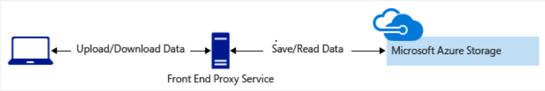

# Secure Azure Storage account

Azure Storage provides multilayered security to protect data. Access keys, secure networks, Advanced Threat Protection for proactive monitoring.

## Learning objectives

- How Azure Storage protects your data
- Authentication options
- Advanced Threat Protection
- Network access control
- Azure Data Lake enterprise-class security features

## Azure Storage security features

- protect data at rest
    - automatic Storage Service Encryption, 256-bit AES cipher [FIPS 140-2](https://en.wikipedia.org/wiki/FIPS_140-2) compliant
    - VHD Azure Disk Encryption
        - BitLocker for windows images
        - dm-crypt for linux
    - automatically uses Key Vault
- protect data in transit
    - Always enforce secure transfer on storage accounts
- cross-domain access
    - CORS uses HTTP headers
    - ensures only authorised content is loaded from authorised sources
- access control
    - RBAC
    - AAD and RBAC for resource management and data ops
    - Security principals assignment of scoped RBAC roles
    - AAD is supported on data ops on Blob and Queue
- auditing
    - built-in Storage Analytics service
    - logs every op in real time

## Storage account keys

Best approach - Storage accounts can create authorized app in AD to control access to data in blobs and queues.

Other models
- <i>storage account key</i> shared-key (shared-secret)
    - easy to use
    - HTTP Auth header
    - Blobs, Queues, Tables, Files
    - <b>gives access to everything in the account!</b>
    - use only with trusted inhouse apps
    - regen key periodically

## Shared access signatures (SAS)
- for untrusted apps
- use to delegate access to storage objects and specify constraints
    - permissions
    - time range of access
- types
    - <i>service-level</i> SAS for access to specific resources
    - <i>account-level</i> SAS for anything service-level + additional resources and abilities (eg. create file systems)

### Front-end proxy pattern

- clients upload/download through a proxy service which auths
    - allows validation / business rules
    - can be a bottleneck in high volume scenarios

- lightweight service direct access
    - auths the client
    - generates a SAS
    - direct access to the storage account

## Control network access to storage account

Storage accounts accept connections from any network by default. To limit access you must change the default action.

Restrict by
- IP address
- IP range
- VNets

## Advanced Threat Protection

Azure Defender for Storage provides an extra layer of security intelligence that detects unusual and potentially harmful attempts to access or exploit storage accounts. Triggers alerts when anomalies occur. 

Supports
- Blob
- Files
- Data Lake Gen2

