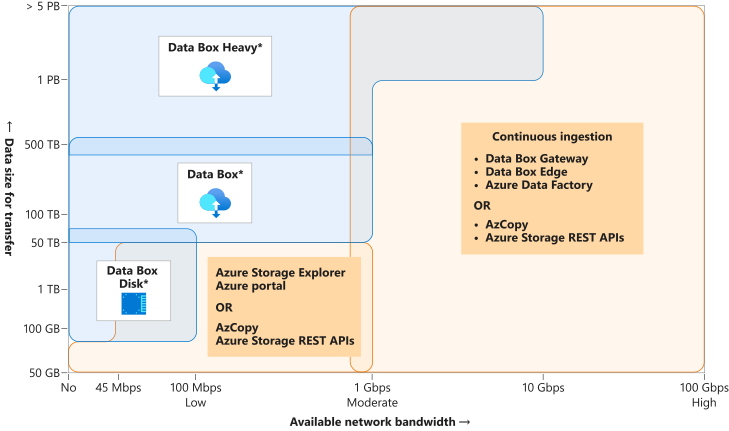

# Store and share files in your app with Azure Files


Cloud based file share for storing and sharing files. Accessible from apps hosted on Azure App Service, VM or on-prem, for secure and resilient file access.


## Learning objectives

- Azure Files use cases
- Configure for use on a server
- Secure Azure Files


## Plan Azure Files deployment

How are you going to access and update the files?
- Replace existing SMB shares with Azure Files equiv.
- Instance of Azure File Sync (more flexible)


## What is Azure Files?


Standard file share, hosted on Azure, supporting SMB. Mount or connect to it at the same time on all the main OSs. Can add to or replace a company's existing on-prem NAS devices or file shares.

- Devs can store apps and config in a file share and connect new VMs to the shared files, reducing time to get a new machine to production.
- Cloud apps telemetry to File share
- Company doesn't need to own an on-prem solution
- Can be automated
- Inherits from the Azure platform (global redundancy, backups, recovery services)
- Secure in transit and rest
- Cross platform


Flexibility of moving data and processing into the cloud, and benefit from scalability, security, cost savings.


## Data access method

- Direct via mounted drive on the OS
- Windows server with Azure File Sync


## Redundancy

- <b>Standard performance</b> double digit ms latency, 10,000 IOPS, 300-MBps bandwidth
    - HDD
    - lower costs
    - lower perf
- <b>Premium performance</b> single digit ms latency, 100,000 IOPS, 5-GBps bandwidth
    - SSD arrays
    - higher costs
    - higher perf
    - ZRS limited regions


|                                                                |LRS|ZRS|GRS/GZRS|
|--                                                              |:--|:--|:--     |
|You can easily re-create data, and cost is a priority.          |✔  |   |        |		
|Data must be stored in a single known location.                 |✔  |   |        |		
|Premium performance is required.                                |✔  |✔  |        |
|Data needs to be highly available, and redundancy is a priority.|   |✔  |✔       |
|99.999999999% (11 nines) durability.                            |✔  |   |        |
|99.9999999999% (12 nines) durability.                           |   |✔  |        |
|99.99999999999999% (16 nines) durability.                       |   |   |✔       |


## Data migration



|Utility	        |Description|
|-------------------|-----------|
|AzCopy             |Command-line tool that offers the best performance, especially for a low volume of small files.|
|Robocopy	        |Command-line tool shipped with Windows and Windows Server. AzCopy is written to be Azure aware and performs better.|
|Azure Storage      |Explorer	Graphical file management utility that runs on Windows, Linux, and macOS.|
|Azure portal	    |Use the portal to import files and folders.|
|Azure File Sync	|Can be used to do the initial data transfer, and then uninstalled after the data is transferred.|
|Azure Data Box	    |If you have up to 35 TB of data and you need it imported in less than a week.|


## Creating and connecting to Azure Files share

Two steps
- create a storage account
- create file shares

```sh
export STORAGEACCT=afileshare$RANDOM

az storage account create \
    --name $STORAGEACCT \
    --resource-group $RG \
    --sku Standard_GRS

STORAGEKEY=$(az storage account keys list \
    --resource-group $RG \
    --account-name $STORAGEACCT \
    --query "[0].value" | tr -d '"')

az storage share create \
    --account-name $STORAGEACCT \
    --account-key $STORAGEKEY \
    --name "reports"

az storage share create \
    --account-name $STORAGEACCT \
    --account-key $STORAGEKEY \
    --name "data"
```

Azure Files supports mounting from SMB V3.0. SMB V1.0 has known vulnerabilities. Remove V1.0 to reduce to risk of SMB-based attack.


