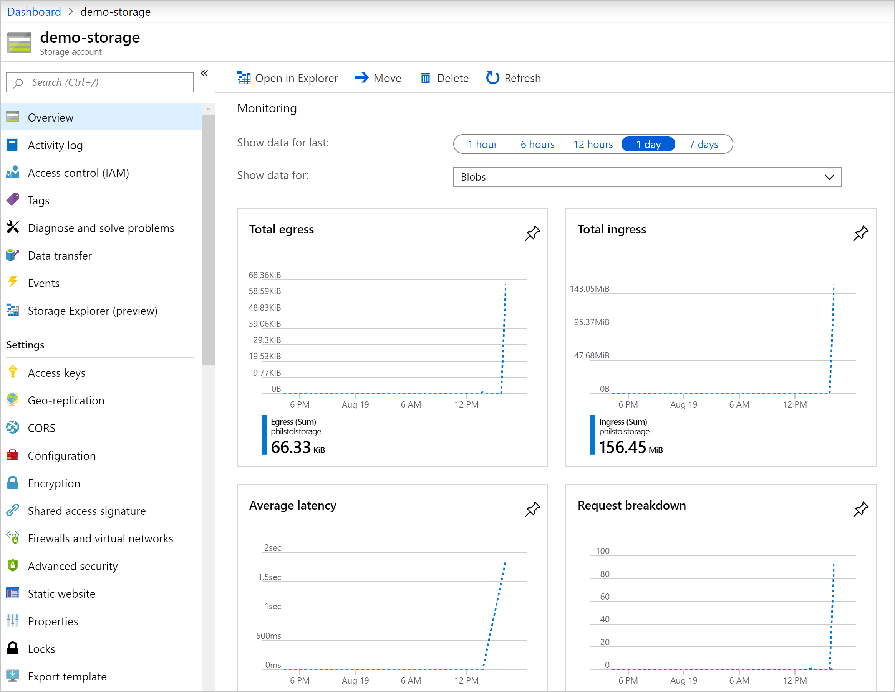
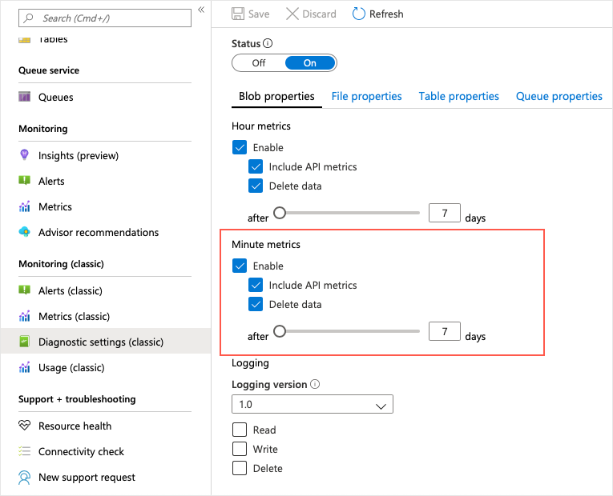
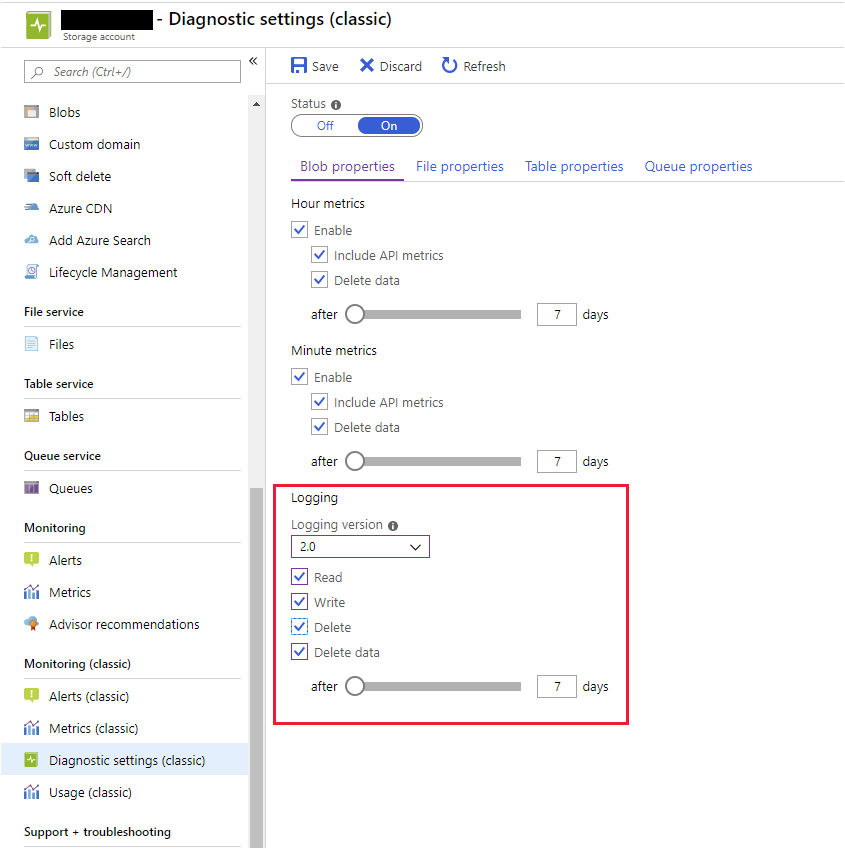

# Monitor, diagnose, and troubleshoot your Azure storage

Cloud apps and systems are likely distributed across services which complicates the diagnosing and troubleshooting of issues. To support apps and systems successfully, monitoring and understanding diagnosis through tools and logging can be used to identify issues.

## Learning objectives

- Tools available to detect and troubleshoot issue with Azure storage
- Metrics and logs for troubleshooting and diagnosing storage performance
- Troubleshoot storage performance in Azure storage


## Tools

### Azure portal

Near real time GUI view to monitor storage performance.

- Configure metrics and logging
- View graphs and charts, and select metrics to visualise
- Assess metrics over time
- Alert notification when behavior diverges from baseline




### Azure Storage Explorer

View of $Metrics tables and $logs container through Storage Explorer.


### AzCopy

Utility used to download storage account logs for analysis. Doesn't support storage tables (i.e. $Metrics).


## Storage Analytics metrics

Azure storage metrics allow analysis of usage trends and diagnosis of possible issues.
- Transactional metrics for storage and capacity metrics for blob storage
- Aggregated view of work requested by apps in the storage account
- Request level detail via storage logging


### Transactional metrics

Storage ops are transactional. Metrics summarise information about ops and is useful if errors occur because of storage availability.

- request types (read/write/delete) and op success or failure.
- Ingress/egress
- Storage availability
- Transactional information for blob, file, queue table, storage API calls

Service level ops aggregated hourly. API ops level stats recorded on invokation of an op.


### Capacity metrics

Available for blob storage. Sent to analytics service hourly, aggregated stats updated daily.

- <b>Capacity</b> records the sum total of the storage occupied by the blobs in the storage account
- <b>Container count</b> shows how many containers have been created across blob storage in the storage account
- <b>Object count</b> displays the total number of blobs created across all containers


## Capture Storage Analytics metrics

Metrics are stored in tables in the storage account.
 
- $MetricsHourPrimaryTransactionsBlob
- $MetricsHourSecondaryTransactionsBlob
- $MetricsHourPrimaryTransactionsTable
- $MetricsHourSecondaryTransactionsTable
- $MetricsCapacityBlob

Capture is automatically enabled when you create a new storage account. Disable or set retention in the Diagnostics setting blade.

```sh
az storage metrics update \
    --hour true \
    --api true \
    --services b \
    --retention 7 \
    --connection-string <storage account connection string>
```

Aggregations are by the hour. Can be broken down by minute for more detailed analysis. 

```sh
az storage metrics update \
    --minute true \
    --api true \
    --services b \
    --retention 7 \
    --connection-string <storage account connection string>
```

This creates more tables

- $MetricsMinutePrimaryTransactionsBlob
- $MetricsMinuteSecondaryTransactionsBlob
- etc...

API metrics provide aggregated data for each API for each hour or minute which provides good insight into why the performance of the app might be suffering:

- success and failure rate
- failure reason (timeouts, throttling, network errors, authorisation etc)


## Metrics Example

```sh
STORAGEACCT=$(az storage account create \
        --resource-group $RG \
        --name demo0sa0$RANDOM \
        --sku Standard_RAGRS \
        --output tsv \
        --query "name")
echo $STORAGEACCT
```

Enable minute-level metrics:

```sh
PS /home/andrew> $context = New-AzureStorageContext -StorageAccountName demo0sa011077 -StorageAccountKey <storage-key>


PS /home/andrew> Set-AzureStorageServiceMetricsProperty -Context $context -ServiceType Blob -MetricsType Minute -MetricsLevel ServiceAndApi -PassThru -RetentionDays 7

Version              MetricsLevel                   RetentionDays
-------              ------------                   -------------
1.0                  ServiceAndApi                  7


PS /home/andrew> Get-AzureStorageServiceProperty -Context $context -ServiceType Blob

Logging.Version                     : 1.0
Logging.LoggingOperations           : None
Logging.RetentionDays               :
HourMetrics.Version                 : 1.0
HourMetrics.MetricsLevel            : ServiceAndApi
HourMetrics.RetentionDays           : 7
MinuteMetrics.Version               : 1.0
MinuteMetrics.MetricsLevel          : ServiceAndApi
MinuteMetrics.RetentionDays         : 7
DeleteRetentionPolicy.Enabled       : False
DeleteRetentionPolicy.RetentionDays :
StaticWebsite.Enabled               : False
StaticWebsite.IndexDocument         :
StaticWebsite.ErrorDocument404Path  :
Cors                                :
DefaultServiceVersion               :

```




## Storage Analytics logging

- records each op performed in the storage account and the outcome of the op
- request level detail
- logged on <i>best effort</i> basis
- means of examining the workload for the storage account
- records authenticated and anonymous requests
    - successful
    - failed (timeout, throttled, network, authorization etc)
    - SAS / OAuth requests
- written to blobs in the $logs blob container
- not enabled by default

Turn it on in the portal...




Turn it on in PowerShell...

```sh
$context = New-AzureStorageContext -StorageAccountName <storage account name> -StorageAccountKey <storage account key>

Set-AzureStorageServiceLoggingProperty -Context $context -ServiceType Blob -LoggingOperations read,write,delete -RetentionDays 7
```

CLI...

```sh
az storage logging update \
    --log rwd \
    --services b \
    --retention 7 \
    --version 2 \
    --connection-string <storage account connection string>
```


