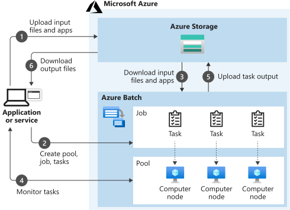
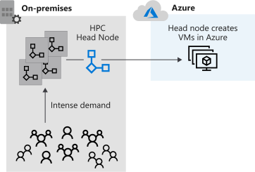

# Introduction to high-performance computing (HPC) on Azure

Services available for high-performance computing on Azure.

- HPC and batch solutions available on Azure
- Scenarios where HPC and batch technologies fit

## Azure Batch

Bstch processessing and HPC choices on Azure

- Azure Batch
- Azure VM HPC Instances
- Microsoft HPC Pack

Not mutually exclusive, they build on one another.

### HPC

Enables you to perform HPC tasks in the cloud without building your own expensive HPC hardware. Dynamically add or remove resources as they are needed.

### Batch

Flexible management and scheduling service layer on top of the huge scale of Azure.

- Service for working with large-scale parallel and computationally intensive tasks
- Managed service
- Windows or Linux
- Autoscaling
- Batch handles compute provisioning / capacity
- Optimises parallel processing
- Pay for the compute used
- Suited for heavy workloads, [<i>embarrassingly parallel</i>](https://en.wikipedia.org/wiki/Embarrassingly_parallel) workloads 

Components include 

- Azure Batch Account, a container for all the batch elements
- Batch pools of VMs (windows or linux nodes)
- Batch jobs, logical containers configurable for real unit of work known as Batch tasks

 

### VM HPC instances

- HB-series VMs, memory optimised
- HC-series VMs, dense computation optimised
- Remote Direct Memory Access (RDMA)
    - enables direct memory access between system 
    - without OS involvement
    - InfiniBand network connections enable high-speed access
- Message Passing Interface (MPI)
    - protocol for comms between computers running complex HPC parallel
    - large boost to perf
    - need to select the correct tier that supports this
- InfiniBand interconnects
    - a data interconnect hardware standard for HPC
    - accelerates comms
    - highest speeds / lowest latencies between CPU and storage

HC and HB use 100 GB/sec Mellanox EDR InfiniBand interconnect in a non-blocking tree config.

- N-series VMs, NVidia GPUs
- NC-series VMs, Tesla K80 GPU (low cost) + CUDA
- ND-series VMs, Tesla P40 GPU, AI optimised

## HPC Pack

- More flexible control of HP infra
- Manage cloud and on-prem VMs
- A version of the Batch management and scheduling control layer over which you have full control and responsibility.

