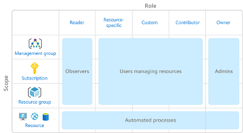

# Build a cloud governance strategy on Azure

Build comprehensive cloud governance strategy with access policies, resource locks, and tags, as well as Azure Policy and Azure Blueprints.

The term <i>governance</i> describes the general process of establishing rules and policies and ensuring that those rules and policies are enforced.

Good governance strategy helps you maintain control over applications and resources that you manage in the cloud. Maintaining control over an environment ensures that you stay compliant with:

- Industry standards like PCI DSS
- Corporate or organisational standards, such as ensuring that network data is encrypted

Most beneficial when:

- Multiple engineering teams working in Azure
- Multiple subscriptions to manage
- Regulatory requirements that must be enforced
- Standards that must be followed for all cloud resources

# [Cloud Adoption Framework for Azure](https://docs.microsoft.com/en-us/azure/cloud-adoption-framework/)

- Proven guidance to help with cloud adoption journey
- Create and implement the business and technology strategies needed to succeed in the cloud

## What's in the Cloud Adoption Framework?

Consists of tools, documentation, and proven practices. 

1. Define your strategy
2. Make a plan
3. Ready your organisation
4. Adopt the cloud
5. Govern and manage your cloud environments

## Define your Strategy

- Why are you moving to the cloud?
- What you want to get out of cloud migration
    - Scale to meet demand?
    - Reach new markets?
    - Reduce costs?
    - Increase business agility?

Steps of this stage:

1. Define and document motivations. Meeting with stakeholders and leadership can help answer why you're moving to the cloud.
2. Document business outcomes.
3. Develop a business case. Validate that moving to the cloud gives you the right return on investment (ROI) for the efforts.
4. Choose the right first project. Project that is achievable and shows progress toward cloud migration goals.

## Make a plan

- Build a plan that maps your aspirational goals to specific actions.
- Ensures efforts map to the desired business outcomes.

Steps of this stage:

1. <b>Digital estage</b>: Create an inventory of the existing digital assets and workloads that you plan to migrate to the cloud.
2. <b>Initial organisational alignment</b>: Ensure that the right people are involved in migration efforts, both from a technical standpoint as well as from a cloud governance standpoint.
3. <b>Skills readiness plan</b>: Build a plan that helps individuals build the skills they need to operate in the cloud.
4. <b>Cloud adoption plan</b>: Build a comprehensive plan that brings together the development, ops, and business teams toward a shared cloud adoption goal.

## Ready the org

Create a <i>landing zone</i>, or an environment in the cloud to begin hosting workloads.

Steps of this stage:

1. <b>Azure setup guide</b>: Review the Azure setup guide to become familiar with the tools and aproaches needed to create a landing zone.
2. <b>Azure landing zone</b>: Begin to build out the Azure subscriptions that support each of the major areas of the business. A landing zone includes cloud infrastructure as well as governance, accounting, and security capabilities.
3. <b>Expand the landing zone</b>: Refine your landing zone to ensure that it meets your operations, governance, and security needs.
4. <b>Best practices</b>: Start with recommended and proven practices to help ensure that your cloud migration efforts are scalable and maintainable.

## Adopt the cloud

Begin to migrate apps to the cloud. Potentially find ways to modernise apps and build innovative solutions that use cloud services. Two stage process, <b>Migrate</b> and <b>Innovate</b>.

Migrate:

1. <b>Migrate first workload</b>: Use Azure migration guide to deploy the first project to the cloud.
2. <b>Migration scenarios</b>: Use additional in-depth guides to explore more complex migration scenarios.
3. <b>Best practices</b>: Reference Azure cloud migration best practices checklist to verify that you're following recommended practices.
4. <b>Process improvements</b>: Identify ways to make the migration process scale while requiring less effort.

Innovate:

1. <b>Business value consensus</b>: Verify that investments in new innovations add value to the business and meet customer needs.
2. <b>Azure innovation guide</b>: Use this guide to accelerate development and build a minimum viable product (MVP) for your idea.
3. <b>Best practices</b>: Verify that progress maps to recommended practices before moving forward.
4. <b>Feedback loops</b>: Check in frequently with customers to verify that you're building what you need.

## Govern and manage cloud environments

Begin to form cloud governance and management strategies. Create resilient solutions that are constantly optimised.

Govern:

1. <b>Methodology</b>: Define a methodology that incrementally takes your from first steps all the way to full cloud governance.
2. <b>Benchmark</b>: Use [governance benchmark tool](https://cafbaseline.com) to assess current state and future state to stablish vision for applying the framework.
3. <b>Initial governance foundation</b>: Create an MVP that captures the first steps of the governance plan.
4. <b>Improve the initial governance foundation</b>: Iteratively add governance controls that address tangible risks as your progress toward your end state solution.

Manage:

1. <b>Establish a management baseline</b>: Define minimum commitment to ops management. Minimum set of tools and processes that should be applied to every asset in an environment.
2. <b>Define business commitments</b>: Document supported workloads to establish operational commitments with the business and agree on cloud management investments for each workload.
3. <b>Expand the management baseline></b>: Apply recommended best practices to iterate on your initial management baseline.
4. Advanced operations and design principles: For workloads that require higher levels of business commitment, perform a deeper architecture review to deliver your resiliency and reliability commitments.

# Subscription governance strategy

Organising structure for resources in Azure has four levels:

- management groups
- subscriptions
- resource groups
- resources

At the beginning of any cloud governance implementation, you identify a cloud org structure that meets business needs. Often involves forming a cloud CoE team (aka <i>cloud enablement team</i> or a <i>cloud custodian team</i>). This team is empowered to implement governance practices from a centralised location for the entire org.

Often:
- start at the sub level
- billing, access control, sub limits

## Billing

Either:
- one billing report per sub
- department chargeback model (one sub per department/project, or resource tags?)

## Access Control

- sub is a deployment boundary
- sub / AAD relationship
- granular RBAC

## Sub limits

- resource limits at the sub (i.e. express route circuit max = 10 per sub)
- consider at design phase
- hard limits have no flexibility and would result in new subs required

# RBAC

Applied to a scope, which is resource or set of resources that this access applies to.

- A management group (collection of multiple subs)
- A single sub
- A resource group
- A single resource

# Blueprints

Status is Preview at March 2021. [What's the future](https://stackoverflow.com/questions/65221387/anyone-know-the-future-of-azure-blueprints), is it going GA? Seems efforts are going towards [Template Specs](https://docs.microsoft.com/en-gb/azure/azure-resource-manager/templates/template-specs?tabs=azure-powershell) and [Bicep](https://github.com/azure/bicep#what-is-bicep), a Domain Specific Language (DSL) for deploying Azure resources declaratively.

So Blueprints is dead, look at <b>Template specs</b>.

[Azure Blueprints](https://azure.microsoft.com/services/blueprints) provide templates for quick, repeatable creation of fully governed cloud subscriptions. These simplify largescale Azure deployments by packaging key environment artifacts, such as ARM templates, RBAC and policies, in a single blueprint definition which can be applied to new subscriptions and environments, then fine-tuned through versioning.

Whys it better than ARM? - ARM is great for declaritively specifying that you want a resource, or small group of resources to exist in a centain way, but breaks down when you compose large environments and becomes a monolith which is hard to manage and debug. This often causes pain and results in teams moving to custom scripted orchestration system so you can keep ARM templates small but have something to tie it all together. <b>Blueprints</b> allows you to package ARM templates, Policies, RBAC assignment, into a native Azure offering which you can manage and version over time. Blueprints doesn't replace ARM, it encapsulates ARM and combines with other things.

Blueprints can be used to stamp out environments using an Azure native service.

- Set of JSON files that can be versioned in source control
- Parameterised templates
- Managable in Portal and in code

