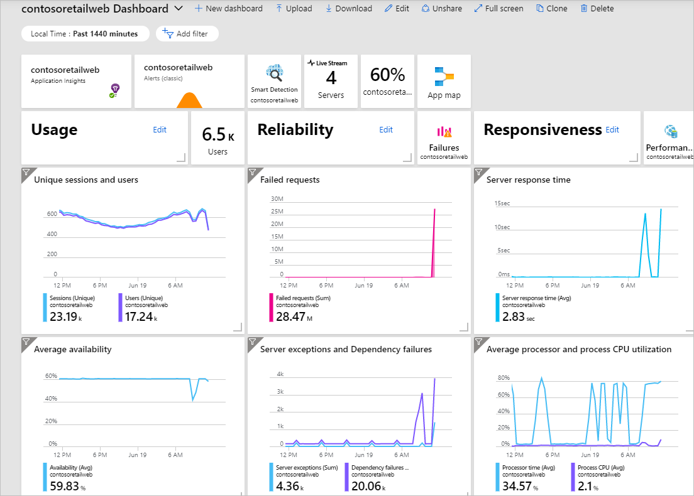
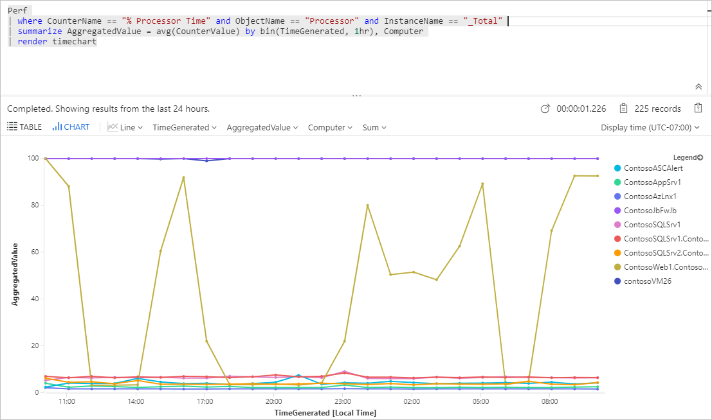
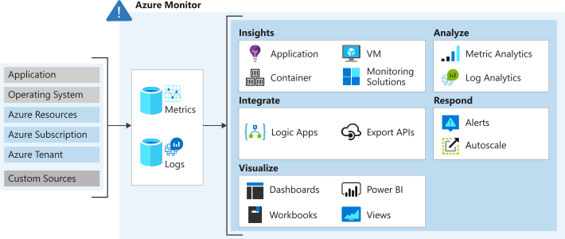
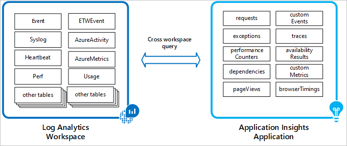

# Design a holistic monitoring strategy on Azure

Use monitoring services on Azure to bring operational excellence to applications and infrastructure.

Tools in Azure can be used to continuously monitor apps and infrastructure.
- System failures / issues
- Extended delays in resolving issues
- Affects customer ability to access account / influences satisfaction

Design a monitoring strategy that encompasses all the solutions. Give insights and alerting into the accumulated log data. Quickly identify and minimise the impact of system failures.

Reputation of an org depends on the reliability and security of its systems. Critical to monitor systems closely to identify problems or attacks before they can affect users.

## Learning objectives

- Select appropriate monitoring solution based on use case
- Integrate monitoring solutions to create a unified monitoring strategy

## Continuous monitoring in Azure

Apps and infra face different kinds of issues such as:
- Security risks
- Fluctuating usage rates
- Errors and exceptions

Response must be appropriate to the kind of issue. Responses could be security patches, adding new features, configuration changes an application code or infra updates.

Monitor for:
- Performance of infra and apps
- Security risks and suspicious activity

Collect / analyze / respond

### App monitoring

- Improve application health and build better apps in the future
- Alerts and automated responses will help deal with issues that affect your application
- Monitoring at pre-release prevents errors and exceptions later in production
    - Pre-prod env monitoring
    - CI/CD pipeline checks
- Monitoring for live issues identify problems and risk promptly

### Infra monitoring

Issues can impact productivity, cause financial loss or reputational damage.

- Performance issues
- Unavailable infra
- Threats to security

Alerts can be configured on infrastructure to monitor for various issues that arise in a timely and effective way. Examples:

- Risks to security of infra 
    - suspicious user accounts
    - malicious IP addresses
- Availability and health of infrastructure

Results in a process - receive notification, take appropriate action.

Automate responses with playbooks and webhooks.

Gather data for analysis across an entire infra and analyse using charts to help make decisions.

## Azure Monitoring options

### Security Center

- Manages the security of your infra from centralised location
- Monitor workload security on-prem and in cloud
- Recommends remediations
- Natively integrated with Azure services (PaaS/SQL Database)
- IaaS automatic provisioning
    - creates an agent on each VM as its created
    - automatically collects data from the machine

### Application Insights

- Monitor and manage performance of apps
- Automatically gather information related to perf, errors, and exceptions in apps
- Diagnose root cause
- Usage analysis to understand how users are using the app
- CI/CD continuous monitoring

### Azure Monitor

Service to collect, combine, and analyse data from different sources.

- Accesses App Insights workspace
- Centralises monitoring and analysis of health and performance of all apps
- Security Center relies on Monitor
    - collects security related data from VMS and resources
    - stores in workspace accessible from Monitor

### Azure Sentinel

- Proactively hunt for threats and anomalies and respond using automation and orchestration.
- Connect sources to Sentinel 
    - Office 365
    - Advanced Threat Protection
    - AWS CloudTrail
    - on-prem sources
- Group and combine related alerts
- Reduce noise generated by data scale
- Automate alert response through playbooks / Azure Logic Apps
- Hunting queries look for threats across the enterprise before they are raised
- Security researchers maintain built-in hunting queries

## Azure Security Center

- Address risks and threats to your infra
- Doesn't require in-house skills and capital needed to secure complex infra
- Supports on-prem and cloud

Gives detailed analysis of:
- Data security
- Network security
- Identity and access
- App security

Helps understand security of the architecture, and recommends how to address issues to improve security and compliance.

### Threat protection

- Access and app controls help protect resources
- Block suspicious activity
- Respond to threats through playbooks

## Analyse web apps using Azure App Insights

- Analyse and address issues and problems that affect ap health
- Imporve apps development lifecycle
- Analyse user activities to help understand them better

Automatically gathers data about app runtime which you view in a dashboard.

### Continuous monitoring

- Alert for failures and unavailability of apps
- Availability tests

## Unified Monitoring Solutions

Spans apps, infra, security. 

- Single solution to collect, analyse, and act on log data from cloud / on-prem
- Uses App Insights to store collected data in workspaces for Azure Monitor
- Use Monitor Log Analytics to interactively query the data

Benefits of Azure Monitor include:

- Centralised and combined metrics and log data from different sources
- Run a single query over the logs collected
- Analyse log data from multiple sources to get unified view
- Minimal configuration to get started
- Integrates with Security Center

Query logs
- Kusto query language (KQL)
- Cross-resource query to analyse log data from other sources

