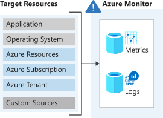

# Improve incident response with alerting on Azure

Respond to incidents and activities in your infrastructure through alerting capabilities in Azure Monitor.

- Alert on events in Azure resources based on metrics, log events, and Activity log events
- Smart groups to identify and group related alerts to reduce alert noise


## Azure Monitor Alert types

The resource defines which data types are available:
- <b>metric</b>, numerical time-sensitive values representing some aspect of the target resource
- <b>log</b>, querying of contentdata held in structured record-based log files
- both metric and log



Three types of signal alerts:
- <b>Metric</b> alert notify when a specified threshold is exceeded
- <b>Activity log</b> alert notify when Azure resources change state
- <b>Log</b> alert based on log file entries

All alerts are a product of a rule. Some rules are built in to the Azure platform. Use alert rules to create custom alerts. Composition is always the same:

- <b>RESOURCE</b>
    - the target resource to be used for the alert rule
    - support multiple
- <b>CONDITION</b>
    - the signal type to be used to access the rule. Metrics, activity log, or logs
    - alert logic applied to the data that;s supplied to the signal type
- <b>ACTIONS</b>
    - Send email, SMS, or webhook
- <b>ALERT DETAILS</b>
    - name, description
    - level


### Scope of alert rules

Report across most Azure services with Azure Monitor Pipeline. Create alert rules for:

- Metric values
- Log search queries
- Activity log events
- Health of the underlying Azure platform
- Tests for website availability


## Metric alerts

Use metric alerts to alert on performance issues in Azure environment.

Monitor resource thresholds through regular threshold monitoring for a number of target resources and instances.  Catches potential issues before they affect customers. Ex. CPU crital 90%, ping an alert.

### Composition

Metric alerts require the condition type, static or dynamic. Define the statistical analysis to be used with either static or dynamic.

Static:
- based on static conditions and thresholds you define
- specify threshold you use to trigger the alert
- Ex. CPU 85%, check it every 2 mins over 10 mins and assess if above threshold.

Dynamic:
- machine learning enabled
- automaticaly imporve the accuracy of thresholds defined by the initial rule
- No hard threshold. Requires two additional parameters:
    - <i>look-back period</i> defines how many previous periods need to be evaluated
    - <i>number of violations</i> defines how many times logic condition has to deviate from expected behaviour before the alert rule fires.


### Dimensions

Monitoring data supplied from multiple target instances.
- define one metric alert rule
- apply to multiple related instances
- monitor CPU across all servers running the app
- receive individual notification for each server instance


### Exercise

Use metric alerts to alert on performance issues in an Azure environment.

Create a config script to stress the resource...

```sh
cat <<EOF > cloud-init.txt
#cloud-config
package_upgrade: true
packages:
- stress
runcmd:
- sudo stress --cpu 1
EOF
```

Create a VM

```sh
az vm create \
    --resource-group $RG \
    --name vm1 \
    --image UbuntuLTS \
    --custom-data cloud-init.txt \
    --generate-ssh-keys
```

Create metric alert

```sh
VMID=$(az vm show \
    --resource-group $RG \
    --name vm1 \
    --query id \
    --output tsv)

az monitor metrics alert create \
    -n "Cpu80PercentAlert" \
    --resource-group learn-61ba8486-4183-4fa7-ae7e-2240ce029586 \
    --scopes $VMID \
    --condition "max percentage CPU > 80" \
    --description "Virtual machine is running at or greater than 80% CPU utilization" \
    --evaluation-frequency 1m \
    --window-size 1m \
    --severity 3
```


## Log alerts for app logging

Capture important information from log files, created by apps, OSs, other hardware, and Azure services. Monitoring log data can detect issues before they become problems for customers and improve resilience in the system.

### When to use

- Log data is historical in nature
- Usage isfocused on analytics and trends
- Examples
    - CPU ustilisation in past 30 min
    - Evaluate response codes issued on web app server


### How they work

- Log search rule
    - how often
    - time period under evaluation
    - the query
- Whe search is +ve and alert record is created and any associated actions are triggered


### Composition of log search rules

Every lof alert has an associated search rule. 
- <b>Log query</b> that runs every time the alert rule fires
- <b>Time period</b> range for the query
- <b>Frequency</b> the query should run on
- <b>Threshold</b> point for an alert to be created

Results are either number of records or metric measurement.


### Number of records

The number of records that the query finds that match. Only fire an alert when you get that count.


### Metric measurement

Same basic functionality as metric alert logs. Use when you need a level of tolerance on the results found. i.e. respond if a particular trend or pattern is found, like number of breaches is five and any server is the group exceeds 85% CPU.

Greatly reduces the volume of alerts that are produced.


## Activity log alerts for infra logging

Get notified when a specific event happens on some Azure resource. Also for Azure service health, service issues or planned maintenance happens on the Azure platform.


### When to use

Activity log alerts are designed to work with Azure resources. Typically, you create this type of log to receive notifications when specific changes occur on a respirce withn your Azure sub.

Two tyoes:
- <b>Specific operations</b> apply to resources within your Azure sub, and often have a scope with specificresources or a resource group. Use when you need to receive an alert that reports a change to an aspect of your sub.
- <b>Service health events</b> include notice of incident and maintenance of target resources.


## Smart groups

In large environments, Monitor can generate large numbers of alerts and it can be hard to see the difference between critical and nonessential issues.

Mechanism that might reduce the alert noise and make the task of managing alerts easier is Smart groups.

### What are Smart Groups?

An automatic feature of Azure Monitor. Uses machine learning algorithms to join alerts based on repeat occurence or similarity. Somart groups enable you to address a group of alerts instead of each alert individually.

Name of a Smart group (taxonomy) is assigned automatically and is the name of the first alert in the group. Assign meaningful names to each alert that you create because the name of the smart group cant be changed.


### When to use?

Its a dynamic filter applied to all the alerts in the Azure Monitor. The machine learning algorithm in Azure Monitor joins alerts based on information such as hiostorical patterns similar properties or structure. Smart groups can reduce alert noise by more than 90 percent.

The power of smart groups is that they show you all related alerts and give import analytics. They can often identify a previously unseen rot cause.

-
