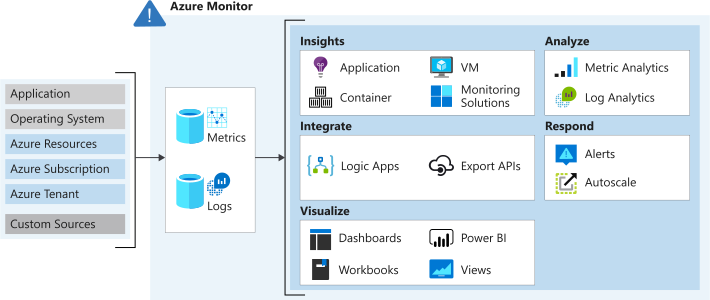

# Analyse your Azure infrastructure by using Azure Monitor logs

Extract valuable information about your infra from log data.

- Features and capabilities of Azure Monitor logs
- Create Monitor log queries to extract information from log data

Logging and monitoring is a vital part of production applications to determine the cause of failures and identify problems before the occur and get maximum performance and availability out of cloud aps.

## Features of Monitor logs

### Data collection in Azure Monitor

Collects two types of data
- metrics, how its performing and resources its consuming
- logs, contain records that show when resources are created or modified

Collects data automatically from a rane of components.

- <b>Application data</b> that relates to your custom app cpde
- <b>Operating system data</b> from VMs that host apps
- <b>Azure resource data</b> that relates to the ops of an Azure resource such as a web app of a load balancer.
- <b>Azure sub data</b> that relates to the Azure sub and contains health and availability.
- <b>Azure tenant data</b> org level services such as AD.

You can the data that Monitor collects by:

- <b>Enabling diagnostics</b> for resources such as Azure SQL Database, you receive full information about a resource only after you have enabled diags logging for it.
- <b>Adding an agent</b> for VMs you can instal teh Log Analytics agent and configure it to send data to a Log Analytics workspace. Agent increases the amount of information thats sent to Azure Monitor.

Devs can send data to Monitor from custom code by calling the Data Collector API. 

### Logs

- Time stamped information about changes made to resource.
- Varies by log source
- Organised into records with differnet sets of properties
- Can include numeric values (metrics) but mostly include text data
- Most commonly contains events which occur sporadically rather than at fixed intervals.
    - Created by apps and services
    - PRovice the context for events
    

### Metrics

- Numerical values that descirve some aspect of a system at a point in time
- Near real time
- Collected at regular intervals, useful for alerting because of freq. sampling
- Stored in time series database
- <b>Combine with logs to identify root cause</b>

### Analysing logs using [Kusto](https://docs.microsoft.com/en-us/azure/data-explorer/kusto/concepts/)

Retrieve, consolidate, and analyse data by specifying a query to run in Azure Monitor logs. You write a lof query with Kusto, which is also used by Azure Data Explorer.

- Log queries can be tested in Azure portal. 
- Create custom dashboards in Azure portal which are targetted displays of resourcecs and data
- Dashboards allow you to combine various data, including both logs and metrics into a single pane.
- Read-only requests to process data and return result
    - Dataflow model to make query easy to read, write, automate

[Azure Monitor Demo Logs](https://portal.azure.com/learn.docs.microsoft.com/#blade/Microsoft_Azure_Monitoring_Logs/DemoLogsBlade?azure-portal=true)

You can get to [SQL](https://docs.microsoft.com/en-us/azure/data-explorer/kusto/query/databasefunction?pivots=azuredataexplorer)

