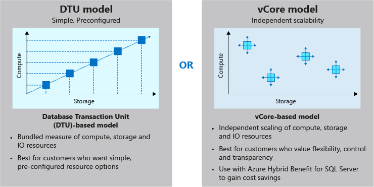

# Scale multiple Azure SQL Databases with SQL elastic pools

Allows you to manage performance and cost for a collection of SQL databases. 
- Manage and scale multiple Azure SQL databases with different resource requirements.
- Traditionally, over-provisioning resources to ensure capacity for peak demand
- Elastic pool is a resource allocation service used to scale and manage perf and cost of a group of Azure SQL databases
- Pool resource requirements are set based on overall needs of the group
- DBs in the pool share the allocated resources
- Manage budget and performance of multiple DBs
- Priced by either DTU or vCore model




When to use? When you have several DBs with low average utilisation with infrequent peaks

Generally, if the combined resources needed for individual databases to meet capacity spike is more than 1.5 times the pool capacity, then the pool will be cost effective.

Minimum recommended 2x S3, or 15x S0 databases to a single pool for it to have potential cost savings.


## Create a SQL elastic pool

Create the pool in the portal, or using CLI...

```sh
az sql elastic-pools create
```

Add databases in the portal or with CLI...

```sh
az sql db create --elastic-pool-name <name>
```

This comman can move existing DBs to a pool also.


### Example

Create SQL server and add DBs for two locations.

```sh
ADMIN_LOGIN="ServerAdmin"
RESOURCE_GROUP=learn-01d50246-6044-4acd-84be-ef9f480cccf8
SERVERNAME=FitnessSQLServer-$RANDOM
LOCATION=westeurope
PASSWORD=<password>

az sql server create \
--name $SERVERNAME \
--resource-group $RESOURCE_GROUP \
--location $LOCATION \
--admin-user $ADMIN_LOGIN \
--admin-password $PASSWORD

az sql db create \
--resource-group $RESOURCE_GROUP \
--server $SERVERNAME \
--name FitnessVancouverDB

az sql db create \
--resource-group $RESOURCE_GROUP \
--server $SERVERNAME \
--name FitnessParisDB
```

Add these to a pool in the portal.


## Manage SQL elastic pools performance and cost


