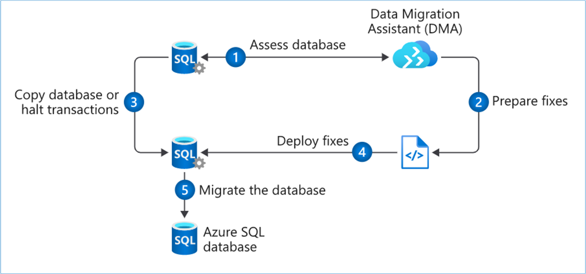
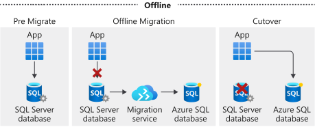
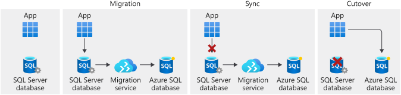

# Migrate your relational data stored in SQL Server to Azure SQL Database

Azure Database Migration Service automates database migration tasks to Azure SQL Database.


- Migration strategy for relational data stored in SQL Server
- Process of migration downtime


## Scenario setup


```sh
wget https://raw.githubusercontent.com/MicrosoftDocs/mslearn-migrate-sql-server-relational-data/master/azuredeploy.json

RG=adt-5d-rg
DEPLOYMENT=adt-5d-$RANDOM

az group create \
    --name $RG \
    --location westeurope

az deployment group create \
--name $DEPLOYMENT \
--resource-group $RG \
--template-uri https://raw.githubusercontent.com/MicrosoftDocs/mslearn-migrate-sql-server-relational-data/master/azuredeploy.json
--parameters \
    sourceWindowsAdminUserName=windowsadmin \
    sourceWindowsAdminPassword=345j3l4kj5kj%f££ \
    sourceSqlAdminUserName=sqladmin \
    sourceSqlAdminPassword=mkl7^^5@!2E \
    targetSqlDbAdministratorLogin=azuresqladmin \
    targetSqlDbAdministratorPassword=45erp0%$£11r64
```

## Migration process




### Pre-migration phase


Discovery phase:
- take inventory of existing databases and tools and apps that rely on them
- identify everything that uses existing databases

Assessment (steps 1 and 2)
- examine databases for incompatabilities between Azure SQL and source database
- Microsoft Data Migraition Assistant automatically examines source database for compatibility issues
    - provides a report which can be used as a guide to update databases
    - iteratively rerun the assistant as changes are made, to track progress

Pre-migration convert
- make any changes for compatibility and that data migration assistant has recommended
- create SQL scripts for deploying to SQL Server instance
    - Data Migration Assistant creates all the SQL scripts needed to deploy schema to target SQL Server instance.


### Migration

Migrating two elements: <i>schema</i> (step 4) and <i>data</i> (step 3 and 5).

- Data Migration Assistant can run the scripts, or scripts can be saved and ran using SSMS, Azure Data Studio, or sqlcmd.
- <i>data</i> migration is done using Azure Database Migration Service
    - Run offline mode, no changes can be made to source system once the migration begins.
    - Run online mode (requires Premium tier), source system remains in use while bulk data is migrated from a backup, then at end, take offline (known as <i>minimal downtime</i>) momentarily to do the final sync, then cutover.
        - <i>sync</i> changes made to the source system after migration are brought into the target
        - <i>cutover</i> takes the source system offline and brings up the Azure SQL Database


Offline:




Online:




### Post-migration

- remediate any applications, updating and affected by database changes, connection strings etc.
- complete thorough testing, comparing responses from source and target systems
- performance test


## Data migration tools

Azure Data Migration Service is the core tool, runs on the Azure platform and moves bulk amounts of data in a timely way. Also provides Data Migration Assistant, a client side tool that you can install on Windows-compatible workstation or server. 


