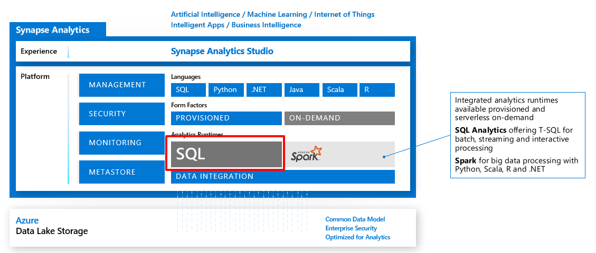

# Design a data warehouse with Azure Synapse Analytics

- Explain Azure Synapse Analytics
- Types of solution workloads
- Massively Parallel Processing Concepts
- Compare Table Geometries
- Create an Azure Synapse Analytics Service

## Understand Azure Synapse Analytics

Designed to meet all analytical needs in an integrated environment if you do not have an analytical environment in place already.

### Analytics capabilities using Azure Synapse SQL through either dedicated SQL pools or SQL Serverless pools

Azure Synapse SQL:
- distributed query system which enables data warehousing and visualisation scenarios
- uses standard T-SQL experiences familiar to data engineers
- serverless and dedicated resource models to work with descriptive and diagnostic analytical scenarios
    - dedicated SQL pools to reserve processing power for data stored in SQL tables
    - for adhoc workloads, use always-available serverless SQL endpoint

### Apache Spark pool with full support for Scala, Python, SparkSQL, and C#

- big data engineering and ML
- handles complex compute transformations that would take too long in data warehouse
- ML workloads
    - SparkML algorithms
    - AzureML integration for Apache Spark 2.4 with Linux Foundation [Delta Lake](https://delta.io)

### Integrate data with Azure Synapse pipelines

- leverages Azure Data Factory capabilities
- cloud-based ETL and data integration service at scale
    - data-driven workflows
    - orchestration
    - transformation
- create and schedule data-driven workflows (pipelines)
    - ingest data
    - ETL visually with data flows, or using Azure HDInsight Hadoop or Azure Databricks

### Azure Synapse Link for operational analytics with near real-time hybrid transactional and analytical processing

- reach out to operational data using Synapse Link
- no performance impact of the transactional datastore
    - requires enabling the feature in Synapse Analytics and source
    - creates an analytocal data store
    - data is fed to a Column store from which Synapse Link can query with no disruption

### Azure Synapse Studio - Single Web UI for all capabilities

- some features managable via portal
- Azure Synapse Studio is the best place to centrally work with all capabilities
    - explore data estate
    - TSQL script / notebook development
    - data integration pipelines
    - monitor workloads
    - manage service components

## Azure Synapse Analytics features

- workload management
- result-set cache
- materialised views
- CI/CD support via SSDT

### Workload management

Capability to prioritise query workloads using Workload Management.

- Workload groups
    - define resource to isolate and reserve resources for it
    - reserves resources for a group of requests
    - limits the amount of resources a group of requests can consume
    - access shared resources based on importance level
    - sets query timeout value
- Workload classification
    - T-SQL
    - map queries to a specific classifier to define the level of importance of a request
    - used to map to a specific workload group
- Workload importance
    - enables higher priority queries to receive resources ahead of lower priority queries
    - default is FIFO
- Result-set cache
    - caching of results in SQL pool storage
    - performance optimisation feature
- Materialized views
    - pre-compute, store, and maintain data like a table
    - automatically updated when data in underlying tables are changed
    - synchronous op that occurs as soon as data is changed
