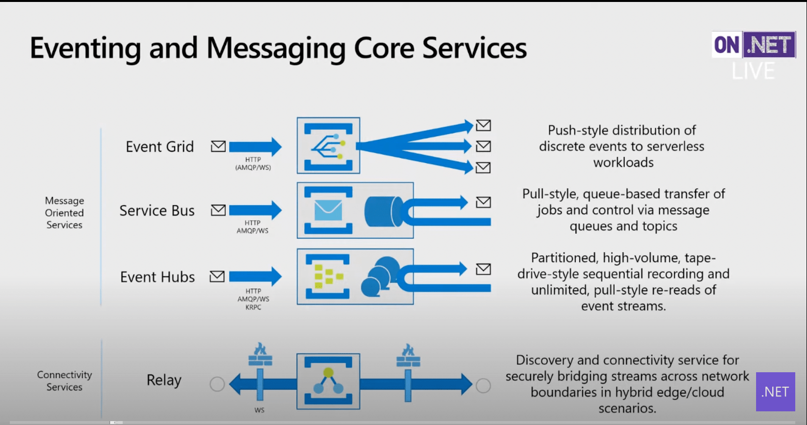
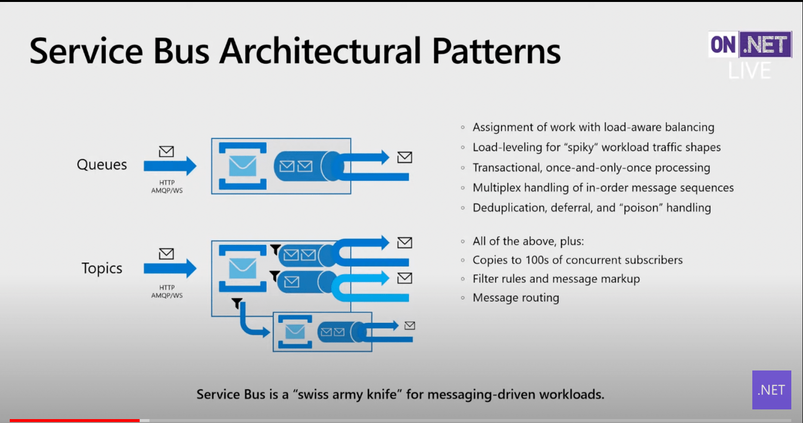
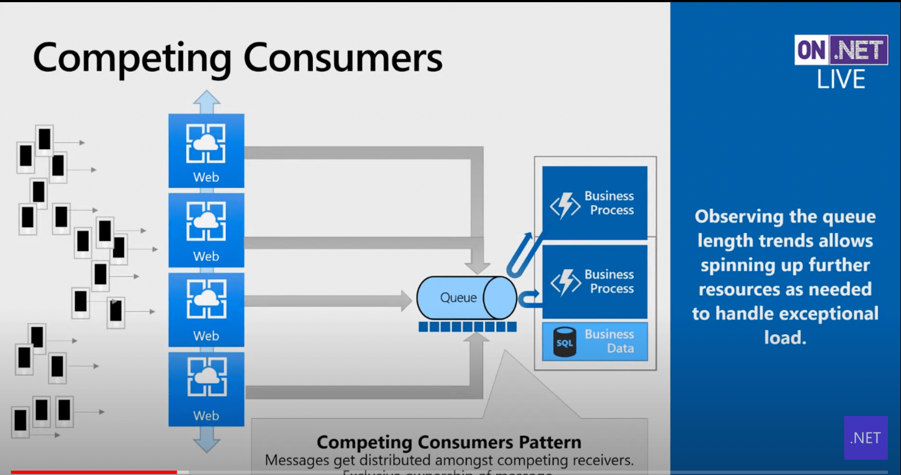

# Choose a messaging model in Azure to loosely connect your services

Azure provides several technologies that can be used for reliable communication, including:
- Storage queues
- Event Hubs
- Event Grid
- Service Bus

Loosely coupled architectures require mechanisms for components to communicate. Reliable messaging is often a critical problem.

## References

- Core messaging services architect - [Clemens Vasters](https://vasters.com)
- [On .NET Live Messaging Patterns](https://www.youtube.com/watch?v=ef1DK76rseM)
- Azure docs [Choose between Azure messaging services - Event Grid, Event Hubs, and Service Bus](https://docs.microsoft.com/en-us/azure/event-grid/compare-messaging-services)

## Vasters On.NET Live notes

Services don't compete, they are a family for different messaging patters.

 

- Event grids
    - push-push broker
    - broadcast notifications
    - events flow in and then events flow out
    - send data to webhooks, queues, event hubs
    - solving the problem of calling endpoints without having to deal with endpoint downtime
    - creates decoupling as an infrastructure
- Service Bus
    - classic queue broker
    - push in, pull out
- Event hubs
    - push, pull
    - client determines where in retained message log it wants to pull data
        - long tape, move back and forth in time
        - inspect collection of messages
        - do work in batches
    - partitioned for higher flow rates
- Relay
    - connectivity service
    - synchronous invocations
    - composes with the other services

### Service Bus

Two components:

- Queues
    - log of messages
    - load levelling mechanism
    - transactional behavior
        - atomic ops
        - take a message from a queue, do work, post result another queue, have delete and post in an atomic op
        - approximates classic transaction model we don't have in the cloud of two phase commits
- Topics
    - publish subscriber
    - route to 2K different destinations (commonly not done!)
 

Competing consumers

