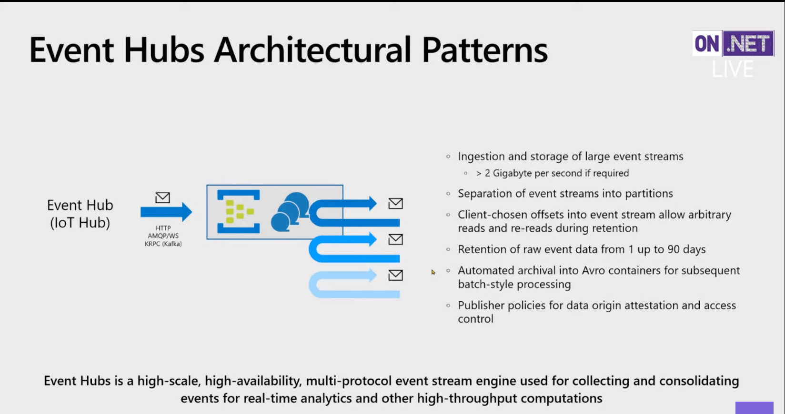
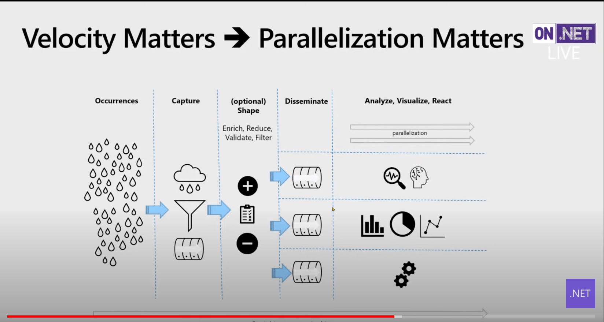
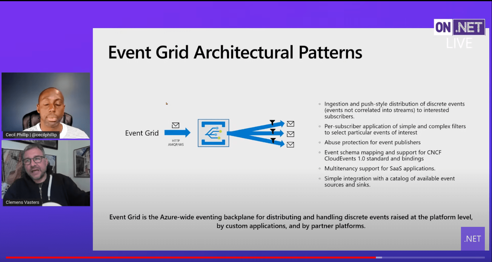
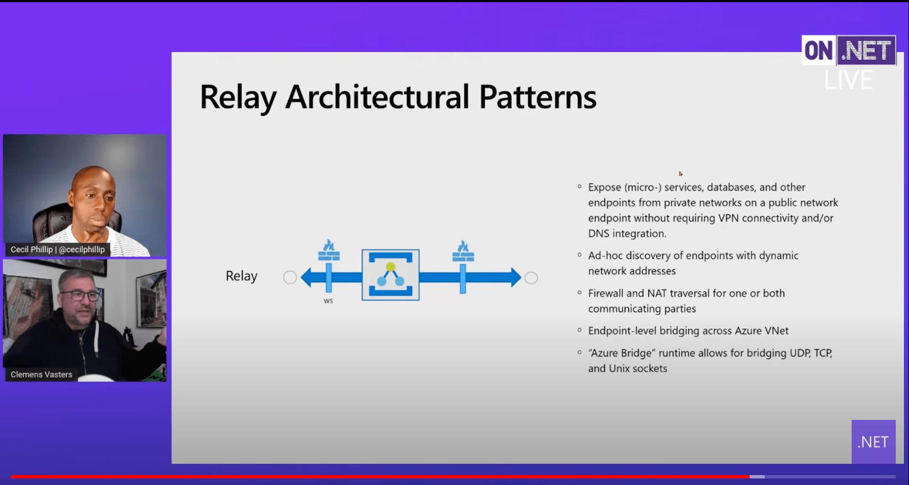
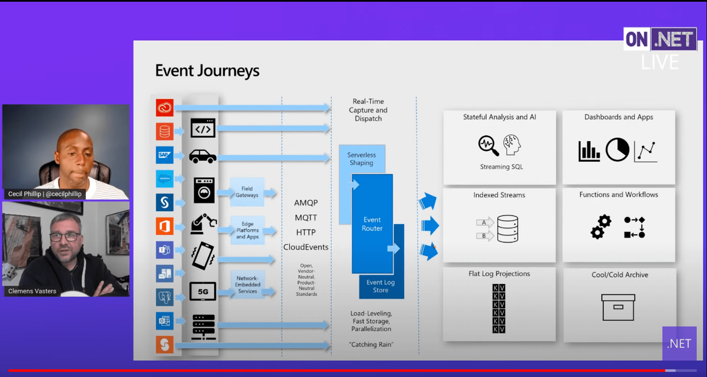

# Choose a messaging model in Azure to loosely connect your services

Azure provides several technologies that can be used for reliable communication, including:
- Storage queues
- Event Hubs
- Event Grid
- Service Bus

Loosely coupled architectures require mechanisms for components to communicate. Reliable messaging is often a critical problem.

## References

- Core messaging services architect - [Clemens Vasters](https://vasters.com)
- [On .NET Live Messaging Patterns](https://www.youtube.com/watch?v=ef1DK76rseM)
- Azure docs [Choose between Azure messaging services - Event Grid, Event Hubs, and Service Bus](https://docs.microsoft.com/en-us/azure/event-grid/compare-messaging-services)
- New Azure Service Bus client [Azure.Messaging.ServiceBus](https://github.com/Azure/azure-sdk-for-net/tree/master/sdk/servicebus/Azure.Messaging.ServiceBus)
- [Clemens Vasters GitHub](https://github.com/clemensv)
- [Clemens Vasters GitHub on-dotnet-live-2021-03](https://github.com/clemensv?tab=repositories)
- [Claim-Check Pattern](https://docs.microsoft.com/en-us/azure/architecture/patterns/claim-check)

## Vasters On.NET Live notes

Services don't compete, they are a family for different messaging patters.

 

- Event grids
    - push-push broker
    - broadcast notifications
    - events flow in and then events flow out
    - send data to webhooks, queues, event hubs
    - solving the problem of calling endpoints without having to deal with endpoint downtime
    - creates decoupling as an infrastructure
- Service Bus
    - classic queue broker
    - push in, pull out
- Event hubs
    - push, pull
    - client determines where in retained message log it wants to pull data
        - long tape, move back and forth in time
        - inspect collection of messages
        - do work in batches
    - partitioned for higher flow rates
- Relay
    - connectivity service
    - synchronous invocations
    - composes with the other services

### Service Bus Architectural Patterns

Note on message sizes. At 1h 13m - For Service Bus they are extending the **maximum message size to 100MB** with the large messages feature. Currently 256KB for Standard tier and 1 MB for Premium tier. Other Event Hub and Event Grid, they aren't changing the message size. Use the [Claim-Check pattern](https://docs.microsoft.com/en-us/azure/architecture/patterns/claim-check) to stash large messages and then pass a reference through the broker.

Two components:

- Queues
    - log of messages
    - load levelling mechanism
    - transactional behavior
        - atomic ops
        - take a message from a queue, do work, post result another queue, have delete and post in an atomic op
        - approximates classic transaction model we don't have in the cloud of two phase commits
- Topics
    - publish subscriber
    - route to 2K different destinations (commonly not done!)
 

**Competing consumers**

- Queue manages which message is being handed out to consumers
- Message owned exclusively by consumer once assigned

**Load Leveling**

- Work jobs can be queued up and processed periodically
- Processor may be offline
- Allows the business process to work at its own pace
- Oportunity to observe queue length and scale the process

### Event Hubs Architectural Patterns

- Super high-scale ingestion broker
- Really useful for when the primary index on data is time axis
    - soon as it becomes something else then better served by a database, so funnel to a DB
- IoT Hub sits on top of Event Hubs
- Separates event streams into partitions (highway lanes)
- Clients are choosing what they want to read
- Make events available for consumptions ASAP, velocity matters

### Event Grid Architectural Patterns

- Push-push distribution
- Web hook down? What's your app gonna do, sit and wait?
    - Event grid will try reach the endpoint for 24hrs
    - back off if there's errors
    - deadletter if it can't deliver

### Relay Architectural Patterns

- Exposing services from behind firewalls
- Reach anything and everything
- Reverse web socket across firewalls

### Big picture

- Picture is bigger than the broker
    - sourcing events
        - events come from many different sources
        - 300+ adapters on logic apps
        - edge systems for IoT events
    - transformation and routing
        - Azure Functions
        - Event Grid / Service Bus / Event Hubs
- Open standards story, no future in proprietary protocols
    - AMQP
    - MQTT
    - HTTP
    - interop story with other brokers
- Services on the platform are part of an ecosystem
    - brokers on the left, services on the right
    - Azure already has loads of the services on the platform

## Messages or events?

Question: *Does the sender expect the communication to be processed in a particular way be the destination component?* If yes then choose a message, otherwise it may be events.

Messages
- contains raw data, not just a reference
- sending component expects the message content to be processed in a certain way by destination component

Events
- light weight notifications, doesn't contain data
- multiple receivers or none at all
- publisher has no expectation about the action a receiving component take

