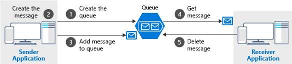

# Communicate between applications with Azure Queue storage

Implementation of publish-subscribe pattern using Azure Queue storage.

- storage queues are high perf message buffers
- acts as a broker between producers and consumers
- increases resiliency by temporarily storing waiting messages
- a single queue can be 500 TB in size, millions of messages
- 2000 messages per second for high volume scenarios
- app automatic and immediate scale
- messages upto 64 KB (48 KB when Base64 encoded)
- Azure doesn't look at the message


## Creating a storage account

```sh
az storage account create \
    --name [unique-name] \
    -g $RG \
    --kind StorageV2 \
    --sku Standard_LRS
```


## Authorization

| Authorization type | description |
| --- | :--- |
| Azure AD | RBAC to identify specific clients based on AAD creds |
| Shared key | aka Account Key. Encrypted key signature associated with the storage account. Each account has two of these. Don't use this, its like **root password** with full access to the storage account |
| Shared access signature | Generated URI that grants limited access to objects in the storage account to clients. Access can be scoped to scenario requirements |


```sh
az storage account show-connection-string \
    --name <name> \
    --resource-group $RG
```

DefaultEndpointsProtocol=https;EndpointSuffix=core.windows.net;AccountName=adt0sa06d;AccountKey=E8Yl8896Rzoo32a2yHJOi8XCH8RBBpYagAi2+vRcLu14QrECxu/VzAUt66BVYPDnZ2G/OdYnnc9Jn0mHr8WwPw==




- sender creates a queue and adds a message
- receiver retrieves a message and processes it
- receive deletes the message

This is *at-least-once-delivery* pattern. The receiver has a lock on a message while it processes the message but if it crashes then it never completes the message. Message then reappears on the queue available to be consumed by another receiver.


```sh
az storage message peek \
    --queue-name newsqueue \
    --connection-string "<connection-string>"
```
