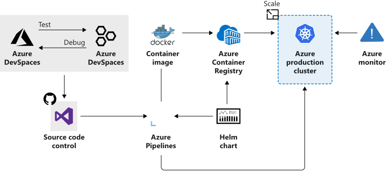

# Introduction to Azure Kubernetes Service

- Determine the types of business problems that can be solved using AKS
- Describe the benefits of container orchestration

## Introduction

- Containers make it easy to package and deploy apps with all its services to any compute environment
- Easy to scale services by deploying additional container instances
- Containers are less resource intensive than VMs
- Container management can be challenging, common to use a container management platform like Kubernetes

## What is Azure Kubernetes Service?

### What is a container

- a *container* is an atomic unit of software that packages up code, dependencies, and config for an app
- split up monolithic apps into individual services that make up a solution

### Why use a container?

The container concept gives us three major benefits:

1. **A container is immutable** - the unchaning nature of a container allows it to be deployed and run reliably with the same behavior from one compute environment to another. A container image tested in a QA environment is the same container image deployed in production.
2. **A container is lightweight** - think of a container as a VM image, but smaller. A VM image is normally installed on a physical host. The image contains both the OS and the application you want to run. In contrast, a container doesn't need an OS, only the application. The container always relies on the host installed OS for Kernel-specific services. Containers are less resource intensive, and multiple containers can be installed on the same compute environment.
3. **Container startup is fast** - containers can start up in a few seconds instead of minutes, like a VM.

The benefits make containers a popular choice for developers and IT ops alike.

### What is container management?

Container management can be justified by the requirement for the following functionality.

- management of container lifecycle
    - life cycle makes containers disposable and impacts how devs and IT ops should think about the management of large container deployments
- app scaling, adding additional containers
- app deployment, replacing older versions with newer versions

### What is Kubernetes?

Portable, extensible open-source platform for automating deployment, scaling, and management of containerised workloads. Abstracts away complex container management and provides us with declarative config to orchestrate containers in different compute environments. Provides the same ease of use and flexibility as with PaaS and IaaS offerings.

- Kubernetes isn't a full PaaS offering. It operates at a container level and offers only a common set of PaaS features
- Kubernets isn't monolithic. It's not a single application that is installed. Aspects such as deployment, scaling, load balancing, logging, and monitoring are all optional. You're responsible for finding the best solution that fits your needs to address these aspects.
- Kubernetes doesn't limit the types of applications that can run. If your app can run in a container, it can run on Kubernetes. Your developers need to understand concepts such as microservices architecture, to make optimal use of container solutions.
- Kubernetes doesn't provide middleware, data-processing frameworks, databases, caches, nor cluster storage systems. All these items are run as containers or as part of another service offering
- Kubernetes deployment is configured as a cluster. A cluster consists of at least one master machine and one or more worker machines. For production deployments, the preferred master configuration is a multi-master high availability deployment with three to five replicated masters. These machines can be physical or virtual. These worker machines are called nodes or agent nodes.

You are responsible for maintaining the Kube cluster. Manage OS upgrades, Kube installation and upgrades, hardware config of the host machines, networking, memory, storage etc.

### What is Azure Kubernetes Service (AKS)?

- manages hosted Kubernets environment and makes it simple to deploy and manage containerised apps in Azure
- includes features such as 
    - automated updates
    - self-healing
    - scaling
- cluster master is managed by Azure and is free
- you manage the agent nodes in the cluster and only pay for the VMs they run on
- aligns with other Azure services such as AAD, monitoring, ARM

### How workloads are developed and deployed to AKS

AKS supports the Docker image format that means that you can use any development environment to create a workload, package the workload as a container, and deploy the container as a Kube pod.

### Azure Dev Spaces

- local kube cluster setup can be complex and often single node cluster
- mocks for dependencies

Azure Dev Spaces helps your dev team be more productive on Kubernetes and allows:
- minimise local dev machine setup, devs work directly with AKS
- rapid iteration and debug in kubernetes using VS / VSCode
- config-as-code assets to use from dev to production
- develop code in isolation and do integration testing without mocking

### Deployment Center

- simplifies setting up a DevOps pipeline for your app
- automatically create Azure resources (AKS cluster)
- create App Insights resource for monitoring AKS cluster
- Azure Monitor for container perf monitoring
- deployment approvals

