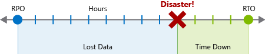

# Protect on-premises infrastructure from disasters with Azure Site Recovery

Provide disaster recovery for your on-prem infrastructure by managing and orchestrating replication, failover, and failback of VMWare VMs, Hyper-V VMs, and physical servers with Azure Sire Recovery.

- Identify the fetures and protection capabilities Azure Site Recovery provides to on-premises infrastructure
- Identify the requirement for enabling protection of on-premises infrastructure

## Overview

Azure Site Recovery is more than just a tool to help you recover from system outages.

- replicates workloads between primary and secondary site
- migrate VMs from on-prem infra to Azure

### Business continuitity and disaster recovery

- BCDR plans are formal documents that cover the scope and actions to be taken when a disaster or large-scale outage happens
- BCDR identifies the recovery time objective (RTOs) and recovery point obective (RPOs)
- Both objectives help realise the maximum tolerable hours that business can be without specified services, and wwhat the data recovery process should be.

### Recovery time objective

Measure of the maximum amount of time business can survive after a disaster before normal service is restored

### Recovery point objective

- Measure of the maximum amount of data loss that's acceptable during a disaster.
- Restoring to a backup point will cause some data loss

### Site Recovery

Contributes to a BCDR plan by replicating workloads from a primary site to a secondary site. Site recovery can be automatically invoked to replicate the protected virtual machines to another location. Failover could be from on-prem to Azure or from one Azure region to another.

- **Central management**: replication can be set up and managed, and failover and failback can be invoked all from within Azure portal.
- **On-prem VM replication**: VMs can be replicted to Azure or to a secondary on prep datacenter if necessary.
- **Azure VM replication**: CMs can be replicated from one region to another.
- **App consistency during failover**: Recovery points and application-conistent snapshots keep VMs in a consistent state at all times during replication.
- **Flexible failover**: Failovers can be run on demand as a test or triggered during an actual disacter. Tests can be run to simulate a disaster recovery scenario without interruption to liver service.
- **Network integration**: Manages network management during a replication and disaster recovery scenario. Reserved IP addresses and load balancers are included so that the VMs can work in the new location.

