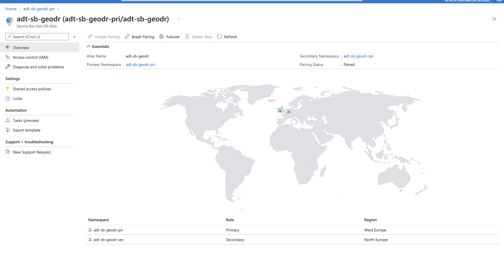
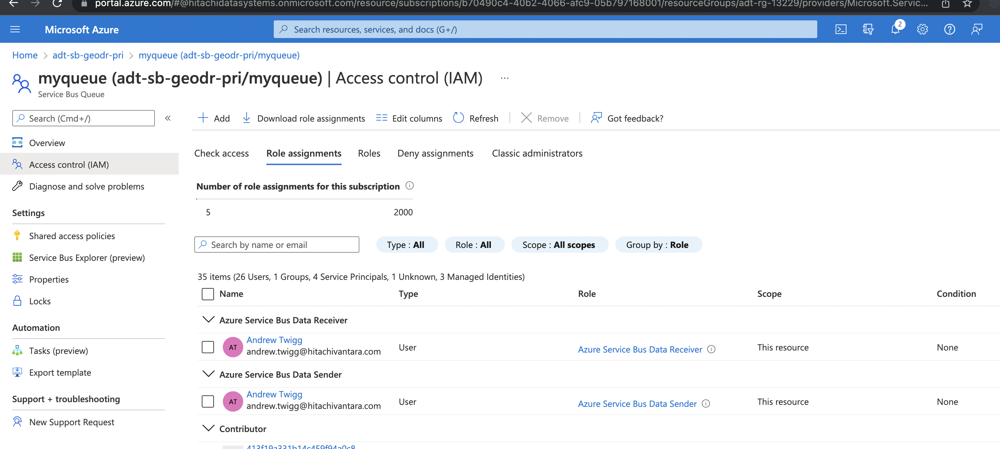

# Azure Service Bus Premium Geo-Recovery Config and Demo

This scenario deploys Azure Service Bus Premium namespaces across multiple regions and pairs them for Geo-DR failover scenario. The configuration is from [azure quickstart template](https://github.com/Azure/azure-quickstart-templates/tree/master/quickstarts/microsoft.servicebus/servicebus-create-namespace-geo-recoveryconfiguration). The scenario builds on the quickstart template to add producer consumer apps so that you can fail over the service bus namespaces and check the behaviour. There is also an older [Geo-DR](https://github.com/Azure/azure-service-bus/tree/master/samples/DotNet/Microsoft.ServiceBus.Messaging/GeoDR) sample for this in the Microsoft.ServiceBus.Messaging samples which has more details for the DR use cases.



The scenario runs under the local user account. The scenario creates the queue sender and receiver role assignments for the local logged on user.



## Running the sample

### Create the Azure Environment

```sh
// A unique ID for the sample deployment
// Powershell prompt? Use $id=Get-Random.
id=$RANDOM

// Resource group name for both namespaces
// Resource group is primary region, but contains the paired namespace in secondary region
// Powershell prompt? Use $rg="adt-rg-$id".
rg=adt-rg-$id

// Create resource group
az group create -g $rg -l westeurope

// Look up the object ID of the account that will run the scenario.
// This is for queue authorization.
userId=$(az ad user list --upn andrew.twigg@hitachivantara.com --query "[].objectId" -o tsv)

// Deploy the environment
az deployment group create -g $rg -f main.bicep -p azuredeploy.parameters.json userObjectId=$userId
```

### Run the Client

```sh
cd application/MessagingSender

dotnet run
```

### Run the Receiver

```sh
cd application/MessagingReceiver

dotnet run
```

## Cleaning up

Break the pairing...

```sh
// See the partner namespace
az servicebus georecovery-alias show -g $rg \
    -a adt-sb-geodr \
    --namespace-name adt-sb-geodr-pri \
    --query "partnerNamespace"

// Break the pair because you cannot delete if paired
az servicebus georecovery-alias break-pair -g $rg \
    --namespace-name adt-sb-geodr-pri \
    --alias adt-sb-geodr

// Check the status (takes a min or so)
az servicebus georecovery-alias show -g $rg \
    -a adt-sb-geodr \
    --namespace-name adt-sb-geodr-pri \
    --query provisioningState \
    -o tsv

Succeeded
```

Delete the resource group.

```sh
// Check the resource group name to make sure its the one you want...
echo $rg

// Delete the resource group
az group delete -g $rg --no-wait -y
```
