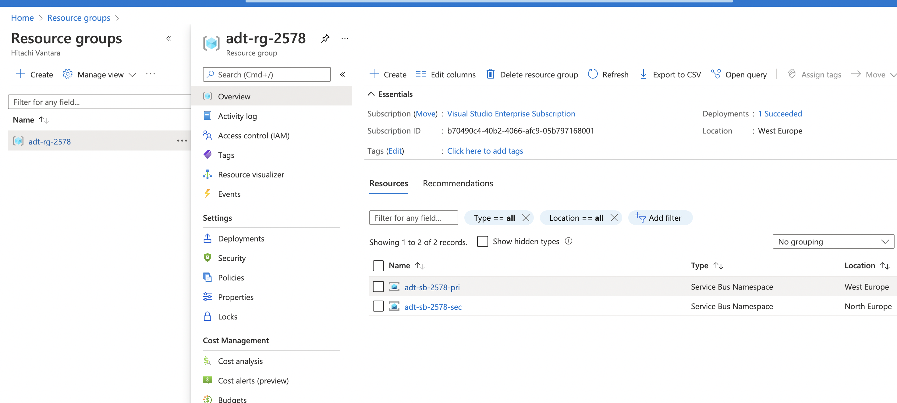

# Azure Service Bus Standard Active Replication

This scenario deploys Azure Service Bus Standard namespaces across multiple regions and implements the [Active replication](https://docs.microsoft.com/en-us/azure/service-bus-messaging/service-bus-outages-disasters#active-replication) pattern at the app level as shown in the [Microsoft.ServiceBus.Messaging GeoReplication](https://github.com/Azure/azure-service-bus/tree/master/samples/DotNet/Microsoft.ServiceBus.Messaging/GeoReplication) sample.

## Running the sample

### Create the Azure Environment

```sh
// A unique ID for the sample deployment
// Powershell prompt? Use $id=Get-Random.
id=$RANDOM

// Resource group name for both namespaces
// Resource group is primary region, but contains the paired namespace in secondary region
// Powershell prompt? Use $rg="adt-rg-$id".
rg=adt-rg-$id

// Create resource group
az group create -g $rg -l westeurope

// Look up the object ID of the account that will run the scenario.
// This is for queue authorization.
userId=$(az ad user list --upn andrew.twigg@hitachivantara.com --query "[].objectId" -o tsv)

// Deploy the environment
az deployment group create -g $rg \
    -f main.bicep \
    -p azuredeploy.parameters.json userObjectId=$userId serviceBusNamespaceNamePrimary=adt-sb-$id-pri serviceBusNamespaceNameSecondary=adt-sb-$id-sec
```

Creates an environment like...



### Run the producer

```sh
cd application/SenderActiveReplication
dotnet run --sb-primary adt-sb-$id-pri --sb-secondary adt-sb-$id-sec
```

The producer writes the same messages to both primary and secondary queues.

```sh
Messaging Sender started. Primary bus: adt-sb-2578-pri, Secondary bus: adt-sb-2578-sec

Sending messages to primary and secondary queues...

Message 0 sent to primary queue: Body = Message0
Message 0 sent to secondary queue: Body = Message0
Message 1 sent to primary queue: Body = Message1
Message 1 sent to secondary queue: Body = Message1
Message 2 sent to primary queue: Body = Message2
Message 2 sent to secondary queue: Body = Message2
Message 3 sent to primary queue: Body = Message3
Message 3 sent to secondary queue: Body = Message3
Message 4 sent to primary queue: Body = Message4
Message 4 sent to secondary queue: Body = Message4
```

### Run the consumer

```sh
cd application/GeoReceiver
dotnet run --sb-primary adt-sb-$id-pri --sb-secondary adt-sb-$id-sec
```

The consumer receives from both primary and secondary queues and uses a local state to keep track of what has been processed. This implies that there is **one** consumer and not multiple potentially distributed consumers. This is one of the main issues with this approach.

```sh
Messaging Sender started. Primary bus: adt-sb-2578-pri, Secondary bus: adt-sb-2578-sec
Message0
Message0 (duplicate detected)
Message1
Message1 (duplicate detected)
Message2
Message2 (duplicate detected)
Message3
Message3 (duplicate detected)
Message4
Message4 (duplicate detected)
```
