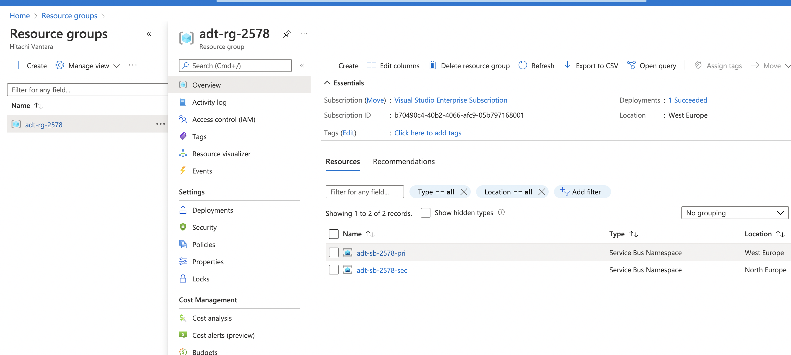

# Azure Service Bus Standard Geo-replication

This scenario deploys Azure Service Bus Standard namespaces across multiple regions and implements the [Active replication](https://docs.microsoft.com/en-us/azure/service-bus-messaging/service-bus-outages-disasters#active-replication) and [Passive replication](https://docs.microsoft.com/en-us/azure/service-bus-messaging/service-bus-outages-disasters#passive-replication) patterns at the app level as shown in the [Microsoft.ServiceBus.Messaging GeoReplication](https://github.com/Azure/azure-service-bus/tree/master/samples/DotNet/Microsoft.ServiceBus.Messaging/GeoReplication) sample, but using the [Azure.Messaging.SeviceBus](https://github.com/Azure/azure-sdk-for-net/tree/main/sdk/servicebus/Azure.Messaging.ServiceBus) client library.

## Running the sample

### Create the Azure Environment

This applies to both the active and passive replication patterns. The environment consists of two Service Bus Standard SKU instances, each deployed to different regions.

```sh
// A unique ID for the sample deployment
// Powershell prompt? Use $id=Get-Random.
id=$RANDOM

// Resource group name for both namespaces
// Resource group is primary region, but contains the paired namespace in secondary region
// Powershell prompt? Use $rg="adt-rg-$id".
rg=adt-rg-$id

// Create resource group
az group create -g $rg -l westeurope

// Look up the object ID of the account that will run the scenario.
// This is for queue authorization.
userId=$(az ad user list --upn andrew.twigg@hitachivantara.com --query "[].objectId" -o tsv)

// Deploy the environment
az deployment group create -g $rg \
    -f main.bicep \
    -p azuredeploy.parameters.json userObjectId=$userId serviceBusNamespaceNamePrimary=adt-sb-$id-pri serviceBusNamespaceNameSecondary=adt-sb-$id-sec
```

Creates an environment like...



### Active Replication Sample

Producer writes the same message to multiple regions, consumer detects the duplicates on the receive side and throws them away.

#### Run the producer

```sh
cd application/SenderActiveReplication
dotnet run --sb-primary adt-sb-$id-pri --sb-secondary adt-sb-$id-sec
```

The producer writes the same messages to both primary and secondary queues.

```sh
Messaging Sender started. Primary bus: adt-sb-2578-pri, Secondary bus: adt-sb-2578-sec

Sending messages to primary and secondary queues...

Message 0 sent to primary queue: Body = Message0
Message 0 sent to secondary queue: Body = Message0
Message 1 sent to primary queue: Body = Message1
Message 1 sent to secondary queue: Body = Message1
Message 2 sent to primary queue: Body = Message2
Message 2 sent to secondary queue: Body = Message2
Message 3 sent to primary queue: Body = Message3
Message 3 sent to secondary queue: Body = Message3
Message 4 sent to primary queue: Body = Message4
Message 4 sent to secondary queue: Body = Message4
```

#### Run the consumer

```sh
cd application/GeoReceiver
dotnet run --sb-primary adt-sb-$id-pri --sb-secondary adt-sb-$id-sec
```

The consumer receives from both primary and secondary queues and uses a local state to keep track of what has been processed. This implies that there is **one** consumer and not multiple potentially distributed consumers. This is one of the main issues with this approach.

```sh
Messaging Sender started. Primary bus: adt-sb-2578-pri, Secondary bus: adt-sb-2578-sec
Message0
Message0 (duplicate detected)
Message1
Message1 (duplicate detected)
Message2
Message2 (duplicate detected)
Message3
Message3 (duplicate detected)
Message4
Message4 (duplicate detected)
```

### Passive Replication Sample

In the fault free case, only send messages to the active bus. If the operation on the active entity fails with an error code that indicates the datacenter that hosts the active entity might be unavailable, the client sends a copy of the message to the backup entity. At that point the active and the backup entities switch roles: the sending client considers the old active entity to be the new backup entity, and the old backup entity is the new active entity. If both send operations fail, the roles of the two entities remain unchanged and an error is returned.

More economical that active replication. Latency, throughput, and monetary cost are identical to the non-replicated scenario.

Possible to have message delay, loss, or duplicate reception when using passive replication. For duplicate reception, receiver can remove duplicates if it has a record.
