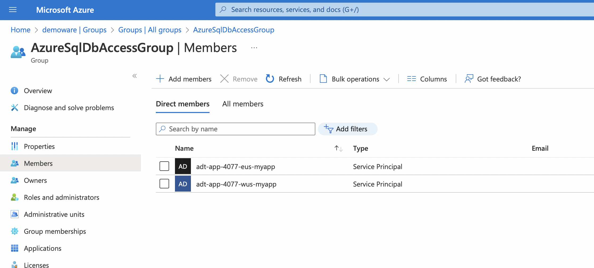

# Azure SQL AAD Auth from App Service with Managed Identity

Key features:

* Demonstrates managed identity as a turn-key solution for securing access to Azure SQL Database from Azure App Service
* Eliminates secrets from the app tier
* Builds on the secure + HA [multi-region private endpoints](../private-link/README.md) scenario to add AAD auth

## References

* [Tutorial: Connect to SQL Database from .NET App Service without secrets using a managed identity](https://docs.microsoft.com/en-us/azure/app-service/tutorial-connect-msi-sql-database)
* [Using AAD auth with SqlClient](https://docs.microsoft.com/en-us/sql/connect/ado-net/sql/azure-active-directory-authentication)

## Bicep Infra Setup

### Linux / Mac

```sh
id=$RANDOM

env1=wus
env2=eus

rg1=adt-rg-$id-$env1
rg2=adt-rg-$id-$env2

loc1=westeurope
loc2=eastus

az group create -g $rg1 -l $loc1
az group create -g $rg2 -l $loc2

az deployment group create -g $rg1 -f main.bicep \
    -p  deploymentId=$id \
        envNamePrimary=$env1 \
        envNameSecondary=$env2 \
        sqlAdminPassword=<something>
az deployment group create -g $rg2 -f main.bicep \
    -p  isSecondary=true \
        primaryDeploymentResourceGroup=$rg1 \
        deploymentId=$id \
        envNamePrimary=$env1 \
        envNameSecondary=$env2 \
        sqlAdminPassword=<something>
```

### Testing Network Connectivity

From one of the App Service consoles...

```sh
C:\home\site\wwwroot>nameresolver adt-sql-5419.database.windows.net
Server: 168.63.129.16

Non-authoritative answer:
Name: adt-sql-5419-wus.privatelink.database.windows.net
Addresses:
    10.1.1.4
Aliases:
    adt-sql-5419-wus.database.windows.net
    adt-sql-5419-wus.privatelink.database.windows.net

C:\home\site\wwwroot>tcpping adt-sql-5419.database.windows.net:1433
Connected to adt-sql-5419.database.windows.net:1433, time taken: 121ms
Connected to adt-sql-5419.database.windows.net:1433, time taken: 201ms
Connected to adt-sql-5419.database.windows.net:1433, time taken: <1ms
Connected to adt-sql-5419.database.windows.net:1433, time taken: <1ms
Complete: 4/4 successful attempts (100%). Average success time: 80.5ms

C:\home\site\wwwroot>nameresolver adt-sql-5419.secondary.database.windows.net
Server: 168.63.129.16

Non-authoritative answer:
Name: adt-sql-5419-eus.privatelink.database.windows.net
Addresses:
    10.2.1.4
Aliases:
    adt-sql-5419-eus.database.windows.net
    adt-sql-5419-eus.privatelink.database.windows.net

C:\home\site\wwwroot>tcpping adt-sql-5419.secondary.database.windows.net:1433
Connected to adt-sql-5419.secondary.database.windows.net:1433, time taken: 170ms
Connected to adt-sql-5419.secondary.database.windows.net:1433, time taken: 63ms
Connected to adt-sql-5419.secondary.database.windows.net:1433, time taken: 62ms
Connected to adt-sql-5419.secondary.database.windows.net:1433, time taken: 63ms
Complete: 4/4 successful attempts (100%). Average success time: 89.5ms
```

Following forced failover:

> Note: Trace is from a different deployment session. Hence IDs different.

```sh
D:\home\site\wwwroot>nameresolver adt-sql-11053.database.windows.net
Server: 168.63.129.16

Non-authoritative answer:
Name: adt-sql-11053-eus.privatelink.database.windows.net
Addresses:
    10.2.1.4
Aliases:
    adt-sql-11053-eus.database.windows.net
    adt-sql-11053-eus.privatelink.database.windows.net
```

## Connect to SQL Database from .NET App Service

> Note: App Service supports [Service Connector](https://docs.microsoft.com/en-us/azure/service-connector/overview) to Azure SQL Database. I couldn't get this to work across VNet hub and spoke network topology. This uses a direct connection from the application to SQL Database.

### Setup the SQL AD Admin

> Note: A user account has been created in AD for admin to represent the SQL Admin AD account.

```sh
azureuser=$(az ad user list --filter "userPrincipalName eq 'azuresqladmin@demoware.onmicrosoft.com'" --query '[].id' --output tsv)
az sql server ad-admin create -g $rg1 --server-name adt-sql-$id-wus --display-name ADMIN --object-id $azureuser
az sql server ad-admin create -g $rg2 --server-name adt-sql-$id-eus --display-name ADMIN --object-id $azureuser
```

!SO6hRT7fvNq

### Grant permissions to the managed identity

This step adds the managed identity to a group which has permissions on the SQL database.

```sh
groupid=$(az ad group create --display-name AzureSqlDbAccessGroup --mail-nickname AzureSqlDbAccessGroup --query 'id' -o tsv)

msiobjectidwus=$(az webapp identity show -g $rg1 -n adt-app-$id-wus-myapp --query principalId -o tsv)
msiobjectideus=$(az webapp identity show -g $rg2 -n adt-app-$id-eus-myapp --query principalId -o tsv)

az ad group member add --group $groupid --member-id $msiobjectidwus
az ad group member add --group $groupid --member-id $msiobjectideus

az ad group member list -g $groupid
```



Create a user in SQL to represent the group and assign permissions.

> Note: You need to login to SQL DB using the Azure SQL AD Admin account create above.

```sh
CREATE USER [AzureSqlDbAccessGroup] FROM EXTERNAL PROVIDER;
ALTER ROLE db_datareader ADD MEMBER [AzureSqlDbAccessGroup];
ALTER ROLE db_datawriter ADD MEMBER [AzureSqlDbAccessGroup];
ALTER ROLE db_ddladmin ADD MEMBER [AzureSqlDbAccessGroup];
```

## Deploy the App

### Generate the Database Schema

> Note: You need to open a firewall connection to generate the DB schema.
> Note: Your CLI account will need to also have permissions on SQL. Add it to the group.

```sh
cd msdocs-app-service-sqldb-dotnetcore/DotNetCoreSqlDb/

dotnet tool install -g dotnet-ef
dotnet ef migrations add InitialCreate
dotnet ef database update
```

Generates the schema as follows:

```sh
➜  DotNetCoreSqlDb git:(master) ✗ dotnet ef database update
Build started...
Build succeeded.
info: Microsoft.EntityFrameworkCore.Infrastructure[10403]
      Entity Framework Core 6.0.0 initialized 'MyDatabaseContext' using provider 'Microsoft.EntityFrameworkCore.SqlServer:6.0.0' with options: None
info: Microsoft.EntityFrameworkCore.Database.Command[20101]
      Executed DbCommand (38ms) [Parameters=[], CommandType='Text', CommandTimeout='30']
      SELECT 1
info: Microsoft.EntityFrameworkCore.Database.Command[20101]
      Executed DbCommand (33ms) [Parameters=[], CommandType='Text', CommandTimeout='30']
      SELECT OBJECT_ID(N'[__EFMigrationsHistory]');
info: Microsoft.EntityFrameworkCore.Database.Command[20101]
      Executed DbCommand (23ms) [Parameters=[], CommandType='Text', CommandTimeout='30']
      SELECT 1
info: Microsoft.EntityFrameworkCore.Database.Command[20101]
      Executed DbCommand (64ms) [Parameters=[], CommandType='Text', CommandTimeout='30']
      CREATE TABLE [__EFMigrationsHistory] (
          [MigrationId] nvarchar(150) NOT NULL,
          [ProductVersion] nvarchar(32) NOT NULL,
          CONSTRAINT [PK___EFMigrationsHistory] PRIMARY KEY ([MigrationId])
      );
info: Microsoft.EntityFrameworkCore.Database.Command[20101]
      Executed DbCommand (21ms) [Parameters=[], CommandType='Text', CommandTimeout='30']
      SELECT 1
info: Microsoft.EntityFrameworkCore.Database.Command[20101]
      Executed DbCommand (23ms) [Parameters=[], CommandType='Text', CommandTimeout='30']
      SELECT OBJECT_ID(N'[__EFMigrationsHistory]');
info: Microsoft.EntityFrameworkCore.Database.Command[20101]
      Executed DbCommand (34ms) [Parameters=[], CommandType='Text', CommandTimeout='30']
      SELECT [MigrationId], [ProductVersion]
      FROM [__EFMigrationsHistory]
      ORDER BY [MigrationId];
info: Microsoft.EntityFrameworkCore.Migrations[20402]
      Applying migration '20220815151401_InitialCreate'.
Applying migration '20220815151401_InitialCreate'.
info: Microsoft.EntityFrameworkCore.Database.Command[20101]
      Executed DbCommand (25ms) [Parameters=[], CommandType='Text', CommandTimeout='30']
      CREATE TABLE [Todo] (
          [ID] int NOT NULL IDENTITY,
          [Description] nvarchar(max) NULL,
          [CreatedDate] datetime2 NOT NULL,
          CONSTRAINT [PK_Todo] PRIMARY KEY ([ID])
      );
info: Microsoft.EntityFrameworkCore.Database.Command[20101]
      Executed DbCommand (26ms) [Parameters=[], CommandType='Text', CommandTimeout='30']
      INSERT INTO [__EFMigrationsHistory] ([MigrationId], [ProductVersion])
      VALUES (N'20220815151401_InitialCreate', N'6.0.0');
Done.
```

### Deploy to App Service

```sh
dotnet publish -c Release
```

Right click the publish and select deploy to web app.
