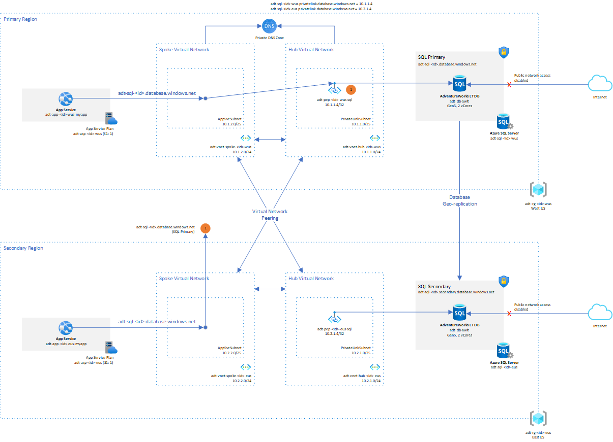

# Multi-region web app with private connectivity to database

This example shows a secure and highly available deployment if Azure SQL.

* Multi-region Azure SQL Failover Group
* Hub and spoke virtual networks with the Azure SQL instances exposed in each region via Private Endpoints in the hub networks
* Azure App Service VNet integrated into each regions spoke network
* Azure SQL read/write primary and readonly secondary with auto-failover of the DNS CNAME to save needing to update connection strings.
* Configuration of the Private DNS, adding the SQL Private endpoint records, and adding the VNet links to all VNets across regions.

> Note: [Private Endpoint Limitations](https://docs.microsoft.com/en-us/azure/private-link/private-endpoint-overview#limitations)
>
> NSGs on the Private endpoint subnet or the NIC do not apply to a private endpoint. There is a [public preview](https://azure.microsoft.com/en-us/updates/public-preview-of-private-link-network-security-group-support/) of Private Link NSG support.



## TODOs

* Update the DNS configuration to use [Private DNS Zone Groups](https://docs.microsoft.com/en-us/azure/private-link/private-endpoint-dns#private-dns-zone-group) as shown in this [quickstart](https://github.com/Azure/azure-quickstart-templates/blob/master/demos/private-endpoint-sql-from-appservice/azuredeploy.json).

## References

* [Multi-region web app with private connectivity to database](https://docs.microsoft.com/en-us/azure/architecture/example-scenario/sql-failover/app-service-private-sql-multi-region)
* [Bicep and ARM templates Microsoft.Sql servers](https://docs.microsoft.com/en-us/azure/templates/microsoft.sql/servers?tabs=bicep)
* [Azure quickstart templates web app consuming an Azure SQL private endpoint](https://github.com/Azure/azure-quickstart-templates/tree/master/demos/private-endpoint-sql-from-appservice)
* [Azure SQL active geo-replication and failover](https://docs.microsoft.com/en-us/azure/azure-sql/database/active-geo-replication-configure-portal?view=azuresql&tabs=azure-cli)
* [Web app private link with Azure SQL DB and storage](https://azure.microsoft.com/en-gb/resources/templates/web-app-regional-vnet-private-endpoint-sql-storage/)
* [Web app private connectivity to Azure SQL Database](https://docs.microsoft.com/en-us/azure/architecture/example-scenario/private-web-app/private-web-app#deploy-this-scenario)
* [Private endpoint limitations](https://docs.microsoft.com/en-us/azure/private-link/private-endpoint-overview#limitations)

## Bicep Setup

### Linux / Mac

```sh
id=$RANDOM

env1=wus
env2=eus

rg1=adt-rg-$id-$env1
rg2=adt-rg-$id-$env2

loc1=westus
loc2=eastus

az group create -g $rg1 -l $loc1
az group create -g $rg2 -l $loc2

az deployment group create -g $rg1 -f azure-sql-private-link.bicep \
    -p  deploymentId=$id \
        envNamePrimary=$env1 \
        envNameSecondary=$env2 \
        sqlAdminPassword=<something>
az deployment group create -g $rg2 -f azure-sql-private-link.bicep \
    -p  isSecondary=true \
        primaryDeploymentResourceGroup=$rg1 \
        deploymentId=$id \
        envNamePrimary=$env1 \
        envNameSecondary=$env2 \
        sqlAdminPassword=<something>
```

### Windows

```sh
$id=Get-Random

$env1='wus'
$env2='eus'

$rg1="adt-rg-$id-$env1"
$rg2="adt-rg-$id-$env2"

$loc1='westus'
$loc2='eastus'

az group create -g $rg1 -l $loc1
az group create -g $rg2 -l $loc2

az deployment group create -g $rg1 -f azure-sql-private-link.bicep -p  deploymentId=$id envNamePrimary=$env1 envNameSecondary=$env2 sqlAdminPassword=<something>
az deployment group create -g $rg2 -f azure-sql-private-link.bicep -p  isSecondary=true primaryDeploymentResourceGroup=$rg1 deploymentId=$id envNamePrimary=$env1 envNameSecondary=$env2 sqlAdminPassword=<something>
```

## Testing Connectivity

From one of the App Service consoles...

```sh
C:\home\site\wwwroot>nameresolver adt-sql-5419.database.windows.net
Server: 168.63.129.16

Non-authoritative answer:
Name: adt-sql-5419-wus.privatelink.database.windows.net
Addresses:
    10.1.1.4
Aliases:
    adt-sql-5419-wus.database.windows.net
    adt-sql-5419-wus.privatelink.database.windows.net

C:\home\site\wwwroot>tcpping adt-sql-5419.database.windows.net:1433
Connected to adt-sql-5419.database.windows.net:1433, time taken: 121ms
Connected to adt-sql-5419.database.windows.net:1433, time taken: 201ms
Connected to adt-sql-5419.database.windows.net:1433, time taken: <1ms
Connected to adt-sql-5419.database.windows.net:1433, time taken: <1ms
Complete: 4/4 successful attempts (100%). Average success time: 80.5ms

C:\home\site\wwwroot>nameresolver adt-sql-5419.secondary.database.windows.net
Server: 168.63.129.16

Non-authoritative answer:
Name: adt-sql-5419-eus.privatelink.database.windows.net
Addresses:
    10.2.1.4
Aliases:
    adt-sql-5419-eus.database.windows.net
    adt-sql-5419-eus.privatelink.database.windows.net

C:\home\site\wwwroot>tcpping adt-sql-5419.secondary.database.windows.net:1433
Connected to adt-sql-5419.secondary.database.windows.net:1433, time taken: 170ms
Connected to adt-sql-5419.secondary.database.windows.net:1433, time taken: 63ms
Connected to adt-sql-5419.secondary.database.windows.net:1433, time taken: 62ms
Connected to adt-sql-5419.secondary.database.windows.net:1433, time taken: 63ms
Complete: 4/4 successful attempts (100%). Average success time: 89.5ms
```

Following forced failover:

> Note: Trace is from a different deployment session. Hence IDs different.

```sh
D:\home\site\wwwroot>nameresolver adt-sql-11053.database.windows.net
Server: 168.63.129.16

Non-authoritative answer:
Name: adt-sql-11053-eus.privatelink.database.windows.net
Addresses:
    10.2.1.4
Aliases:
    adt-sql-11053-eus.database.windows.net
    adt-sql-11053-eus.privatelink.database.windows.net
```
