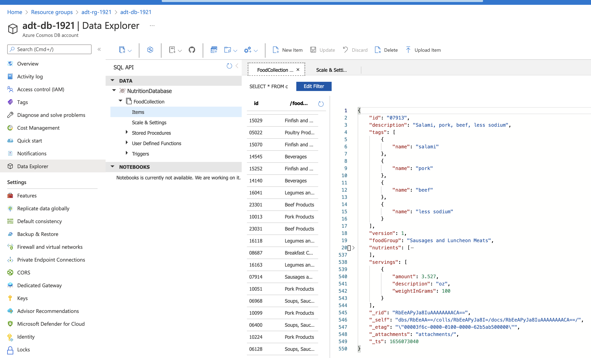
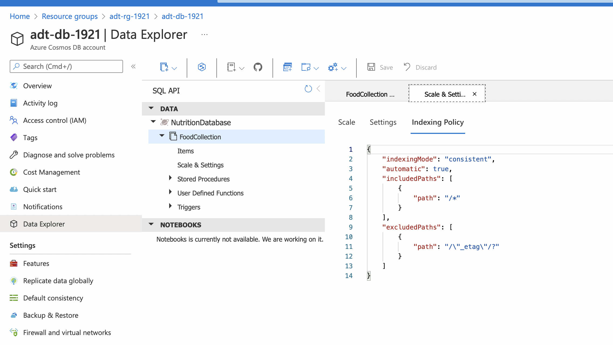
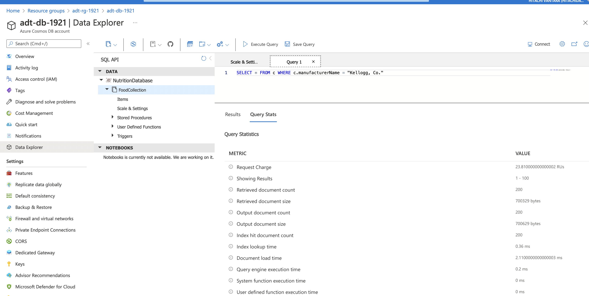
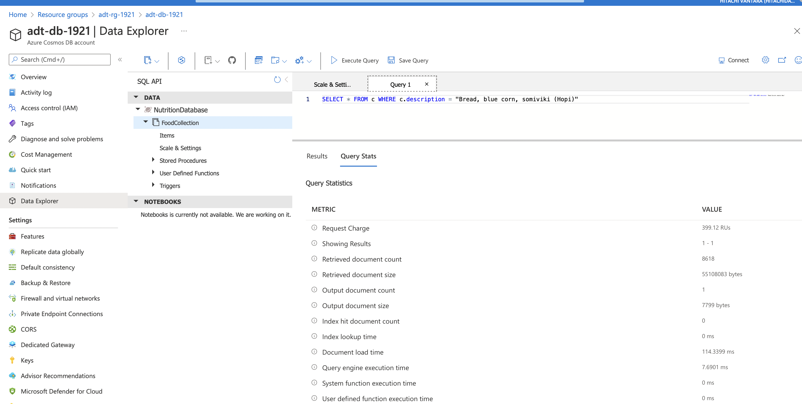
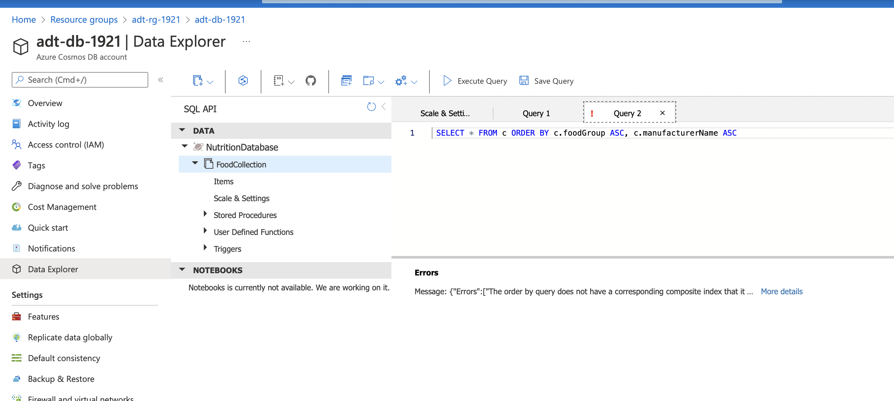
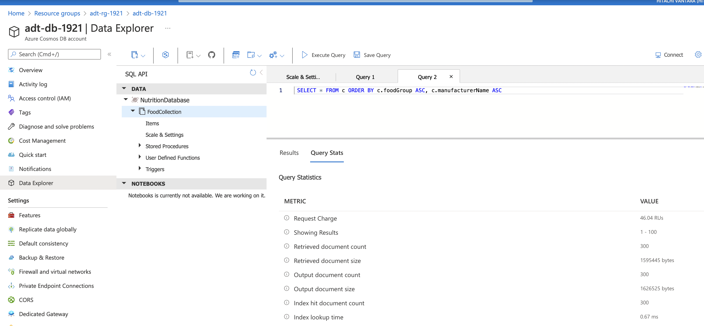

# Indexing in Cosmos DB

## Contents

* [Contents](#contents)
* [References](#references)
* [Lab Setup](#lab-setup)
    * [Resource Group](#resource-group)
    * [Cosmos DB](#cosmos-db)
    * [Azure Storage](#azure-storage)
    * [Azure Data Factory](#azure-data-factory)

## References

* [Cosmos DB indexing lab](https://cosmosdb.github.io/labs/dotnet/labs/04-indexing_in_cosmosdb.html)

## Lab Setup

The setup has been extracted from the [lab setup script](https://github.com/CosmosDB/labs/blob/master/dotnet/setup/labSetup.ps1).

### Resource Group

```sh
id=$RANDOM
loc=eastus
rg=adt-rg-$id

az group create -g $rg -l $loc
```

### Cosmos DB

```sh
cdb=adt-db-$id
az cosmosdb create -g $rg -n $cdb
az cosmosdb sql database create -g $rg \
    -a $cdb \
    -n NutritionDatabase
az cosmosdb sql container create -g $rg \
    -a $cdb \
    -d NutritionDatabase \
    -n FoodCollection \
    -p "/foodGroup" \
    --throughput 11000
```

### Azure Storage

```sh
sa=adt0sa0$id
az storage account create -g $rg -l $loc -n $sa
az storage container create -g $rg -n nutritiondata \
    --account-name $sa \
    --auth-mode key

wget https://raw.githubusercontent.com/AzureCosmosDB/labs/master/dotnet/setup/NutritionData.json

# Had to do manually because of timeout.
# Tried the --timeout which didn't work. Also tried the --socket-timeout on the upload-batch which also failed.
az storage blob upload --account-name $sa \
    --name NutritionData.json \
    --container-name nutritiondata \
    --file NutritionData.json \
    --auth-mode key

sacs=$(az storage account show-connection-string -g $rg -n $sa --key primary --query "connectionString" -o tsv)
```

### Azure Data Factory

Loads the Nutrition data from storage into the Cosmos DB Nutrition database, FoodCollection.

```sh
cdbDocumentEndpoint=$(az cosmosdb show -g $rg -n $cdb --query 'documentEndpoint' -o tsv)


# Blob location should be replaced by new hosted container-read SAS
sourceBlobFolder="nutritiondata"
sourceBlobFile="NutritionData.json"
pipelineName="ImportLabNutritionData"

cosmosKey=$(az cosmosdb keys list -g $rg -n $cdb --query primaryMasterKey -o tsv)

adf=adt-df-$id
az datafactory create -g $rg --factory-name $adf

echo "{ \"type\":\"AzureStorage\", \"typeProperties\": { \"connectionString\": { \"type\": \"SecureString\", \"value\": \"$sacs\" } } }" >> AzureStorageLinkedService.json
echo "{ \"type\":\"CosmosDb\", \"typeProperties\": { \"connectionString\": { \"type\":\"SecureString\", \"value\":\"AccountEndpoint=$cdbDocumentEndpoint;AccountKey=$cosmosKey;Database=NutritionDatabase\" } } }" >> CosmosDbSQLAPILinkedService.json

az datafactory linked-service create -g $rg \
    --factory-name $adf \
    --linked-service-name AzureStorageLinkedService \
    --properties @AzureStorageLinkedService.json

az datafactory linked-service create -g $rg \
    --factory-name $adf \
    --linked-service-name CosmosLinkedService \
    --properties @CosmosDbSQLAPILinkedService.json

echo "{ \"type\":\"AzureBlob\", \"typeProperties\": { \"format\": { \"type\": \"JsonFormat\", \"filePattern\": \"arrayOfObjects\" }, \"fileName\": \"$sourceBlobFile\", \"folderPath\": \"$sourceBlobFolder\" }, \"linkedServiceName\": { \"referenceName\": \"AzureStorageLinkedService\", \"type\": \"LinkedServiceReference\"}, \"parameters\": {} }" >> BlobDataset.json
echo "{ \"type\":\"DocumentDbCollection\", \"linkedServiceName\": {\"referenceName\": \"CosmosLinkedService\", \"type\": \"LinkedServiceReference\"}, \"typeProperties\": {\"collectionName\": \"FoodCollection\"} }" >> CosmosDataset.json

az datafactory dataset create -g $rg \
    --factory-name $adf \
    --dataset-name BlobDataset \
    --properties @BlobDataset.json

az datafactory dataset create -g $rg \
    --factory-name $adf \
    --dataset-name CosmosDataset \
    --properties @CosmosDataset.json

# Note CopyPipeline.json is a file in the source code.
az datafactory pipeline create -g $rg \
    --factory-name $adf \
    --name $pipelineName \
    --pipeline @CopyPipeline.json
```

Create a pipeline run:

```sh
az datafactory pipeline create-run -g $rg \
    --factory-name $adf \
    --pipeline-name $pipelineName
```

## Indexing Policies

### Range Indexes

The documents have many properties, including arrays. If we do not use a particular property in the WHERE clause, ORDER BY clause, or a JOIN, indexing the property does not provide any performance benefit.



The Indexing Policy can be customised. View the lab to see the different indexing.



It’s important to understand how the data is used in the collection. If the workload is write-heavy or documents are large, only index necessary paths. This will [significantly decrease the amount of RU’s required](https://devblogs.microsoft.com/cosmosdb/new-ways-to-use-composite-indexes/) for inserts, updates, and deletes.

Let’s imagine that the following queries are the only read operations that are executed on the FoodCollection container.

```sql
SELECT * FROM c WHERE c.manufacturerName = <manufacturerName>
SELECT * FROM c WHERE c.foodGroup = <foodGroup>
```

These queries only require that a range index be defined on manufacturerName and foodGroup, respectively. We can modify the indexing policy to index only these properties.

```json
{
    "indexingMode": "consistent",
    "includedPaths": [
        {
            "path": "/manufacturerName/*"
        },
        {
            "path": "/foodGroup/*"
        }
    ],
    "excludedPaths": [
        {
            "path": "/*"
        }
    ]
}
```

This new indexing policy will create a range index on only the manufacturerName and foodGroup properties. It will remove range indexes on all other properties.

The RU charge can been seen on the query stats:



For queries where no range index is defined, the RU charge is high. Also the *Index hit document count* is 0.

```sql
 SELECT * FROM c WHERE c.description = "Bread, blue corn, somiviki (Hopi)"
```



The query has *Retrieved document count* of 8K+ but only returns one document.

### Composite Indexes

For ORDER BY queries that order by multiple properties, a composite index is required. A composite index is defined on multiple properties and must be manually created.

Fails if an index doesn't exist:



```json
 {
     "indexingMode": "consistent",
     "automatic": true,
     "includedPaths": [
         {
             "path": "/manufacturerName/*"
         },
         {
             "path": "/foodGroup/*"
         }
     ],
     "excludedPaths": [
         {
             "path": "/*"
         },
         {
             "path": "/\"_etag\"/?"
         }
     ],
     "compositeIndexes": [
         [
             {
                 "path": "/foodGroup",
                 "order": "ascending"
             },
             {
                 "path": "/manufacturerName",
                 "order": "ascending"
             }
         ]
     ]
 }
```



Doesn't support a DESC query though...

```sql
SELECT * FROM c ORDER BY c.foodGroup DESC, c.manufacturerName ASC
```

It'll return an error...

```sh
Message: {"Errors":["The order by query does not have a corresponding composite index that it can be served from."]}
```

Need to add this index...

```json
{
    "indexingMode": "consistent",
    "automatic": true,
    "includedPaths": [
        {
            "path": "/manufacturerName/*"
        },
        {
            "path": "/foodGroup/*"
        }
    ],
    "excludedPaths": [
        {
            "path": "/*"
        },
        {
            "path": "/\"_etag\"/?"
        }
    ],
    "compositeIndexes": [
        [
            {
                "path": "/foodGroup",
                "order": "ascending"
            },
            {
                "path": "/manufacturerName",
                "order": "ascending"
            }
        ],
        [
            {
                "path": "/foodGroup",
                "order": "descending"
            },
            {
                "path": "/manufacturerName",
                "order": "ascending"
            }
        ]
    ]
}
```
