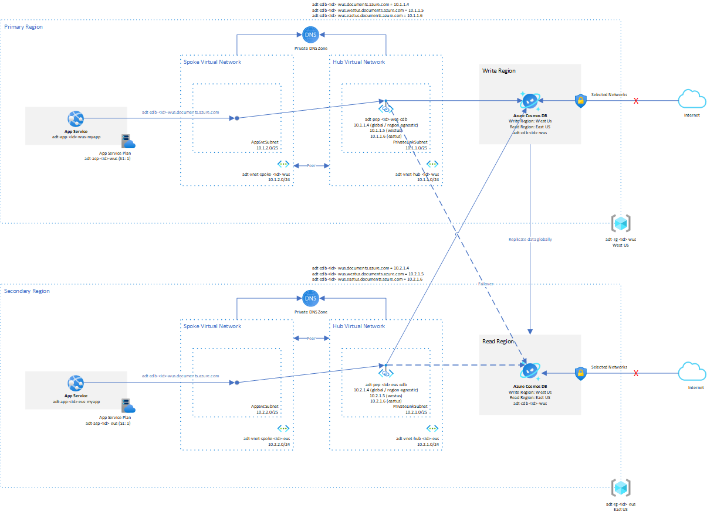

# Multi-region web app with private connectivity to Cosmos database

This example shows a secure and highly available deployment if Cosmos DB.

> Note: [Private Endpoint Limitations](https://docs.microsoft.com/en-us/azure/private-link/private-endpoint-overview#limitations)
>
> NSGs on the Private endpoint subnet or the NIC do not apply to a private endpoint. There is a [public preview](https://azure.microsoft.com/en-us/updates/public-preview-of-private-link-network-security-group-support/) of Private Link NSG support.



## References

* [Azure Quickstart templates Cosmos DB with Private endpoint](https://github.com/Azure/azure-quickstart-templates/tree/master/quickstarts/microsoft.documentdb/cosmosdb-private-endpoint)
* [Private endpoint limitations](https://docs.microsoft.com/en-us/azure/private-link/private-endpoint-overview#limitations)

## Bicep Setup

```sh
id=$RANDOM

env1=wus
env2=eus

rg1=adt-rg-$id-$env1
rg2=adt-rg-$id-$env2

loc1=westus
loc2=eastus

az group create -g $rg1 -l $loc1
az group create -g $rg2 -l $loc2

az deployment group create -g $rg1 -f cosmos-private-link.bicep \
    -p  primaryDeploymentResourceGroup=$rg1 \
        deploymentId=$id \
        envNamePrimary=$env1 \
        envNameSecondary=$env2
az deployment group create -g $rg2 -f cosmos-private-link.bicep \
    -p  isSecondary=true \
        primaryDeploymentResourceGroup=$rg1 \
        deploymentId=$id \
        envNamePrimary=$env1 \
        envNameSecondary=$env2
```

## Testing Connectivity

From App Service console in West US...

```sh
C:\home\site\wwwroot>nameresolver adt-cdb-21768-wus.documents.azure.com
Server: 168.63.129.16

Non-authoritative answer:
Name: adt-cdb-21768-wus.privatelink.documents.azure.com
Addresses:
    10.1.1.4
Aliases:
    adt-cdb-21768-wus.privatelink.documents.azure.com

C:\home\site\wwwroot>nameresolver adt-cdb-21768-wus-eastus.documents.azure.com
Server: 168.63.129.16

Non-authoritative answer:
Name: adt-cdb-21768-wus-eastus.privatelink.documents.azure.com
Addresses:
    10.1.1.6
Aliases:
    adt-cdb-21768-wus-eastus.privatelink.documents.azure.com

C:\home\site\wwwroot>nameresolver adt-cdb-21768-wus-westus.documents.azure.com
Server: 168.63.129.16

Non-authoritative answer:
Name: adt-cdb-21768-wus-westus.privatelink.documents.azure.com
Addresses:
    10.1.1.5
Aliases:
    adt-cdb-21768-wus-westus.privatelink.documents.azure.com
```

From App Service console in East US...

```sh
C:\home\site\wwwroot>nameresolver adt-cdb-21768-wus.documents.azure.com
Server: 168.63.129.16

Non-authoritative answer:
Name: adt-cdb-21768-wus.privatelink.documents.azure.com
Addresses:
    10.2.1.4
Aliases:
    adt-cdb-21768-wus.privatelink.documents.azure.com

C:\home\site\wwwroot>nameresolver adt-cdb-21768-wus-westus.documents.azure.com
Server: 168.63.129.16

Non-authoritative answer:
Name: adt-cdb-21768-wus-westus.privatelink.documents.azure.com
Addresses:
    10.2.1.5
Aliases:
    adt-cdb-21768-wus-westus.privatelink.documents.azure.com

C:\home\site\wwwroot>nameresolver adt-cdb-21768-wus-eastus.documents.azure.com
Server: 168.63.129.16

Non-authoritative answer:
Name: adt-cdb-21768-wus-eastus.privatelink.documents.azure.com
Addresses:
    10.2.1.6
Aliases:
    adt-cdb-21768-wus-eastus.privatelink.documents.azure.com
```
