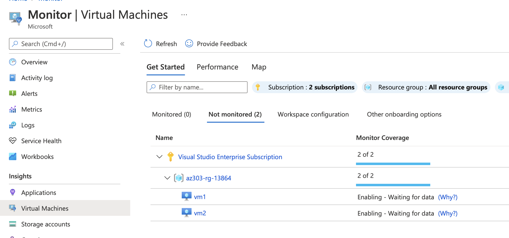
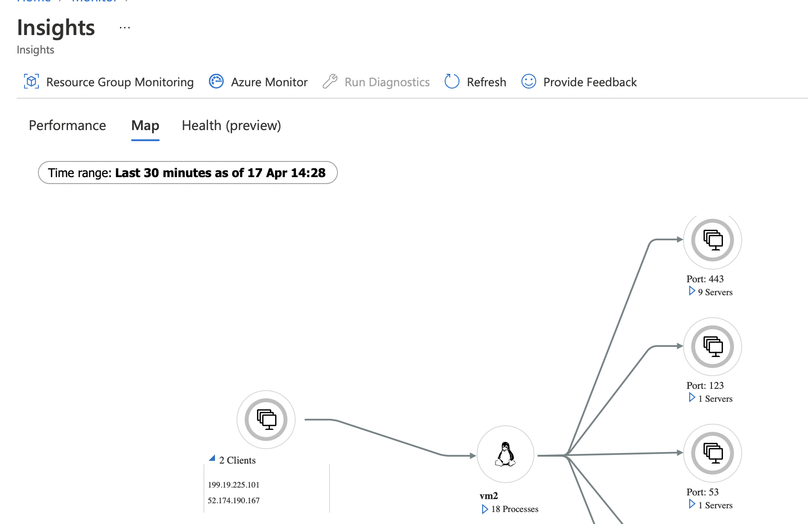

# Scenario - Use Azure Monitor to graph visualisation to display traffic flow between VMs

## References

- [Azure Monitor Workbooks](https://docs.microsoft.com/en-us/azure/azure-monitor/visualize/workbooks-overview)
- [Analysis of network connection data with Azure Monitor for virtual machines](https://azure.microsoft.com/en-us/blog/analysis-of-network-connection-data-with-azure-monitor-for-virtual-machines/)
- [Graph Visualisations](https://docs.microsoft.com/en-us/azure/azure-monitor/visualize/workbooks-graph-visualizations)
- [VMConnection](https://docs.microsoft.com/en-gb/azure/azure-monitor/reference/tables/VMConnection)

## Prereqs

- An Analyics Workspace with VM insights installed, as described [here](https://docs.microsoft.com/en-gb/azure/azure-monitor/vm/vminsights-configure-workspace?tabs=CLI#add-vminsights-solution-to-workspace)


## Setup

```sh
% RG=az303-rg-$RANDOM
% VNET=az303-net-$RANDOM

% az group create \
    -l westeurope \
    -g $RG

% az network vnet create \
    -g $RG \
    -n $VNET \
    --address-prefix 10.20.0.0/16 \
    --subnet-name subnet1 \
    --subnet-prefix 10.20.1.0/24

% az network vnet subnet create \
    --address-prefixes 10.20.2.0/24 \
    -n subnet2 \
    -g $RG \
    --vnet-name $VNET

% az vm create \
    -g $RG \
    -n vm1 \
    --vnet-name $VNET \
    --subnet subnet1 \
    --image UbuntuLTS \
    --admin-username azureuser \
    --admin-password <PASSWORD>

% az vm create \
    -g $RG \
    -n vm2 \
    --vnet-name $VNET \
    --subnet subnet2 \
    --image UbuntuLTS \
    --admin-username azureuser \
    --admin-password <PASSWORD>
```

Install the agent on the VMs. There's different ways to do it, can't see any CLI instructions. I've just done it via the portal. See [here](https://docs.microsoft.com/en-gb/azure/azure-monitor/vm/vminsights-enable-overview) for options.



Once enabled, you'll see the VMs on the *Monitored* tab. I updated the agents to the newest versions.

Connect to VM1 and then open a connection from VM1 to VM2, so we can chart the comms.

```sh
# lookup VM2's IP
% az vm show -d -g $RG -n vm2 --query "publicIps" -o table

# connect to vm1
% VM1IP=$(az vm show -d -g $RG -n vm1 --query "publicIps" -o tsv)
% ssh azureuser@$VM1IP

# from vm1, connect to vm2
azureuser@vm1:~$ ssh azureuser@<VM2 IP>
```




Workbooks support visualizing arbitrary graphs based on data from logs to show the relationships between monitoring entities.

You can build up a graph visualisation using the VMConnection data and the *Graph* visualisation component.
